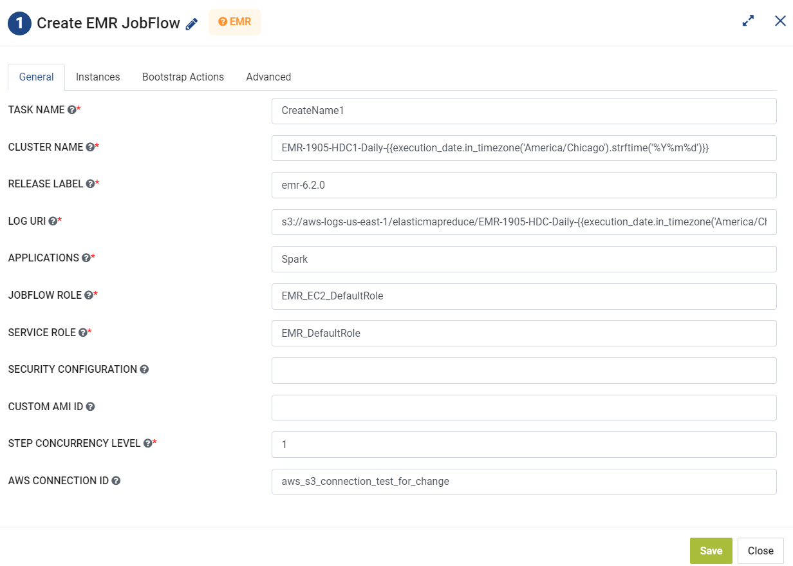

Create EMR Jobflow
=========
**Create EMR Jobflow** node creates a new EMR Jobflow by using the details in configuration and passes the EMR id to the next step.

**Create EMR Jobflow** can be configured as below:

*   **Task Name:** Enter Unique name of the task in the Airflow DAG.
*   **Cluster Name:** Enter Cluster Name.
*   **Release Label:** Enter comma separated Release Label values.
*   **Log URI:** Enter the Log URI path.
*   **Application:** Enter the Application Name.
*   **Jobflow Roke:** Enter the IAM role that specified when Jobflow was created.
*   **Service Role:** Enter the IAM role that is assumed by the Amazon EMR service to access AWS resources.
*   **AWS Connection ID:** Enter AWS Connection ID to be used.
