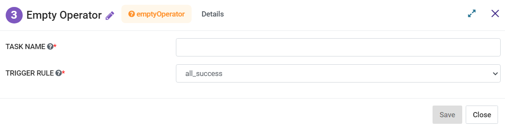

Empty Operator
=========
**Empty Operator** node can be used to create an Empty Operator.

**Empty Operator** can be configured as below:

*   **Task Name:** Enter Unique name of the task in the Airflow DAG.
*   **Trigger Rule:** Select a Trigger Rule to be used.
