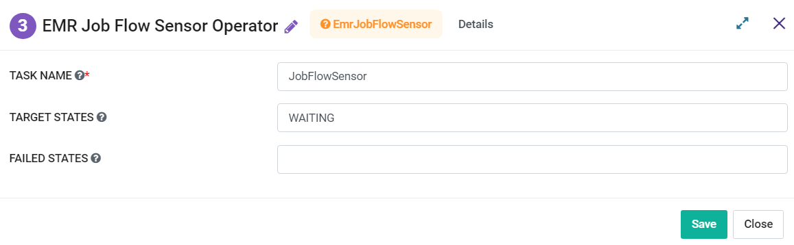

EMR Jobflow Sensor operator
=========
**EMR Jobflow Sensor operator** node will Periodically check if the state of the EMR Jobflow reaches any of the target state.

**EMR Jobflow Sensor operator** can be configured as below:

*   **Task Name:** Enter Unique name of the task in the Airflow DAG.
* 	**Target States:** Enter comma separated values for Target States.
*   **Failes States:** Enter comma separated values for Failed States.
