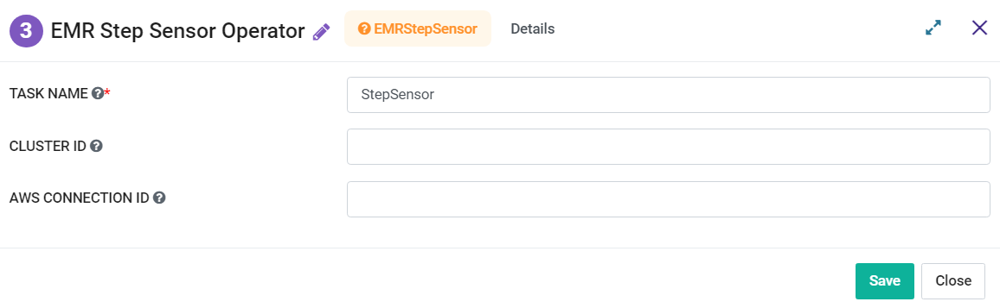

EMR Step Sensor operator
=========
**EMR Step Sensor operator** node will Periodically check if the last added steps in EMR are completed, skipped, or terminated.

**EMR Step Sensor operator** can be configured as below:

*   **Task Name:** Enter Unique name of the task in the Airflow DAG.
* 	**Cluster ID:** Enter a Cluster ID.
*   **AWS Connection ID:** Enter AWS Connection ID to be used.
