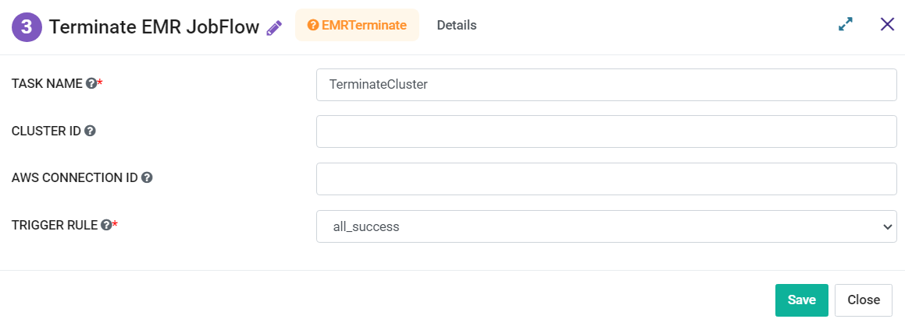

Terminate EMR Jobflow
=========
**Terminate EMR Jobflow** node terminates the EMR Jobflow.

**Terminate EMR Jobflow** can be configured as below:

*   **Task Name:** Enter Unique name of the task in the Airflow DAG.
* 	**Cluster ID:** Enter a Cluster ID.
*   **AWS Connection ID:** Enter AWS Connection ID to be used.
*   **Trigger Rule:** Select a Trigger Rule to be used.
