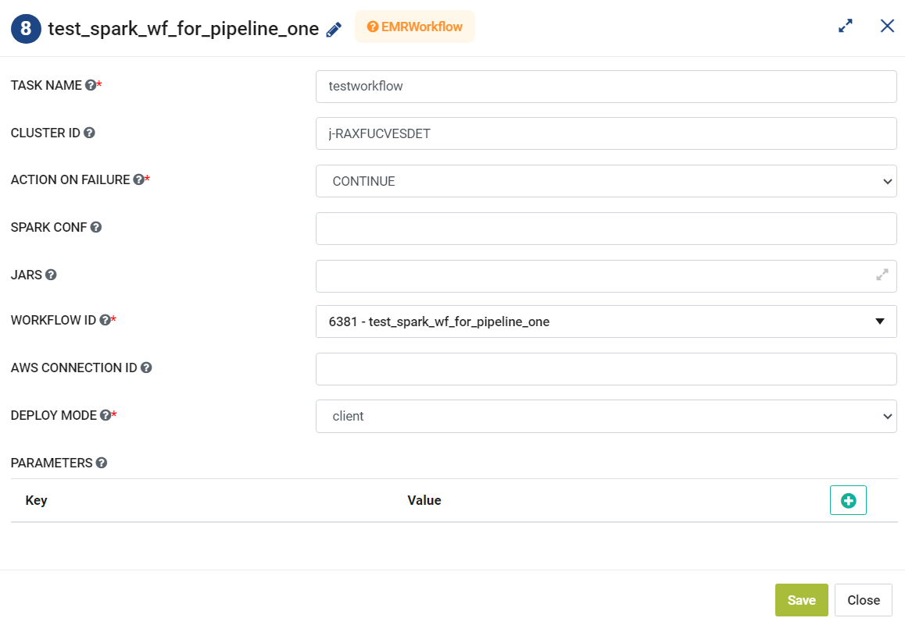

EMR Workflow
=========
**EMR Workflow** node can be used to allow the user to add the workflow in a project to an EMR step to execute.

**EMR Workflow** can be configured as below:

*   **Task Name:** Enter Unique name of the task in the Airflow DAG.
* 	**Cluster ID:** Enter a Cluster ID.
*   **Action On Failure:** Select an action from the list that can be teaken on failure.
*   **Spark Conf:** Add comma separated Spark Conf values in key=value pairs.
*   **Jars:** Add comma separated jars that would be used during execution.
*   **Workflow ID:** Select a Workflow from the list to execute.
*   **AWS Connection ID:** Enter AWS Connection ID to be used.
*   **Deploy Mode:** Select a Deployment mode either as Cluster or Client.
*   **Parameters:** Enter Key and Values to be used in the workflow.
