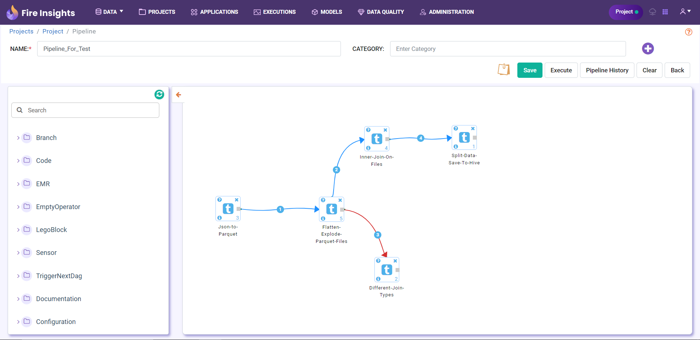

Nodes
=========
This document outlines the various nodes that can be added to a Pipeline in Sparkflows.

Various nodes can be added to a Pipeline. Some of them are listed below:

*	**Workflow** node can be added to a Pipeline to execute a Workflow. A Workflow node can be connected to another Workflow node thus forming a series of workflows that can be executed one after another.

.. note:: Workflow node is available only when Airflow Server is not configured.

Below is an example of a Pipeline with multiple Workflows.

Below is a list of nodes available when **Airflow** is enabled:

.. panels::
    :container: container-lg pb-3
    :column: text-center col-lg-6 col-md-6 col-sm-6 col-xs-12 p-2

    :doc:`pipeline-bash-operator`

    ---

    :doc:`emr-workflow-operator`

    ---

    :doc:`xml-parser-node`

    ---

    :doc:`s3-sensor-node`

    --- 

    :doc:`add-dag-variables`

    ---

    :doc:`create-emr-jobflow`

    ---

    :doc:`add-step-emr-jobflow`

    --- 

    :doc:`add-dag-arguments`

    --- 

    :doc:`branch-python-operator`

    ---

    :doc:`python-operator`

    ---

    :doc:`emr-terminate`

    ---

    :doc:`empty-operator`
	
    --- 

    :doc:`xml-mapping`

    ---

    :doc:`emr-step-sensor-operator`

    ---

    :doc:`emr-jobflow-sensor`

    ---

    :doc:`trigger-dag-run`

.. toctree::
   :hidden:

   pipeline-bash-operator.rst
   emr-workflow-operator.rst
   xml-parser-node.rst
   s3-sensor-node.rst
   add-dag-variables.rst
   create-emr-jobflow.rst
   add-step-emr-jobflow.rst
   add-dag-arguments.rst
   branch-python-operator.rst
   python-operator.rst
   emr-terminate.rst
   empty-operator.rst
   xml-mapping.rst
   emr-step-sensor-operator.rst
   emr-jobflow-sensor.rst
   trigger-dag-run.rst
