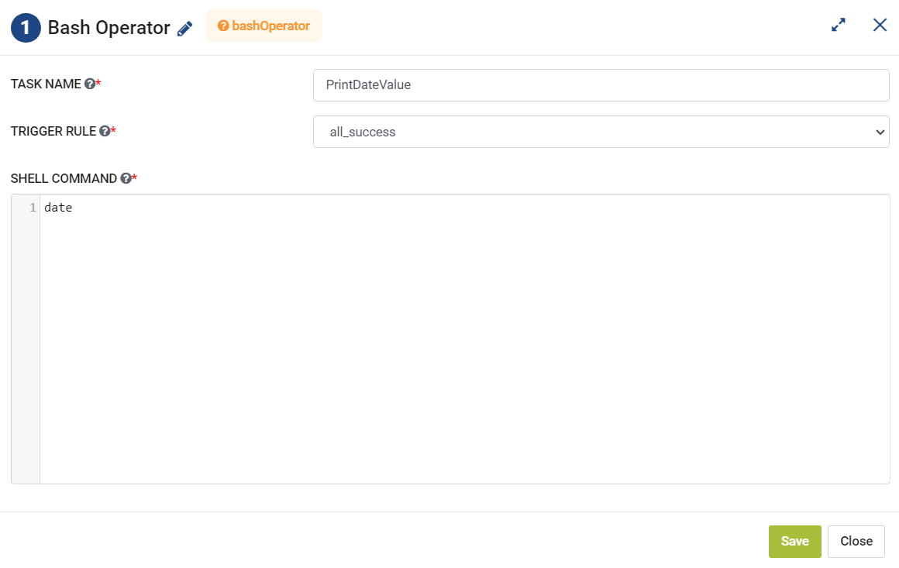

Bash Operator
=========
**Bash Operator** node can be used to execute the commands depending on the selected trigger rule.

**Bash Operator** can be configured as below:

*   **Task Name:** Enter Unique name of the task in the Airflow DAG.
*   **Trigger Rule:** Select a Trigger Rule to be used.
*   **Shell Command:** Enter a Shell Command to be executed.
