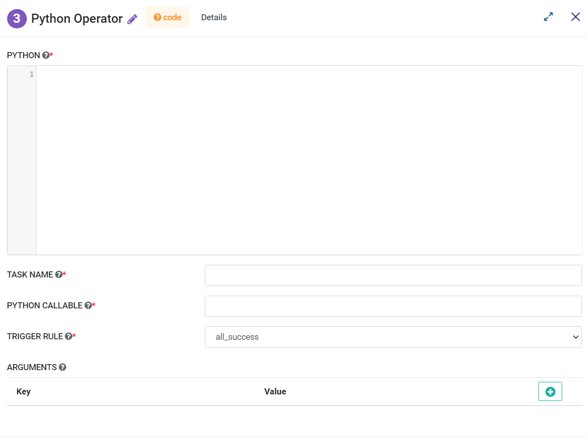

Python Operator
=========
**Python Operator** node can be used to execute python code using python operator.

**Python Operator** can be configured as below:

*   **Python:** Write a python code to be executed.
*   **Task Name:** Enter Unique name of the task in the Airflow DAG.
*   **Python Callable:** Enter the name of the User defined function.
*   **Trigger Rule:** Select a Trigger Rule to be used.
*   **Arguments:** Enter Key and Values to be used.
