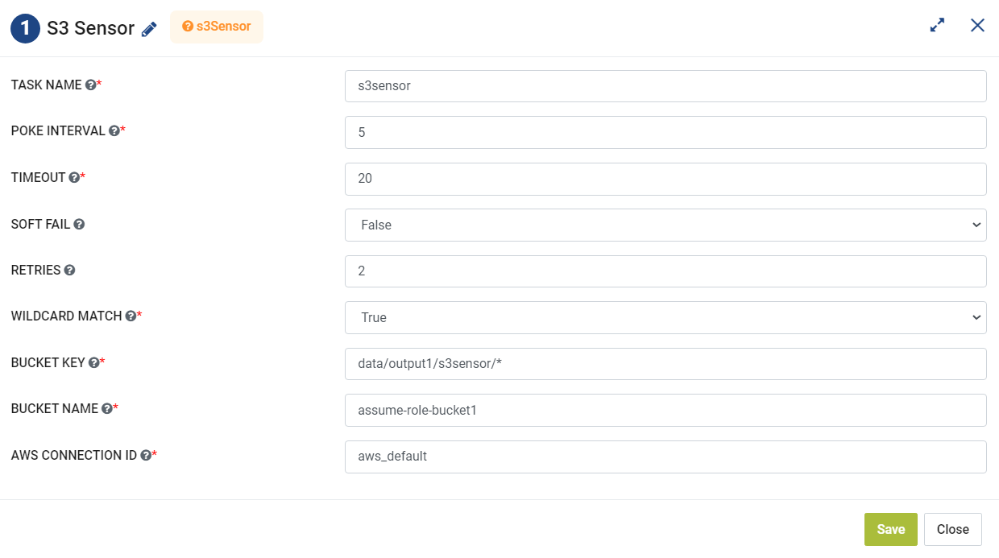

S3 sensor
=========
**S3 sensor** node supports Airflow `s3_key_sensor` operations.

**S3 sensor** can be configured as below:

*   **Task Name:** Enter Unique name of the task in the Airflow DAG.
*   **Poke Interval:** Enter poke interval value in seconds.
* 	**Timeout:** Enter a Timeout value in seconds.
*   **Soft Fail:** Select a Soft Faile from the drop down as either True or False.
*   **Retries:** Enter a value for the number of retries.
*   **Wildcard Match:** Select a value from the dropdown either as True or False. It indicates whether the bucket_key should be interpreted as a Unix wildcard pattern.
*   **Bucket Key:** Enter the key being waited on.
*   **Bucket Name:** Enter name of the S3 bucket.
*   **AWS Connection ID:** Enter AWS Connection ID to be used.
