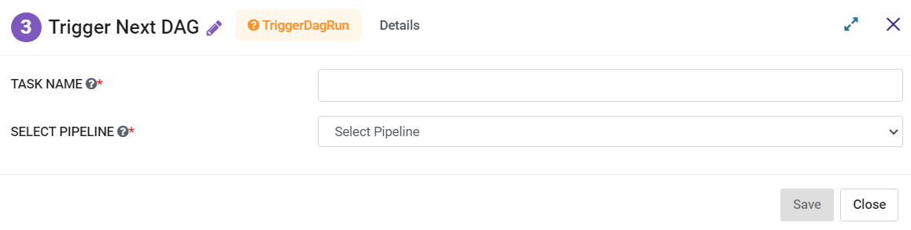

Trigger next dag run
=========
**Trigger next dag run**  node can be used to trigger the next pipeline DAG.

**Trigger next dag run** can be configured as below:

*   **Task Name:** Enter Unique name of the task in the Airflow DAG.
* 	**Select Pipeline:** Select a pipeline to trigger next.
