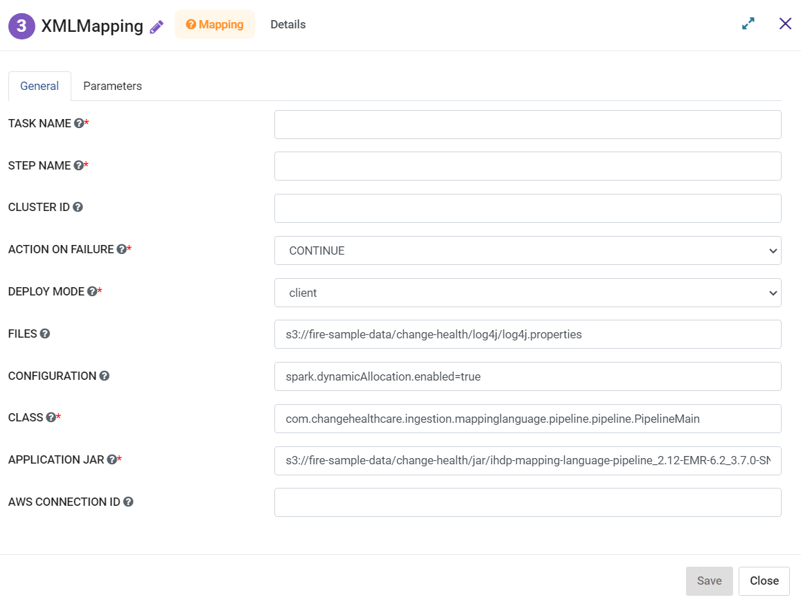

XML Mapping
=========
**XML Mapping** node can be used as Lego Block: Execute Mapping Language Pipeline (a wrapper around Mapping Language Engine).

**XML Mapping** can be configured as below:

*   **Task Name:** Enter Unique name of the task in the Airflow DAG.
*   **Step Name:** Enter name for the EMR step.
* 	**Cluster ID:** Enter a Cluster ID.
*   **Action On Failure:** Select an action from the list that can be teaken on failure.
*   **Deploy Mode:** Select a Deployment mode either as Cluster or Client.
*   **Files:** Add comma separated list of files to be placed on the working directory of each executor.
*   **Configuration:** Add comma separated Spark Conf values in key=value pairs.
*   **Class:** Add a class which would be the entry point for the application.
*   **Application Jar:** Enter the path of the bundled jar including the application and all dependencies.
*   **AWS Connection ID:** Enter AWS Connection ID to be used.
