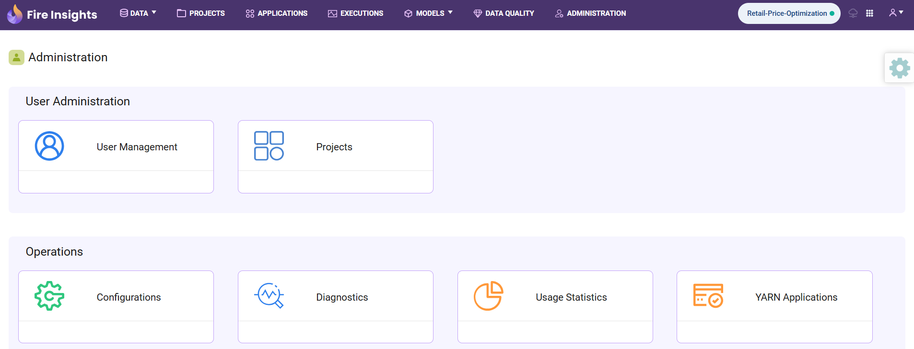

Overview
========

Sparkflows supports Pipelines wherein multiple workflows can be chained and run in accordance to the DAG generated by Sparkflows.

Sparkflows can trigger Pipelines in one of the below listed ways :

1. Run on Compute engine.
2. Run via Airflow.

Steps Involved in Configuring Pipeline in Sparkflows:

1. **Login to Sparkflows Web Server URL and traverse to Administrations -> Configurations and enable the below properties:**

::

    module.enablePipeline	true

.. figure:: ../../_assets/user-guide/pipeline/pipeline_configurations.PNG
   :alt: Pipeline List
   :width: 60%
   
2. **Once the above Configuration is enabled, you will see three tabs in project namely** ``Pipelines, Executions & Schedules`` 

.. figure:: ../../_assets/user-guide/pipeline/pipeline-list-new.png
   :alt: Pipeline List
   :width: 60% 

3. **Set the following configurations if you have Airflow running on any remote server.**

In the Airflow tab :

.. list-table:: 
   :widths: 10 20 30
   :header-rows: 1

   * - Title
     - Description
     - Value
   * - Airflow Home
     - Airflow Home
     - Airflow Home Directory, if running on same machine.
   * - Airflow Endpoint URL
     - Airflow Endpoint URL
     - Airflow Endpoint URL where its running.
   * - Enable/Disable Airflow
     - Enable/Disable Airflow
     - Enable Airflow
   * - Airflow Dag
     - Airflow Dag
     - Airflow Dag location if you configured S3 Bucket.
   * - Airflow IAM Role
     - Airflow IAM Role
     - Airflow IAM Role used for accessing S3 Bucket for dags.
   * - Airflow dag max check
     - Maximum retry scheduler will do for checking availability of dag file in airflow dag directory
     - Depending on your requirements.
   * - Airflow dag Sync delay
     - Airflow dag Sync delay(seconds)
     - Depending on your requirements.
     
.. figure:: ../../_assets/user-guide/pipeline/pipeline_airflow.PNG
   :alt: Pipeline List     
   :width: 60%

Once the above Configurations are saved, the pipelines will start getting submitted on Airflow server for scheduling and execution.

.. note:: Make sure that Airflow and other parameter are updated with absolute path.

4. **Pipeline List**

``Pipeline`` tab under a Project displays list of all Pipelines created under the selected project. Pipelines can be grouped together under several categories. 

.. figure:: ../../_assets/user-guide/pipeline/pipeline-list-new.png
   :alt: Pipeline List
   :width: 60%

5. **Creating a Pipeline**

Following steps can be followed to create a Pipeline:

*	A Pipeline can be created under a Project by navigating to the ``Pipeline`` tab and clicking on ``Create Pipeline`` button.
*	Add ``Nodes`` to the new Pipeline canvas. Enter ``Pipeline Name`` and ``Pipeline Category`` and click on ``Save`` button to save the new Pipeline.

Various ``Nodes`` can be added to a Pipeline. Some of them are listed below:

*	``Workflow`` node can be added to a Pipeline to execute a Workflow. A ``Workflow`` node can be connected to another ``Workflow`` node thus forming a series of workflows that can be executed one after another.

.. note:: Workflow node is available only when Airflow Server is not configured.

Below are list of nodes available when ``Airflow`` is enabled.

*   ``Branch Python Operator`` node can be used to execute flow depends on return value from the previous task.
*   ``Bash Operator`` node can be used to executes the commands depends on selected trigger rule.
*   ``Python Operator`` node can be used to execute python code using python operator.
*   ``Add step to EMR cluster`` node can be used to add step to EMR cluster and execute the arguments as one command using command-runner.jar.
*   ``Create EMR cluster`` node can be used to creates a new EMR cluster by using details in configuration and pass the emr_id to next step.
*   ``Terminate EMR cluster`` node can be used to terminates previously started EMR cluster.
*   ``EMR Workflow`` node can be used to allow to user to add the workflow in project to emr step to execute.
*   ``Empty Operator`` node can be used to creates Empty Operator.
*   ``XMLMapping`` node can be used as Lego Block: Execute Mapping Language Pipeline (a wrapper around Mapping Language Engine).
*   ``XMLParser`` node can be used as Lego Block: Execute Generic XML Parser (a wrapper around Spark XML).
*   ``EMR Step Sensor operator`` node will periodically check if that last added steps in EMR is completed or skipped or terminated.
*   ``S3 sensor`` node supports airflow s3_key_sensor operations.
*   ``Trigger next dag run``  node can be used to trigger other pipeline dag.

Below is an example a Pipeline with multiple Workflows.

.. figure:: ../../_assets/user-guide/pipeline/create-pipeline-new.png
   :alt: Pipeline
   :width: 60%
   
6. **Executing a Pipeline**

Pipelines can be executed in the similar way as Workflow execution when Sparkflows is not configured with an Airflow server. If an Airflow server is configrued, the pipelines are submitted to Airflow for scheduling and executions.

The Pipeline tab displays the list of Pipelines for the current Application.

.. figure:: ../../_assets/user-guide/pipeline/pipeline-list-new.png
   :alt: Pipeline List
   :width: 60%
   
Clicking on the ``Execute`` Action button from ``Pipeline`` list or in the ``Pipeline`` page opens the ``Pipeline Execute`` Page.

.. figure:: ../../_assets/user-guide/pipeline-execute-new.png
   :alt: Pipeline Execute
   :width: 60%
   
7. **Pipeline Execution Result**

Once a Pipeline is submitted for execution, it's execution details can be viewed in the ``Executions`` tab under ``Pipeline`` tab.

.. figure:: ../../_assets/user-guide/pipeline/pipeline-execution-new.png
   :alt: Pipeline Execution
   :width: 60%
   
8. **Pipeline Schedule**

Sparkflows allows you to schedule Pipeline depending on your requirements.

.. figure:: ../../_assets/user-guide/pipeline/pipeline_scheduled.png
   :alt: Pipeline 
   :width: 60%

.. figure:: ../../_assets/user-guide/pipeline/pipeline_schedule_page.png
   :alt: Pipeline 
   :width: 60%
   
.. figure:: ../../_assets/user-guide/pipeline/pipeline_scheduled_start.PNG
   :alt: Pipeline 
   :width: 60%
   
.. figure:: ../../_assets/user-guide/pipeline/pipeline_schedule_list.png
   :alt: Pipeline 
   :width: 60%   

Once the Pipeline scheduled, it will be trigerred automatically based on the schedule.

9. **Import Pipeline**

The Pipeline can be imported from a Json file.

.. figure:: ../../_assets/user-guide/pipeline/Import_Pipeline.png
   :alt: Pipeline Import
   :width: 60%
   
10. **View Pipeline History**

All the previous versions of the pipeline can be viewed. The Pipeline can be restored to a previous version.

.. figure:: ../../_assets/user-guide/pipeline/Pipeline_History.png
   :alt: Pipeline Import
   :width: 60%

11. **Troubleshooting Guide**

* Pipeline Troubleshooting

 https://docs.sparkflows.io/en/latest/troubleshooting/pipelines.html
   
* Websocket Troubleshooting
 
 https://docs.sparkflows.io/en/latest/troubleshooting/websockets.html
