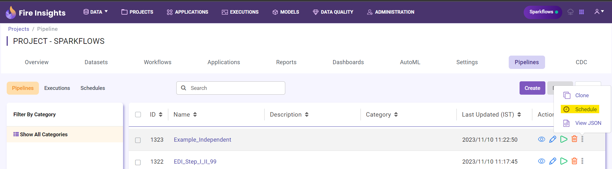
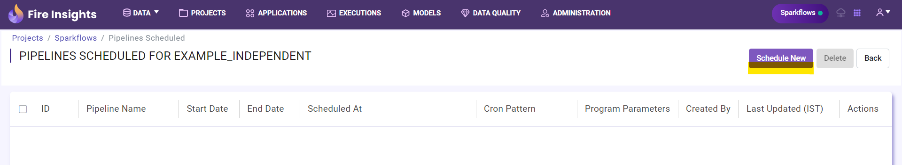
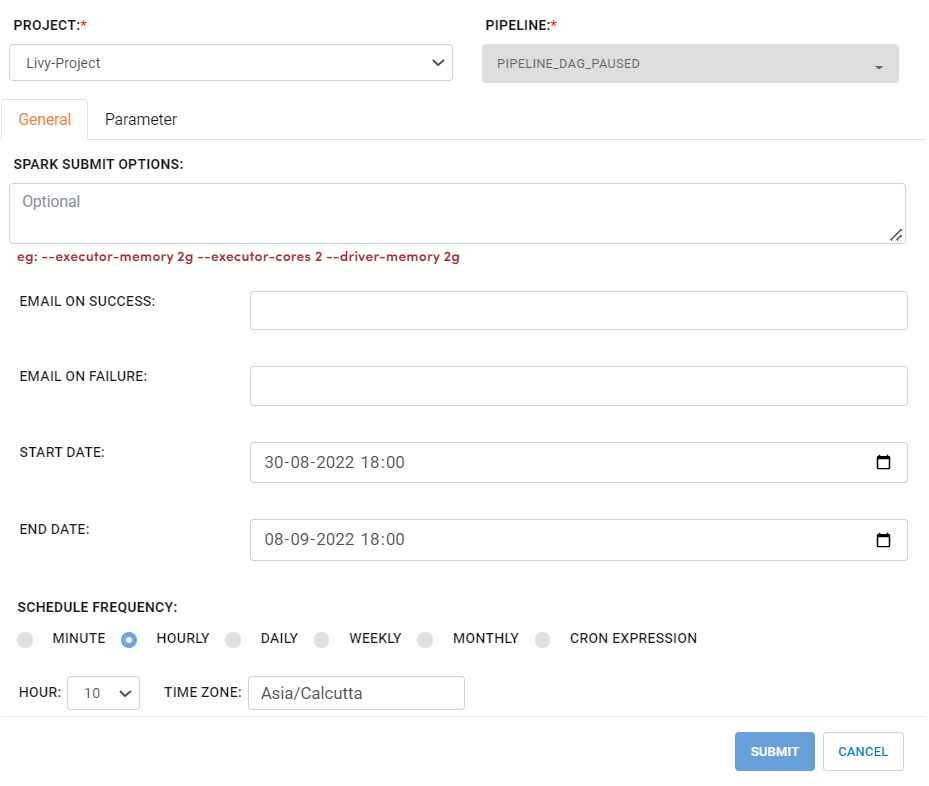
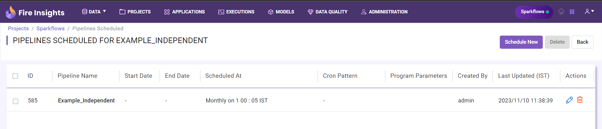

Schedule Pipeline
=====================

Sparkflows allows you to schedule a Pipeline according to your specific requirements. This document outlines the steps needed to schedule a Pipeline in Sparkflows.

Step 1 : Navigate to the Pipelines Tab
-----------------------------------------

Go to the Pipelines tab within your project.

Step 2 : Locate the Desired Pipeline
-----------------------------------

Find the Pipeline you want to schedule.

Step 3 : Access the Schedule Option
-----------------------------------

Click on the **three dots** next to the Pipeline and select the **Schedule option**. This will take you to the schedule pipeline page.

Step 4 : Initiate Pipeline Scheduling
-----------------------------------------

On the schedule Pipeline page, click the **Schedule New** button.

Step 5 : Set Up the Schedule
------------------------------------

In the pop-up window, enter the **details** needed to schedule the Pipeline and click the **Submit** button. 

The Pipeline will then be triggered automatically according to the schedule.

Step 6 : Manage the Pipeline Schedule
---------------------------------------------

You can access, edit, or delete the Pipeline schedule from the Pipelines Scheduled page.

