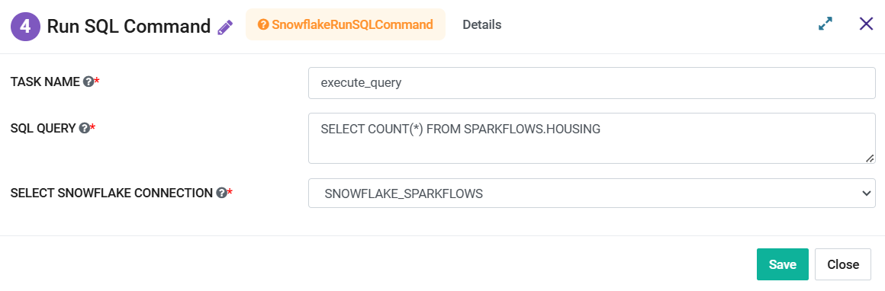

Snowflake Run Sql Command
=========
**Snowflake Run Sql Command** node can be used to execute a SQL Query against a Snowflake Data Table.

**Snowflake Run Sql Command** node can be configured as below:

   
*   **Task Name:** Enter Unique name of the task in the Airflow DAG.
*   **SQL Query:** Enter a SQL Query that needs to be executed.
*   **Select Snowflake Connection:** Select a Snowflake Connection from the dropdown. List contains the connections defined in the Sparkflows.
