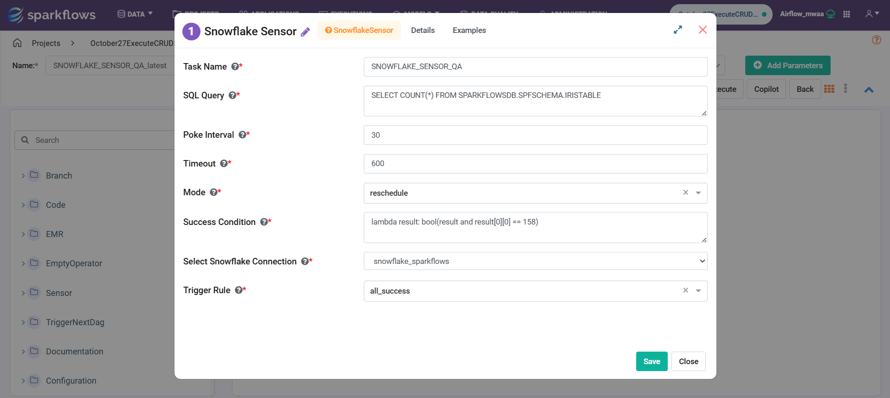

Snowflake Sensor
=========

**Snowflake Sensor** node can be used to monitor a condition in a Snowflake table by executing a specified SQL Query at regular intervals until the success criteria are met or a timeout occurs.

**Snowflake Sensor** node can be configured as below:

* **Task Name:** Enter a unique name for the task in the Airflow DAG.
* **SQL Query:** Enter the SQL Query to be executed periodically in Snowflake for checking the condition.
* **Poke Interval:** Specify the time interval (in seconds) between each check (poll) of the query execution.
* **Timeout:** Define the maximum waiting time (in seconds) before the sensor times out if the success condition is not met.
* **Mode:** Choose the execution mode — *poke* (sequential checks) or *reschedule* (release worker between checks).
* **Success Condition:** Define the condition that determines a successful result (for example, when a query returns a specific count or non-empty result).
* **Snowflake Connection:** Select the Snowflake connection from the dropdown list. The list contains all connections defined in Sparkflows.

Examples
--------

Below are a few examples of how the **Snowflake Sensor** node can be configured:

**Example 1:** Wait until table record count exceeds 150

.. code-block:: sql

   SELECT COUNT(*) FROM SPARKFLOWSDB.SPFSCHEMA.IRISTABLE;

**Success Condition:** ``lambda result: bool(result and len(result) > 153)``

**Example 2:** Wait until specific data appears in a table

.. code-block:: sql

   SELECT * FROM SALES_DATA WHERE STATUS = 'COMPLETED';

**Success Condition:** ``lambda result: bool(result)``
