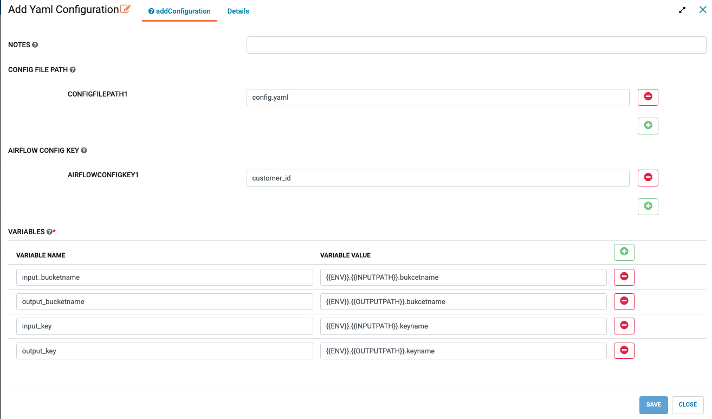
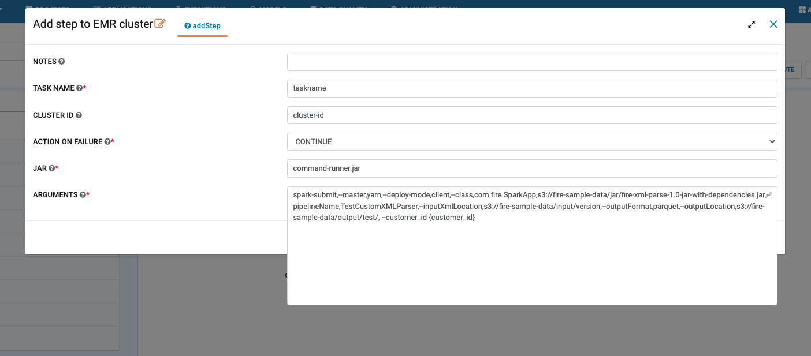
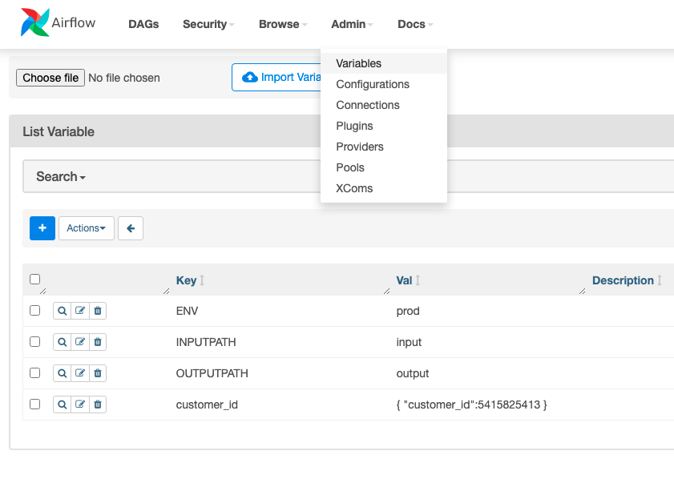

Configure Yaml files and Variables
==================================


Sparkflows provides a node using which yaml files and airflow variables can be configured.

Yaml File Configuration
----------------------

1. In configFilePath, add the names of the config yaml files.

2. In airflowConfigKey, add the variable key name defined in airflow.The variables from airflowConfigKey gets the higher precedence.

3.In variablesList, add the variable names and variable values.

Below is an example of yaml file and variables.
yaml file:
```
dev:
    input:
          bucketname: fire-sample-data
          keyname: inputlocation
           
    output:
          bucketname: fire-sample-data
          keyname: outputlocation
prod:
    input:
          bucketname: fire-sample-data
          keyname: inputlocation
           
    output:
          bucketname: fire-sample-data
          keyname: outputlocation
cuatomer_id: 62300
```
In below examples ENV = dev, INPUTPATH = input and OUTPUTPATH = output variables should be defined in airflow.


 1.<b>input_bucketname</b>  {{ENV}}.{{INPUTPATH}}.bucketname 


 2.<b>output_bucketname</b> {{ENV}}.{{OUTPUTPATH}}.bucketname


Confiured in NodeUI.


   

Now input_bucketname and output_bucketname variables can be used with single curly braces to define the complete paths.


1. Configuration details in UI


   
   
2. Using the defined variables in configuration with single curly braces. i.e {variable_name}




   
3. In airflow variables ENV, INPUTPATH, OUTPUTPATH and cuatomer_id




