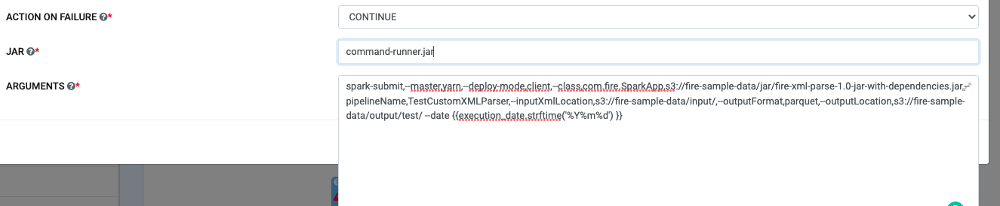

MACRO Usage
-------------------

A macro is a variable that can be expanded into a string at runtime. Macros allow for dynamic template generation and can be used to insert values into the SQL code for a ``SQLOperator`` or the command for a ``BashOperatorAirflow``. 

Macros can be used in sparkflows pipelines. Any of the predefined Airflow Macros can be used as listed in the documentation https://airflow.apache.org/macros.html#default-variables

``{{ prev_ds_nodash }}`` is an example of specifying a macro inside a value as follows:  ``"s3://fre-sample-data/ouput/outputIngestion/dt={{ prev_ds_nodash }}".``

Default Variables
-----------------
The Airflow engine passes the below variables by default that are accessible
in all templates

=====================================   ====================================
Variable                                Description
=====================================   ====================================
``{{ ds }}``                            the execution date as ``YYYY-MM-DD``
``{{ ds_nodash }}``                     the execution date as ``YYYYMMDD``
``{{ prev_ds }}``                       the previous execution date as ``YYYY-MM-DD``
                                        if ``{{ ds }}`` is ``2018-01-08`` and ``schedule_interval`` is ``@weekly``,
                                        ``{{ prev_ds }}`` will be ``2018-01-01``
``{{ prev_ds_nodash }}``                the previous execution date as ``YYYYMMDD`` if exists, else ``None``
``{{ next_ds }}``                       the next execution date as ``YYYY-MM-DD``
                                        if ``{{ ds }}`` is ``2018-01-01`` and ``schedule_interval`` is ``@weekly``,
                                        ``{{ next_ds }}`` will be ``2018-01-08``
``{{ next_ds_nodash }}``                the next execution date as ``YYYYMMDD`` if exists, else ``None``
``{{ yesterday_ds }}``                  the day before the execution date as ``YYYY-MM-DD``
``{{ yesterday_ds_nodash }}``           the day before the execution date as ``YYYYMMDD``
``{{ tomorrow_ds }}``                   the day after the execution date as ``YYYY-MM-DD``
``{{ tomorrow_ds_nodash }}``            the day after the execution date as ``YYYYMMDD``
``{{ ts }}``                            same as ``execution_date.isoformat()``. Example: ``2018-01-01T00:00:00+00:00``
``{{ ts_nodash }}``                     same as ``ts`` without ``-``, ``:`` and TimeZone info. Example: ``20180101T000000``
``{{ ts_nodash_with_tz }}``             same as ``ts`` without ``-`` and ``:``. Example: ``20180101T000000+0000``
``{{ execution_date }}``                the execution_date (`pendulum.Pendulum`_)
``{{ prev_execution_date }}``           the previous execution date (if available) (`pendulum.Pendulum`_)
``{{ prev_execution_date_success }}``   execution date from prior succesful dag run (if available) (`pendulum.Pendulum`_)
``{{ prev_start_date_success }}``       start date from prior successful dag run (if available) (`pendulum.Pendulum`_)
``{{ next_execution_date }}``           the next execution date (`pendulum.Pendulum`_)
``{{ dag }}``                           the DAG object
``{{ task }}``                          the Task object
``{{ macros }}``                        a reference to the macros package, described below
``{{ task_instance }}``                 the task_instance object
``{{ end_date }}``                      same as ``{{ ds }}``
``{{ latest_date }}``                   same as ``{{ ds }}``
``{{ ti }}``                            same as ``{{ task_instance }}``
``{{ params }}``                        a reference to the user-defined params dictionary which can be overridden by
                                        the dictionary passed through ``trigger_dag -c`` if you enabled
                                        ``dag_run_conf_overrides_params` in ``airflow.cfg``
``{{ var.value.my_var }}``              global defined variables represented as a dictionary
``{{ var.json.my_var.path }}``          global defined variables represented as a dictionary
                                        with deserialized JSON object, append the path to the
                                        key within the JSON object
``{{ task_instance_key_str }}``         a unique, human-readable key to the task instance
                                        formatted ``{dag_id}_{task_id}_{ds}``
``{{ conf }}``                          the full configuration object located at
                                        ``airflow.configuration.conf`` which
                                        represents the content of your
                                        ``airflow.cfg``
``{{ run_id }}``                        the ``run_id`` of the current DAG run
``{{ dag_run }}``                       a reference to the DagRun object
``{{ test_mode }}``                     whether the task instance was called using
                                        the CLI's test subcommand
=====================================   ====================================

   
   In the command below, the airflow macros are encapsulated in double curly braces to get the current execute date.
   
   ``spark-submit,--master,yarn,--deploy-mode,client,--class,com.fire.SparkApp,s3://fire-sample-data/jar/fire-xml-parse-1.0-jar-with-dependencies.jar,--pipelineName,TestCustomXMLParser,--inputXmlLocation,s3://fire-sample-data/input/,--outputFormat,parquet,--outputLocation,s3://fire-sample-data/output/test/ --date {{execution_date.strftime('%Y%m%d') }}``

Onboarding new Pipeline nodes
-----------------------------
New custom nodes can be onboarded onto Sparkflows for specific actions. The steps to do the same is layed out in the link below:

https://docs.sparkflows.io/en/latest/developer-guide/pipeline-node.html
