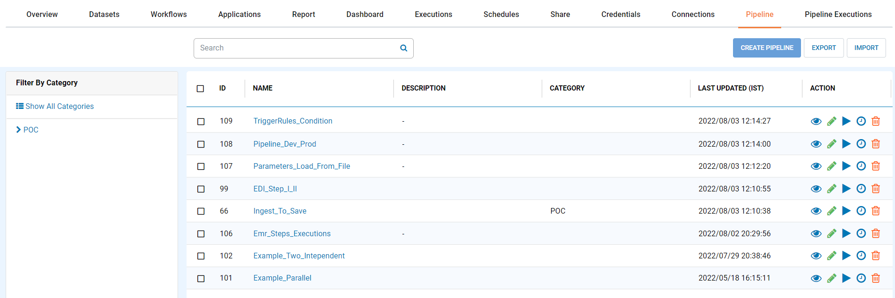
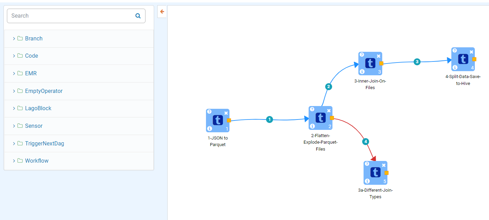
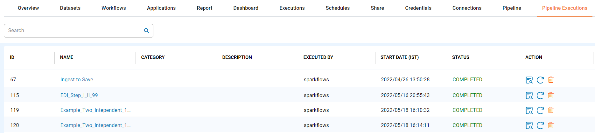

Overview
========

Fire Insights supports Pipelines. Pipelines allow running multiple workflows in a defined order.

Fire Insights can be executed Pipelines in below ways :

1. It Can run workflows on Compute engine configured.
2. It can run them via Airflow. The nodes available in the Pipeline depends on whether Airflow is configured or not.

Steps Involved in Configuring Pipeline in Fire Insights:

1. Login to Fire Insights Web url and Go inside Configurations.

Once Login to Fire Insights Web Server Url Go inside ''Administrations -->> Configurations'' and enable below parameters

::

    module.enablePipeline	true

.. figure:: ../../_assets/user-guide/pipeline/pipeline_administration.PNG
   :alt: Pipeline List
   :width: 60%

.. figure:: ../../_assets/user-guide/pipeline/pipeline_configurations.PNG
   :alt: Pipeline List
   :width: 60%
   
2. Once the above Configurations is enabled, you will see two tab in project ie. ''Pipeline & Pipeline Executions''  

3. Do Below Configurations if you have Airflow running on any remote server.

For Airflow tab :

.. list-table:: 
   :widths: 10 20 30
   :header-rows: 1

   * - Title
     - Description
     - Value
   * - Airflow Home
     - Airflow Home
     - Airflow Home Directory, if running on same machine.
   * - Airflow Endpoint URL
     - Airflow Endpoint URL
     - Airflow Endpoint URL where its running.
   * - Enable/Disable Airflow
     - Enable/Disable Airflow
     - Enable Airflow
   * - Airflow Dag
     - Airflow Dag
     - Airflow Dag location if you configured S3 Bucket.
   * - Airflow IAM Role
     - Airflow IAM Role
     - Airflow IAM Role used for accessing S3 Bucket for dags.
   * - Airflow dag max check
     - Maximum retry scheduler will do for checking availability of dag file in airflow dag directory
     - Depending on your requirements.
   * - Airflow dag Sync delay
     - Airflow dag Sync delay(seconds)
     - Depending on your requirements.
     
.. figure:: ../../_assets/user-guide/pipeline/pipeline_airflow.PNG
   :alt: Pipeline List     
   :width: 60%

Once the above Configurations got saved, the pipeline will be submitted on Airflow server.

.. note:: Make sure that Airflow and other parameter should be updated with absolute path.

4. Pipeline List

``Pipeline`` tab under a Project displays list of all Pipelines created under the selected project. Pipelines can be grouped together under several Categories. 

5. Creating a Pipeline

Following steps can be taken to create a Pipeline:

*	A Pipeline can be created under a Project by navigating to the ``Pipeline`` tab and clicking on ``Create Pipeline`` button.
*	Add ``Nodes`` to the new Pipeline canvas. Enter ``Pipeline Name`` and ``Pipeline Category`` and click on ``Save`` button to save the new Pipeline.

Various ``Nodes`` can be added to a Pipeline. Some of them are listed below:

*	``Workflow`` node can be added to a Pipeline to execute a Workflow. A ``Workflow`` node can be connected to another ``Workflow`` node thus forming a series of workflows that can be executed one after another.
*	``Shell Commands`` node can be used to execute a shell command.
*	``Create EMR Cluster`` node can be used to create an EMR cluster based on the parameters passed.
* 	``XML Parser`` node can be used to parse an XML file.

Below is an example a Pipeline with multiple Workflows.

   
6. Executing a Pipeline

Pipelines can be executed in the similar way as Workflow execution. When a Pipeline is executed without Airflow, But are submitted to Airflow when Airflow is Configured.

The Pipeline tab displays the list of Pipelines for the current Application.

   
Clicking on the ``Execute`` Action button from ``Pipeline`` list or in the ``Pipeline`` page opens the ``Pipeline Execute`` Page.

.. figure:: ../../_assets/user-guide/pipeline-execute-new.png
   :alt: Pipeline Execute
   :width: 60%
   
7. Pipeline Execution

Once a Pipeline is submitted for execution, its execution details can be viewed in the ``Pipeline Executions`` tab.

   
8. Pipeline Schedule

Fire Insights enabled you to schedule the Pipeline.

.. figure:: ../../_assets/user-guide/pipeline/pipeline_scheduled.PNG
   :alt: Pipeline 
   :width: 60%
