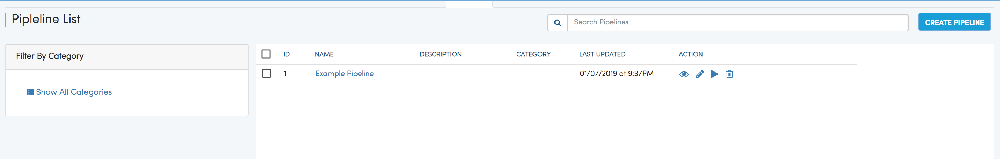
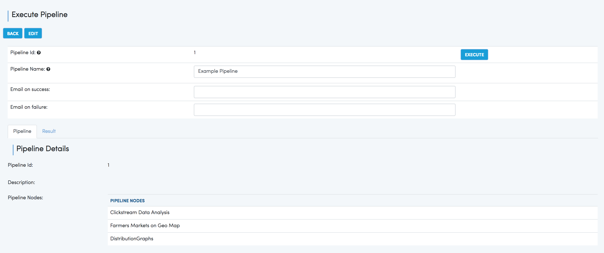

Pipeline
========

Fire supports Pipelines. Pipelines allow running workflows in defined order.

Configuring Pipelines
---------------------

Fire uses Apache Airflow for executing Pipelines. Hence Airflow has to be installed on the same machine as Fire.

Below are the configurations needed in Fire.

.. figure:: ../_assets/user-guide/pipelines-configuration.png
   :alt: Pipelines Configuration
   :align: center

Creating a Pipeline
--------------------

Each Application now allows creating Pipelines.

Below is an example Pipeline with 3 Workflows.

.. figure:: ../_assets/user-guide/pipeline.png
   :alt: Pipeline
   :align: center
   
   
Executing a Pipeline
--------------------

Pipelines can be executed like workflows. When a Pipeline is executed, its execution is submitted to Airflow.

The Pipeline tab displays the list of Pipelines for the current Application.

   
Clicking on the ``Execute`` Action icon opens the Pipeline Execute Page.

   
Airflow Installation
--------------------

It explain the steps involved in installing airflow on Centos and RHEL.

- Login to machine
 - ssh -i xyz.pem sparkflows@x.y.z.w

- Before installing airflow we need to update installed package:
 - yum -y update
 
- let’s install python-pip and any required packages: 
 - sudo yum install epel-release
 - sudo yum install python-pip
 
- Check the version of Pip that is installed and if reqd upgrade:
 - pip -V
 - pip install --upgrade setuptools
 
- Note that for 1.10 you now need to preface install commands or export this env var:
 - export SLUGIFY_USES_TEXT_UNIDECODE=yes
 
- Install gcc , gcc-c++ and dependencies for python 2.7 
 - sudo yum -y install gcc gcc-c++ kernel-devel
  - sudo yum -y install python-devel libxslt-devel libffi-devel openssl-devel
  
- airflow needs a home, ~/airflow is the default,so we can export it
 - export AIRFLOW_HOME=~/airflow  
 
- Install from pypi using pip
  - pip install apache-airflow 

  
