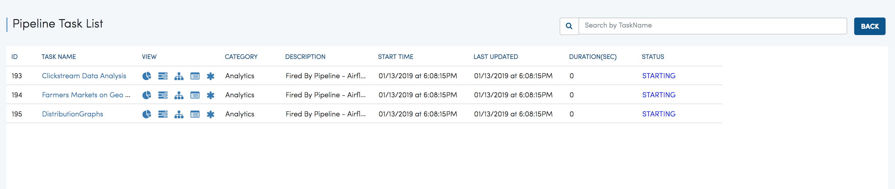

Pipeline
========

Fire supports Pipelines. Pipelines allow running workflows in a defined order.

Pipeline List
-------------

The Pipeline tab displays the list of Pipelines for the current Application.

.. figure:: ../_assets/user-guide/pipeline-list.png
   :alt: Pipeline List
   :align: center

Creating a Pipeline
--------------------

Each Application now allows creating Pipelines.

Below is an example Pipeline with 3 Workflows.

.. figure:: ../_assets/user-guide/pipeline.png
   :alt: Pipeline
   :align: center
   
   
Executing a Pipeline
--------------------

Pipelines can be executed like workflows. When a Pipeline is executed, its execution is submitted to Airflow.

The Pipeline tab displays the list of Pipelines for the current Application.

.. figure:: ../_assets/user-guide/pipeline-list.png
   :alt: Pipeline List
   :align: center
   
Clicking on the ``Execute`` Action icon opens the Pipeline Execute Page.

.. figure:: ../_assets/user-guide/pipeline-execute.png
   :alt: Pipeline Execute
   :align: center
   
Pipeline Execution
------------------

Once a Pipeline is fired, its details are visible in Pipeline Executions.

   
