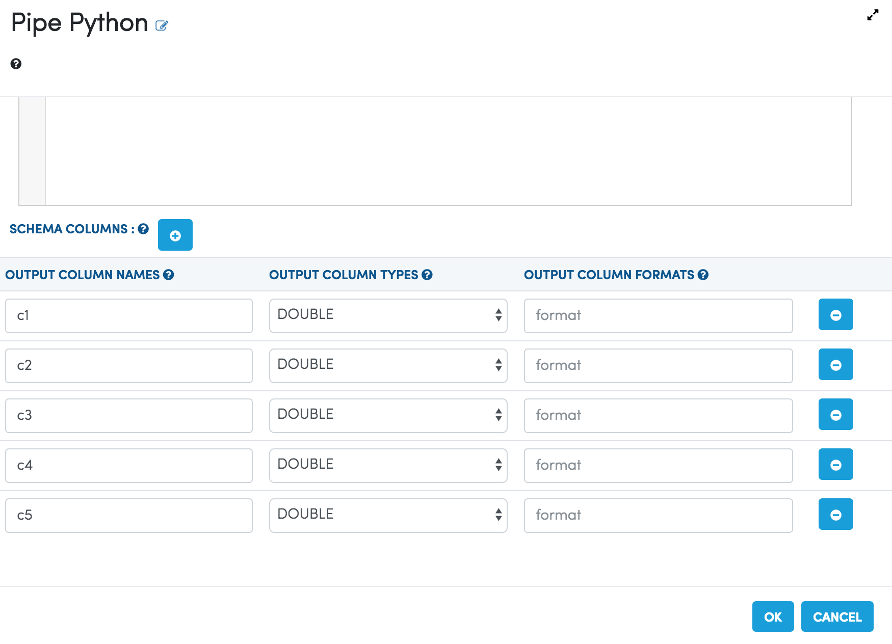
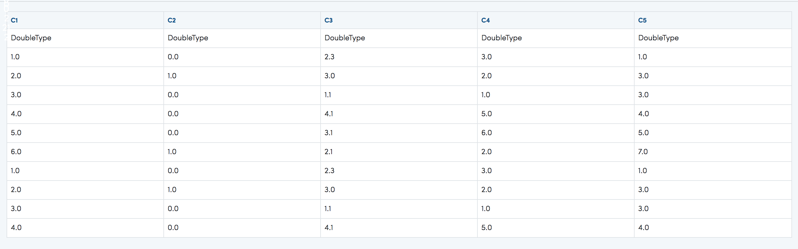

Pipe Python Processor
=====================

Fire Insights has a Pipe Python Processor.

It pipes the incoming DataFrame through pipe to the Python Script. It also passes the Schema of the DataFrame to the Python script through the command line argument. (argv[1])

The Python script is written in the Workflow Editor.

Below is an example workflow containing Pipe Python Processor.

.. figure:: ../../_assets/user-guide/pipe-python-workflow.png
   :alt: Pipe Python Workflow
   :width: 60%

Input DataFrame Schema
-----------------------

The schema of the incoming dataframe is also passed into the Python script as an argument. It can be used in the Python script as needed.

The format of the dataframe schema is below::

    colname1:datatype1|colname2:datatype2|colname3:datatype3
    
Below is an example of printing the arguments and an example result::

    print "The arguments are: " , str(sys.argv)

    ['/tmp/fire/scripts/pipepython-1899418263068404925.py', 'id:DoubleType|label:DoubleType|f1:DoubleType|f2:DoubleType']
    
Simple Example
--------------

The below example reads in the incoming records, parses them, adds a new column whose value is the sum of the first and second fields. Finally it write out the updated record back for Spark to read::

    #!/usr/bin/python

    import sys

    for line in sys.stdin:
      line = line.strip()
      if not line:
        continue

      fields = line.split(",")

      total = str(float(fields[0]) + float(fields[1]))

      result = ",".join(fields) + "," + total

      print result
  
    
Below is the code in the Dialog box of the Pipe Python Processor of the Workflow.

.. figure:: ../../_assets/user-guide/pipe-python-dialog-1.png
   :alt: Pipe Python Dialog
   :width: 60%
   

Output Schema of the Python Script
----------------------------------

The output schema of the Python Script is used in the Spark code for recreating the Spark DataFrame from the data received from running the Python script.

It has to be specified in the Pipe Python Processor Dialog.

   
   
Program Execution Output
----------------------------------

Below is the output produced when executing the workflow.

   
