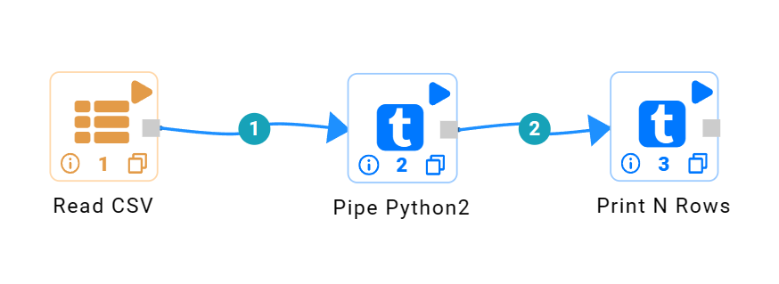
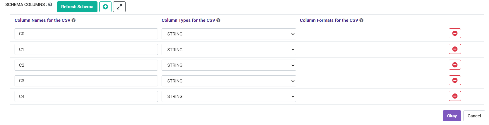

Pipe Python2 Processor
=====================

Fire Insights has a Pipe Python2 Processor.

It pipes the incoming DataFrame through pipe to the Python Script. It also passes the Schema of the DataFrame to the Python script through the command line argument. (argv[1])

The Python script is written in the Workflow Editor.

Below is an example workflow containing Pipe Python2 Processor.

Input DataFrame Schema
-----------------------

The schema of the incoming DataFrame is also passed into the Python script as an argument. It can be used in the Python script as needed.

The format of the DataFrame schema is below::

    colname1:datatype1|colname2:datatype2|colname3:datatype3
    
Below is an example of printing the arguments and an example result::

    print "The arguments are: " , str(sys.argv)

    ['/tmp/fire/scripts/pipepython-1899418263068404925.py', 'id:DoubleType|label:DoubleType|f1:DoubleType|f2:DoubleType']
    
   
Reading in Data in Python into a Pandas DataFrame
-------------------------------------------------

Below is an example script which reads in the input lines and converts it to a Pandas DataFrame. It parses the schema passed in argv[1] to extract the column names which is used in creating the Pandas DataFrame::

    #!/usr/bin/python

    import sys
    import pandas as pd

    dataframe_list_of_rows = []

    for line in sys.stdin:

        line = line.strip()
        if not line:
            continue

        row_list = []
        for field in line.split(","):
            row_list.append(field)

        # convert list to tuple
        row_tuple = tuple(row_list)
        dataframe_list_of_rows.append(row_tuple)

    # generate column names
    schema = sys.argv[1]
    column_names = []
    schema_columns = schema.split("|")
    for column_name_with_type in schema_columns:
        column_name_with_type_split = column_name_with_type.split(":")
        column_names.append(column_name_with_type_split[0])

    # create dataframe from the input rows
    input_dataframe = pd.DataFrame.from_records(dataframe_list_of_rows, columns=column_names)

Transform the Pandas DataFrame
------------------------------

Now that we have the Pandas DataFrame in input_dataframe, we can transform it to create the result DataFrame - output_dataframe. In the below example, we are just setting the output DataFrame to the input DataFrame::

   output_dataframe = input_dataframe

Writing the Pandas DataFrame schema back to Spark
-------------------------------------------------

Below is an example code for writing the Pandas Schema back to Spark. It is used in inferring the schema output of the Python code. This way users do not have to reenter the schema of the output in the Workflow::

   dataframe_dtypes = output_dataframe.dtypes

   f = open(sys.argv[2],'w+')
   f.write(str(dataframe_dtypes))
   f.close()

Fire expects each line of the schema file to contain the following:

   * Name of the column.
   * Data Type of the column.

There can be multiple spaces between the name and the data type.

Fire uses the below for mapping from the data type to Spark DataFrames Data Types:

   * int : integer
   * float : float
   * double : double
   * boolean : boolean
   * string : string
            

Writing the Pandas DataFrame back to Spark
------------------------------------------

Below is an example code for writing the Pandas DataFrame back to Spark::

   # iterate over the dataframe created and return it to the pipeNode
   for index, row in output_dataframe.iterrows():
     list = row.tolist()
     row_string = ','.join(str(e) for e in list)
     print(row_string)
            
            
  
  
Output Schema of the Python Script
----------------------------------

The output schema of the Python Script is written to a file which is read by the Spark Code. Clicking on **Refresh Schema** infers the Python Schema output into Spark.

   
   
