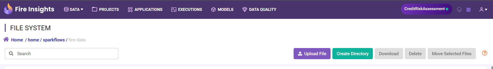
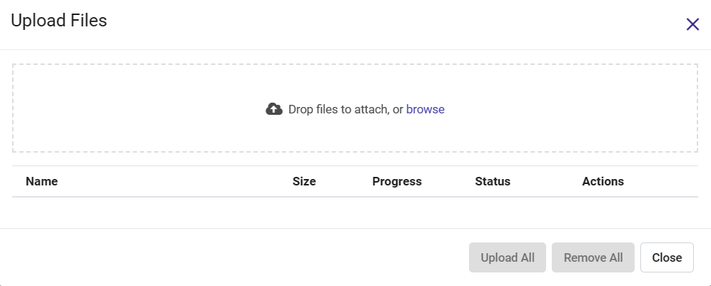
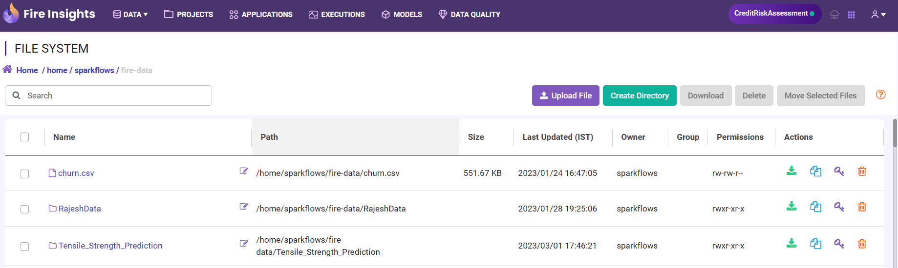

Step 2 : Upload Data Files
===========================

The workflow needs data to work on. As the next step, you will upload a data file that you want to process in your workflow.

Go to the Filesystem Page and Upload File
-------------

If your data is in a CSV file, click on ``DATA`` in top menu. Depending on the File Systems configured, you would see one or more of ``FileSystem``, ``HDFS``, ``DBFS``, ``S3``. Select the appropriate one from the menu depending on where you want to upload your data files.

 
 

Choose files to upload
--------

Click on the ``Upload File`` button. Choose one or more CSV files that you want to upload. 

 

Finally Upload the files
---------

After selecting the files, click ``Upload All``. You can view the uploaded file on File System page.

   

To use CSV files in the workflow, Fire Insights also allows you to wrap them in datasets. In the next step, you will create datasets from the files you have just uploaded.   
