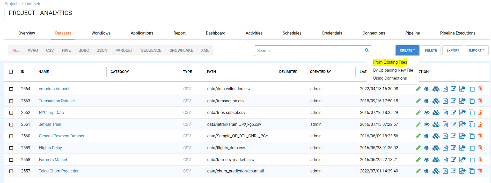
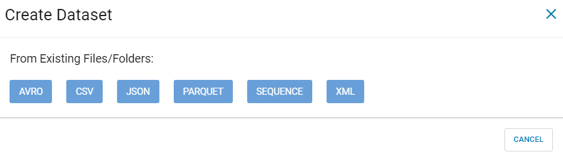
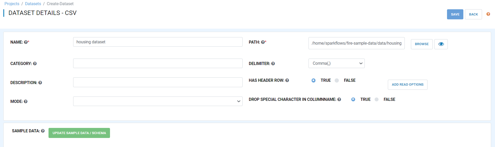
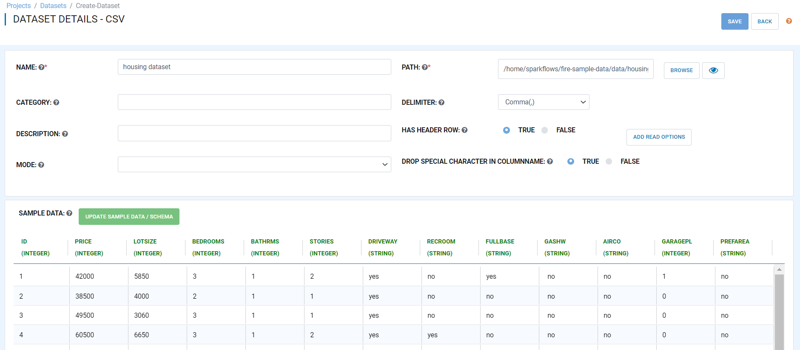

Step 3 : Create Dataset
=========================

To use a dataset in multiple projects/use-cases, it is ideal to wrap it into a dataset. This allows the schema and other meta-info of the data to be defined in one place. Now, we can wrap the CSV file uploaded in the previous step into a dataset. 

The steps involved in creating a dataset are:

- *Open the project where you want to create a dataset*.
- *Click on the 'Datasets' tab*.
- *Click on 'Create' and choose the option through which you want to create 'Datasets'*.
- *Select your dataset type and enter the fields in the dialog*.
- *Update the schema of the dataset*.
- *Click on 'Save'*.
  
When you open your project, you can see the list of all the datasets that belong to this project under the 'Datasets' tab.
 
.. figure:: ../../_assets/tutorials/dataset/new_dataset_page6.PNG
   :alt: Dataset
   :width: 90%

Click on 'Create' and choose the option through which you want to create 'Datasets' from the dropdown. 

Fire Insights enable you to create 'dataset' using any one option ie 'From Existing Files', 'By UPloading New File' or 'Using Connections' available.

Choose 'From Existing Files' option.
 

In the pop-up choose 'CSV' and then click 'OK'.
 

Fill in the required fields as below:

- *Name*: Name of the new dataset. 
- *Description*: Description of the new dataset.
- *Has Header Row*: Indicates whether the dataset has a header row specifying the name of the columns or not.
- *Delimiter*: Indicates the delimiter to be used between the fields in the data.
- *Path*: Path for the location of the file or directory containing the data files for the dataset.
- *DROP SPECIAL CHARACTER IN COLUMNNAME*: Indicate whether the dataset Dataset should drop special character in columnname .

 

 
Now click on 'Update dataset/schema' to update the schema of the dataset. Sample data for the dataset will be displayed followed by the schema.

In the example below, a dataset is created from a housing.csv file. It is a comma-separated file with a header row specifying the names of the various columns.
You can view the file by clicking 'View' file button next to 'Browse'.
 
.. figure:: ../../_assets/tutorials/dataset/2.PNG
   :alt: Dataset
   :width: 90%
   

If the data file did not have a header row, Fire Insights will give dummy column names like 'C0, C1', etc.

You can update the column names in the schema based on your data.
 
.. figure:: ../../_assets/tutorials/dataset/4.PNG
   :alt: Dataset
   :width: 90%
  

Now click 'Save' to save the new dataset and you are ready to use it in your workflows.

 
 
 
 
 
 
 
 

