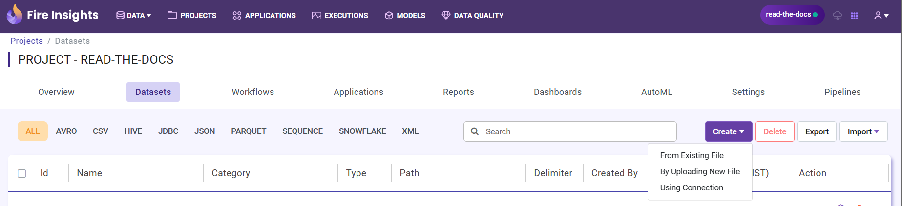
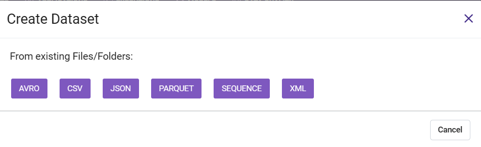
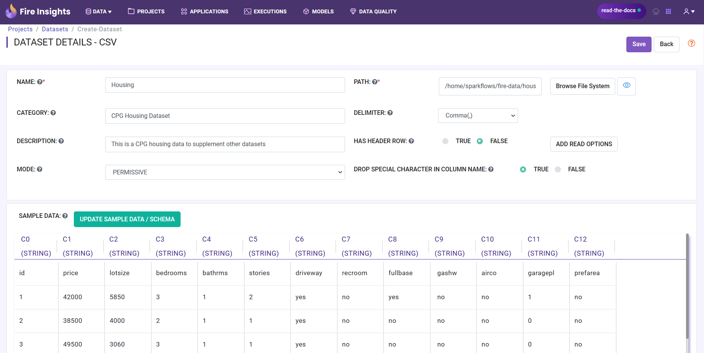
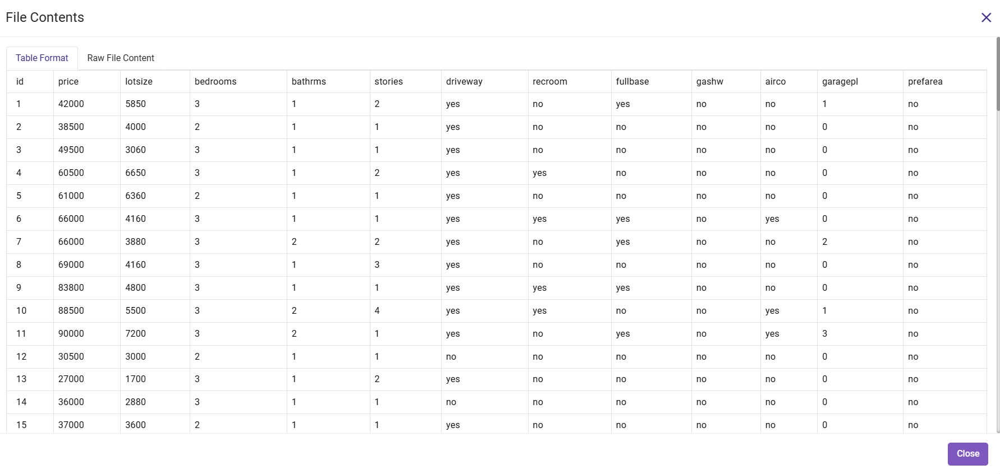
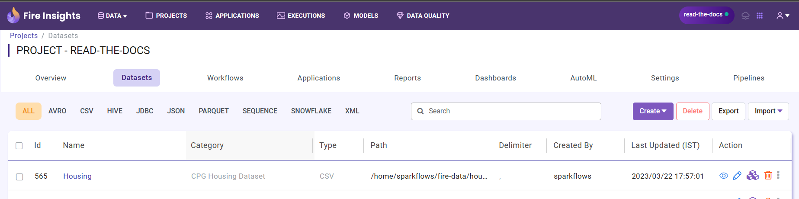

Step 3 : Create Dataset
---------

To use a data file in multiple projects, it is ideal to wrap it into a dataset. Dataset allows the schema and other meta information of the data to be defined in one place.

The steps involved in creating a dataset are:

* Open the project where you want to create a dataset.
* Click on the ``Datasets`` tab.
* Click on ``Create`` and choose one of the option from the dropdown to create a ``Dataset``.
* Select your dataset type and enter the fields in the dialog box.
* Update the schema of the dataset.
* Click on ``Save``.

This page shows the detailed steps for creating a Dataset.

Click on Create button
=============

Click on ``Create`` and choose the option from the dropdown to create the ``Dataset``. Fire Insights enables you to create ``Dataset`` using three options namely ``From Existing Files``, ``By Uploading New File`` and ``Using Connections``. Here, we choose ``From Existing Files`` option.
 

In the pop-up choose ``CSV`` and then click ``OK``
===============
 

Fill in the required fields as below
===============

  * ``Name``: Name of the new dataset. 
  * ``Category``: An apt category that you want to tag the dataset to.
  * ``Description``: Description of the new dataset.
  * ``Mode``: Choose the mode to mark the strictness of parsing of the data file.
  * ``Has Header Row``: Indicates whether the dataset has a header row specifying the names of the columns or not.
  * ``Delimiter``: Indicates the delimiter to be used between the fields in the data.
  * ``Path``: Path for the location of the file or directory containing the data files for the dataset.
  * ``Drop Sepcial Character in Column Name``: Indicate whether the dataset should drop special character in column name.  
 
Now click on ``Update Dataset/Schema`` to update the schema of the dataset
===========

Sample data for the dataset will be displayed followed by the schema.

In the example, a dataset is created from a file named ``housing.csv`` . It is a comma separated file with a header row specifying the names of the various columns.You can view the file by clicking ``Eye icon`` button next to ``Browse``. If the data file does not have a header row, Fire Insights will give dummy column names like ``C0``, ``C1``, etc. You can update the column names in the schema based on your data.
 

  

Now click ``Save`` to save the new dataset
=======

After successfully saving the dataset, you are ready to use it in your workflows.

See Datasets list under ``Datasets Tab``
======== 
 
One can see the list of all the datasets that belong to the project under the Datasets tab.

 
 
 
 
 
 
 
 

