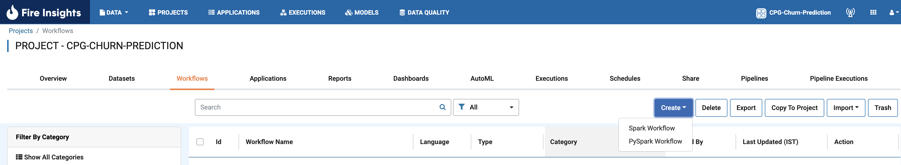
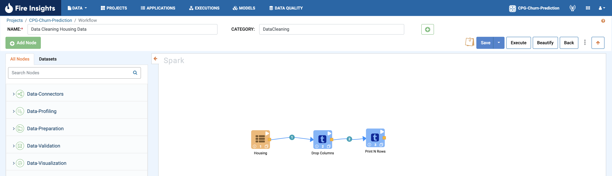

Step 4 : Create Workflow
------------

A typical workflow takes one or more datasets, cleans them, joins them and creates an enriched dataset. After the enriched dataset is created, you can add additional processors to build machine learning models.

The steps invoved in creating a workflow are: 

* Click on the ``Workflows`` tab in the Project.
* Create the empty workflow.
* Add the processors.
* Save the Workflow.

Workflows Tab
============================
Click the ``Workflows`` tab in the ``Project`` to view the list of workflows already in the project. The workflow list will be empty if no workflows have been created in the porject. 

Create Empty Workflow
========================

Click the ``Create`` button and choose the type of workflow you want to create. Then, enter the ``Name``, ``Category``, and ``Description`` for the workflow. The category is used to group various workflows. For instance, if you have several workflows for customer reports, you can group them by specifying the 'Customer Reports' category.

Click ``Save`` to save the empty workflow.

Add Processors
===================

After you have saved the empty workflow, you can start adding processors to process the datasets that you defined earlier. Click on the processors on the left-hand side pane. This will make the processor appear on the workflow canvas. Add other processors, configure and connect them as needed.  Two processors can be connected by clicking on the yellow box in the first processor and dragging it to the second processor. Can even search by name of processors.

Save Workflow
=================

Once your pipeline of processors are built, save the workflow by clicking on the ``Save`` button.

Each time the workflow is saved, a new version of the workflow is created.

