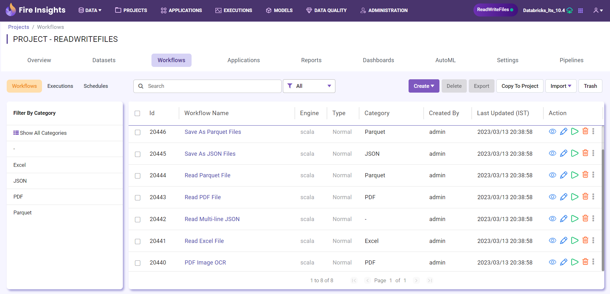
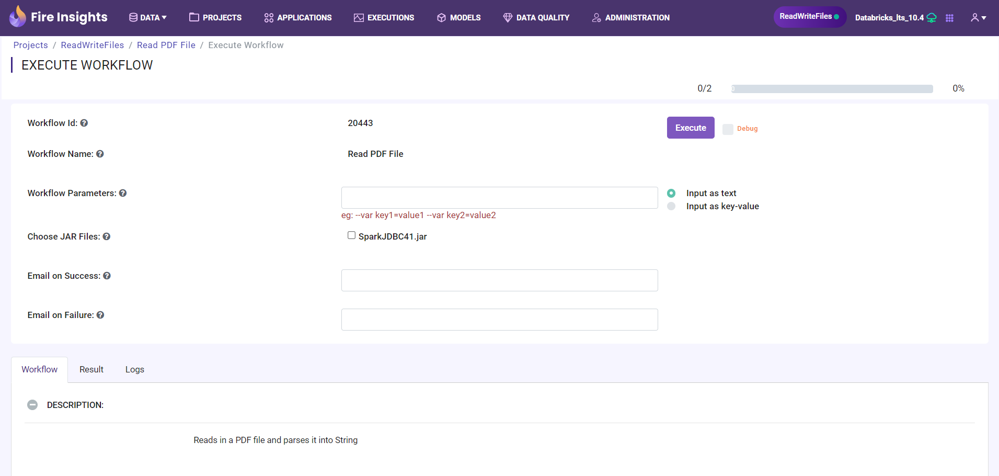

Step 5 : Execute Workflow
----------------------

After you have created a workflow, it is time to execute it and view the results. 

The steps involved in executing a workflow are: 

* Click on the ``Workflows`` tab.
* Click on the ``Play`` button.
* Specify the parameters, if any.
* Click on ``Execute``.

Go to the Workflows tab
============================

Click the ``Workflows`` tab to view the list of workflows in the project. 

Go to the Workflow Execute Page
========================

For each workflow, there is a list of ``Actions`` to trigger a specific functionality.

Click the ``Play`` action icon to execute the workflow.

Specify the execution parameters
======================

Specify any parameters for your workflow. 

Execute the Workflow
================

Once you have specified the parameters, click on the ``Execute`` button. The result of execution are streamed back into your browser.

