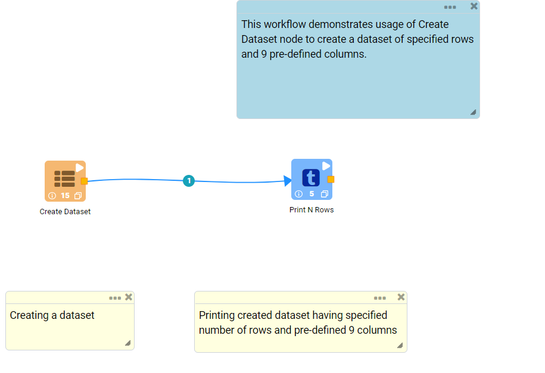
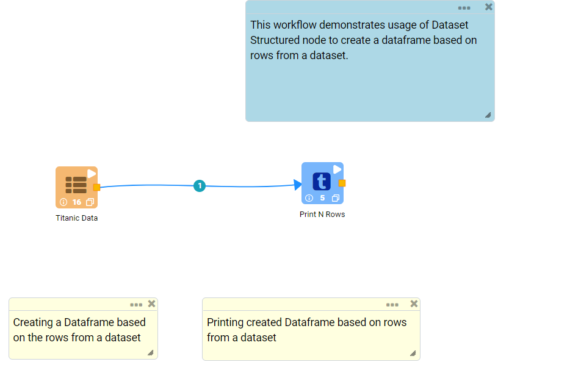
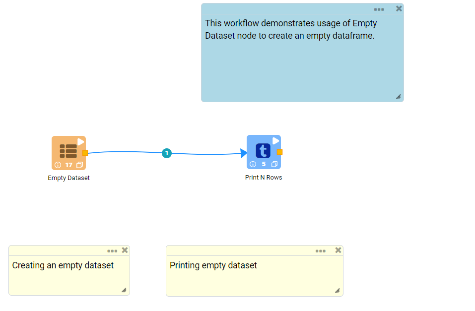
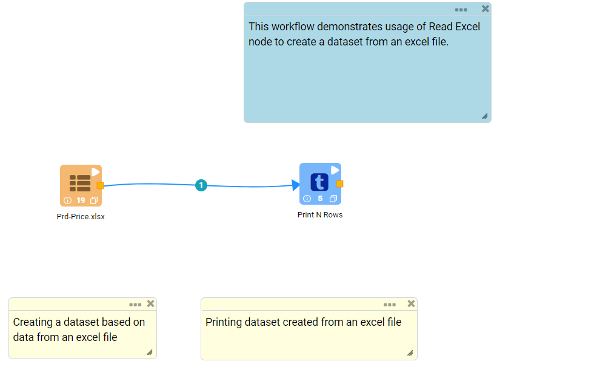
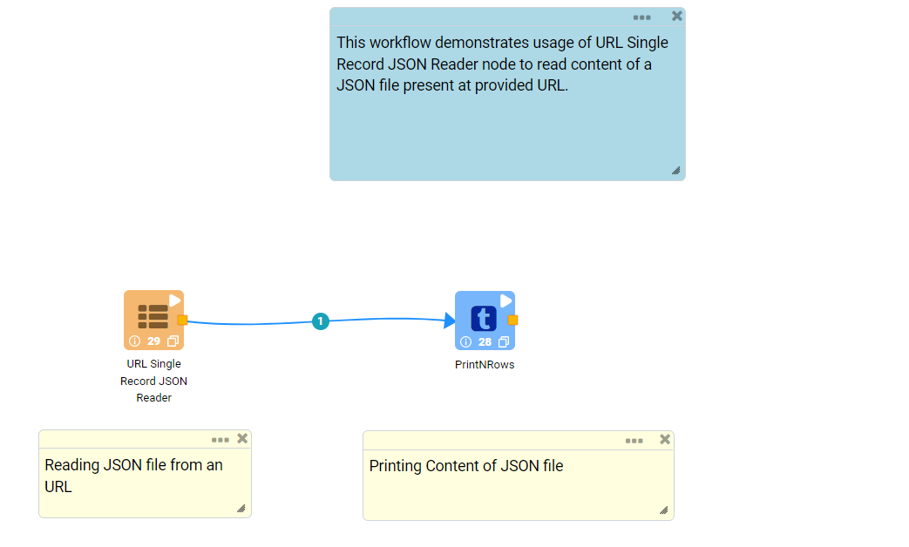
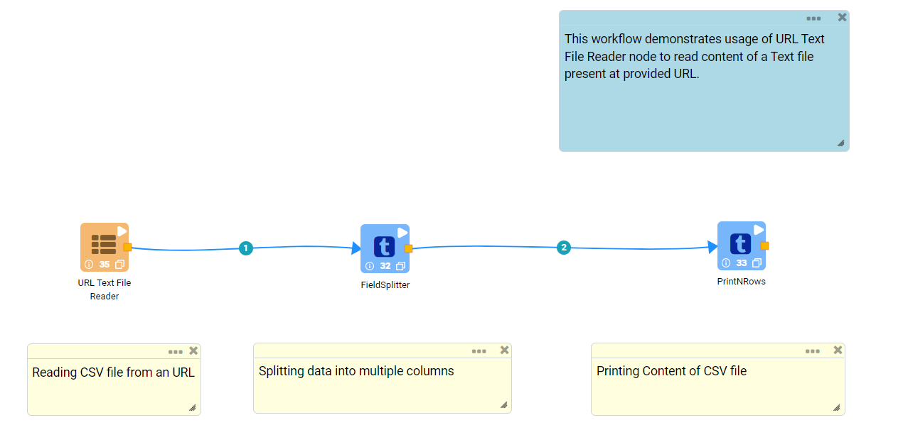

Read Structured files
==========

Fire Insights provides a number of Processors for reading structured data from files.

Read Structured Data from Files Processors in Fire Insights
----------------------------------------

.. list-table:: Read structured files Processors
   :widths: 30 70
   :header-rows: 1

   * - Title
     - Description
   * - Create Dataset
     - Creates a dataset of specified rows and 9 pre-defined columns
   * - Dataset Structured
     - Creates a dataframe based on rows from a dataset
   * - Empty Dataset
     - Creates an empty dataframe
   * - Read Excel
     - Creates a dataset from an excel file
   * - Read Avro
     - Reads Apache Avro files
   * - Read CSV
     - Reads CSV Files
   * - Read Parquet
     - Reads Parquet files
   * - Read JSON
     - Reads JSON files
   * - URL Single Record JSON Reader
     - Reads content of a JSON file present at provided URL.
   * - URL Text File Reader
     - Reads content of a Text file present at provided URL.     

Create Dataset
----------------------------------------

Below is a sample workflow which contains ``Create Dataset`` processor in Fire Insights. It demonstrates usage of ``Create Dataset`` node to create a dataset of specified rows and 9 pre-defined columns.

It does following processing of data:

*	Creates a dataset of specified rows and 9 pre-defined columns using ``Create Dataset`` node.
*	Prints created dataset.

   
**Create Dataset Node configuration**

*	``Create Dataset`` node is configured as below.
*	Number of rows needed in the created dataset is to be entered in ``Number Of Rows`` box.
*	Output prints dataset created with specified number of rows and fixed 9 columns.

.. figure:: ../../_assets/user-guide/read-write/read-structured/createdataset-config.png
   :alt: readwrite_userguide
   :width: 90%
   
**Create Dataset Node output**

Output of ``Create Dataset`` node prints dataset created with specified number of rows and fixed 9 columns.

.. figure:: ../../_assets/user-guide/read-write/read-structured/createdataset-printnode-output.png
   :alt: readwrite_userguide
   :width: 90%       	    

Dataset Structured
----------------------------------------

Below is a sample workflow which contains ``Dataset Structured`` processor in Fire Insights. It demonstrates usage of ``Dataset Structured`` node to create a dataframe based on rows from a dataset.

It does following processing of data:

*	Creates a dataframe based on rows from a dataset using ``Dataset Structured`` node.
*	Prints created dataset.

   
**Dataset Structured Node configuration**

*	``Dataset Structured`` node is configured as below.
*	Dataset to be be used to create dataframe is to be selected in ``Dataset`` list.
*	Output prints dataframe created based on data from the selected dataset.

.. figure:: ../../_assets/user-guide/read-write/read-structured/datasetstructured-config.png
   :alt: readwrite_userguide
   :width: 90%
   
**Dataset Structured Node output**

Output of ``Dataset Structured`` node prints dataframe created based on data from the selected dataset.

.. figure:: ../../_assets/user-guide/read-write/read-structured/datasetstructured-printnode-output.png
   :alt: readwrite_userguide
   :width: 90%       	    

Empty Dataset
----------------------------------------

Below is a sample workflow which contains ``Empty Dataset`` processor in Fire Insights. It demonstrates usage of ``Empty Dataset`` node to create an empty dataframe.

It does following processing of data:

*	Creates an empty dataframe using ``Empty Dataset`` node.
*	Created dataset contains no rows or columns hence it is not displayed in the output.

   
**Empty Dataset Node configuration**

*	``Empty Dataset`` node is configured as below.

.. figure:: ../../_assets/user-guide/read-write/read-structured/emptydataset-config.png
   :alt: readwrite_userguide
   :width: 90%
   
Read Excel
----------------------------------------

Below is a sample workflow which contains ``Read Excel`` processor in Fire Insights. It demonstrates usage of ``Read Excel`` node to create a dataset from an excel file.

It does following processing of data:

*	Creates a dataset from an excel file using ``Dataset Structured`` node.
*	Prints created dataset.

   
**Read Excel Node configuration**

*	``Read Excel`` node is configured as below.
*	Excel file location needs to be selected or entered in ``Path`` box.
*	Sheet Name in the Excel file that needs to be used to create dataset is to be entered in ``Sheetname`` box.
*	If Data Sheet contains header row then ``Header`` needs to be selected accordingly.
*	Output prints dataframe created based on data from the selected excel file.

.. figure:: ../../_assets/user-guide/read-write/read-structured/readexcel-config.png
   :alt: readwrite_userguide
   :width: 90%
   
**Read Excel Node output**

Output of ``Read Excel`` node prints dataframe created based on data from the selected excel file.

.. figure:: ../../_assets/user-guide/read-write/read-structured/readexcel-printnode-output.png
   :alt: readwrite_userguide
   :width: 90%       	    

Read Avro
----------------------------------------

Below is a sample workflow which contains ``Read Avro`` processor in Fire Insights. It demonstrates usage of ``Read Avro`` node to read an Avro Data file.

It does following processing of data:

*	Reads incoming Dataset in ``Avro Data File`` format using ``Read Avro`` node.
* 	Prints content of Avro file using Print node

.. figure:: ../../_assets/user-guide/read-write/read-structured/readavro-demo-workflow.png
   :alt: readavro_node_userguide
   :width: 70%
   

**Read Avro Node configuration**

*	Reads an ``Avro Data File`` using ``Read Avro`` node.
*	An ``Avro Data File`` needs to be selected in ``Path``. ``Browse HDFS`` option can be used to browse and select an Avro file from HDFS.
*	Once an Avro file is selected ``Refresh Schema`` button needs to be clicked to list Schema defined in the ``Avro Data File`` 
*	``OK`` button needs to be clicked to complete configuration.

.. figure:: ../../_assets/user-guide/read-write/read-structured/readavro-configuration.png
   :alt: readavro_node_userguide
   :width: 90%

**Read Avro Node output**

Data read from ``Avro Data File`` is printed as below using Print node

.. figure:: ../../_assets/user-guide/read-write/read-structured/readavro-printnode-output.png
   :alt: readavro_node_userguide
   :width: 90%
   
Read CSV
----------------------------------------

Below is a sample workflow which contains ``Read CSV`` processor in Fire Insights. It demonstrates usage of ``Read CSV`` File node to read a CSV file.

It does following processing of data:

*	Reads incoming Dataset in ``CSV Data`` format using ``Read CSV`` node.
* 	Prints content of CSV file using Print node

.. figure:: ../../_assets/user-guide/read-write/read-structured/readcsv-demo-workflow.png
   :alt: readcsv_node_userguide
   :width: 70%
   

**Read CSV Node configuration**

*	Reads a ``CSV Data File`` using ``Read CSV`` node.
*	A ``CSV Data File`` needs to be selected in ``Path``. ``Browse HDFS`` option can be used to browse and select a CSV file from HDFS.
*	Delimiter or Character used to separate two columns' data needs to be selected in ``Separator``. In most of the cases ``,`` / comma is used to separate two columns.
*	``Header`` needs to be selected as ``True`` or ``False`` based on whether data file contains header row that can be used in imported dataset.
*	Once a CSV file is selected ``Refresh Schema`` button needs to be clicked to list Schema defined in the ``CSV Data File`` 
*	``OK`` button needs to be clicked to complete configuration.

.. figure:: ../../_assets/user-guide/read-write/read-structured/readcsv-configuration.png
   :alt: readcsv_node_userguide
   :width: 90%

**Read CSV Node output**

Data read from ``CSV Data File`` is printed as below using Print node

.. figure:: ../../_assets/user-guide/read-write/read-structured/readcsv-printnode-output.png
   :alt: readcsv_node_userguide
   :width: 90%
   
Read Parquet
----------------------------------------

Below is a sample workflow which contains ``Read Parquet`` processor in Fire Insights. It demonstrates usage of ``Read Parquet`` node to read a Parquet file.

It does following processing of data:

*	Reads incoming Dataset in ``Parquet Data File`` format using ``Read Parquet`` node.
* 	Prints content of Parquet file using Print node

.. figure:: ../../_assets/user-guide/read-write/read-structured/readparquet-demo-workflow.png
   :alt: readparquet_node_userguide
   :width: 70%
   

**Read Parquet Node configuration**

*	Reads a ``Parquet Data File`` using ``Read Parquet`` node.
*	A ``Parquet Data File`` needs to be selected in ``Path``. ``Browse HDFS`` option can be used to browse and select a Parquet file from HDFS.
*	Once a Parquet file is selected ``Refresh Schema`` button needs to be clicked to list Schema defined in the ``Parquet Data File`` 
*	``OK`` button needs to be clicked to complete configuration.

.. figure:: ../../_assets/user-guide/read-write/read-structured/readparquet-configuration.png
   :alt: readparquet_node_userguide
   :width: 90%

**Read Parquet Node output**

Data read from ``Parquet Data File`` is printed as below using Print node

.. figure:: ../../_assets/user-guide/read-write/read-structured/readparquet-printnode-output.png
   :alt: readparquet_node_userguide
   :width: 90%
   
Read JSON
----------------------------------------

Below is a sample workflow which contains ``Read JSON`` processor in Fire Insights. It demonstrates usage of ``Read JSON`` node to read a JSON file.

It does following processing of data:

*	Reads incoming Dataset in ``JSON File`` format using ``Read JSON`` node.
* 	Prints content of JSON file using Print node

.. figure:: ../../_assets/user-guide/read-write/read-structured/readjson-demo-workflow.png
   :alt: readjson_node_userguide
   :width: 70%
   

**Read JSON Node configuration**

*	Reads a ``JSON File`` using ``Read JSON`` node.
*	A ``JSON Data File`` needs to be selected in ``Path``. ``Browse HDFS`` option can be used to browse and select a JSON file from HDFS.
*	If a record data in the JSON file is present in multiple lines then ``Multiline`` needs to be selected as ``True``
*	Once a JSON file is selected ``Refresh Schema`` button needs to be clicked to list Schema defined in the ``JSON Data File`` 
*	``OK`` button needs to be clicked to complete configuration.

.. figure:: ../../_assets/user-guide/read-write/read-structured/readjson-configuration.png
   :alt: readjson_node_userguide
   :width: 90%

**Read JSON Node output**

Data read from ``JSON File`` is printed as below using Print node

.. figure:: ../../_assets/user-guide/read-write/read-structured/readjson-printnode-output.png
   :alt: readjson_node_userguide
   :width: 90%
   
URL Single Record JSON Reader
----------------------------------------

Below is a sample workflow which contains ``URL Single Record JSON Reader`` processor in Fire Insights. It demonstrates usage of ``URL Single Record JSON Reader`` node to read content of a JSON file present at provided URL.

It does following processing of data:

*	Reads content of a JSON file present at provided URL using ``URL Single Record JSON Reader`` node.
*	Prints content of JSON file in tabular format.

   
**URL Single Record JSON Reader Node configuration**

*	``URL Single Record JSON Reader`` node is configured as below.
*	URL address containing JSON file needs to be entered in ``URL`` box. 
*	``Refresh Schema`` button needs to be pressed to list schema of the JSON file.
*	Output prints content of JSON file in tabular format.

.. figure:: ../../_assets/user-guide/read-write/read-structured/urljson-config.png
   :alt: readwrite_userguide
   :width: 90%
   
**URL Single Record JSON Reader Node output**

Output of ``URL Single Record JSON Reader`` node prints content of JSON file in tabular format.

.. figure:: ../../_assets/user-guide/read-write/read-structured/urljson-printnode-output.png
   :alt: readwrite_userguide
   :width: 90%       	    

URL Text File Reader
----------------------------------------

Below is a sample workflow which contains ``URL Text File Reader`` processor in Fire Insights. It demonstrates usage of ``URL Text File Reader`` node to read content of a Text file present at provided URL.

It does following processing of data:

*	Reads content of a Text file present at provided URL using ``URL Text File Reader`` node.
*	Prints content of Text file in tabular format.

   
**URL Text File Reader Node configuration**

*	``URL Text File Reader`` node is configured as below.
*	URL address containing Text file needs to be entered in ``URL`` box. 
*	Output prints content of Text file in tabular format.

.. figure:: ../../_assets/user-guide/read-write/read-structured/urltext-config.png
   :alt: readwrite_userguide
   :width: 90%
   
**URL Text File Reader Node output**

Output of ``URL Text File Reader`` node prints content of Text file in tabular format.

.. figure:: ../../_assets/user-guide/read-write/read-structured/urltext-printnode-output.png
   :alt: readwrite_userguide
   :width: 90%       	    
