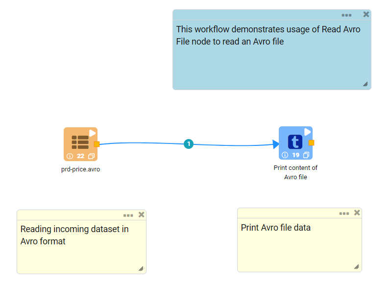
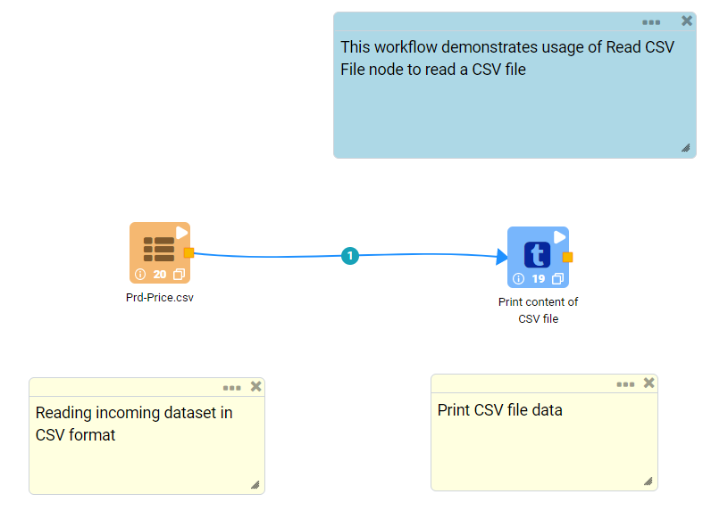
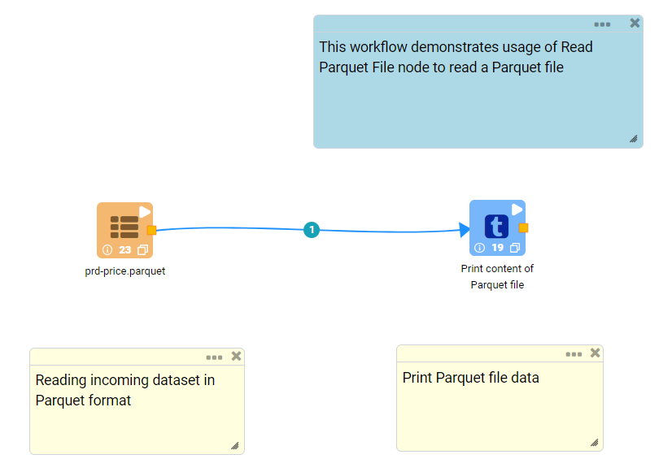
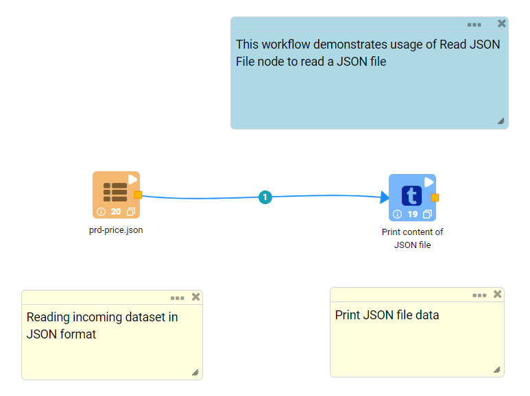

Read Structured files
==========

Fire Insights provides a number of Processors for reading structured data from files.

Read Structured Data from Files Processors in Fire Insights
----------------------------------------

.. list-table:: Read structured files Processors
   :widths: 30 70
   :header-rows: 1

   * - Title
     - Description
   * - Read Avro
     - Reads Apache Avro files
   * - Read CSV
     - Reads CSV Files
   * - Read Parquet
     - Reads Parquet files
   * - Read JSON
     - Reads JSON files

Read Avro
----------------------------------------

Below is a sample workflow which contains ``Read Avro`` processor in Fire Insights. It demonstrates usage of ``Read Avro`` node to read an Avro Data file.

It does following processing of data:

*	Reads incoming Dataset in ``Avro Data File`` format using ``Read Avro`` node.
* 	Prints content of Avro file using Print node

   

**Read Avro Node configuration**

*	Reads an ``Avro Data File`` using ``Read Avro`` node.
*	An ``Avro Data File`` needs to be selected in ``Path``. ``Browse HDFS`` option can be used to browse and select an Avro file from HDFS.
*	Once an Avro file is selected ``Refresh Schema`` button needs to be clicked to list Schema defined in the ``Avro Data File`` 
*	``OK`` button needs to be clicked to complete configuration.

.. figure:: ../../_assets/user-guide/read-write/read-structured/readavro-configuration.png
   :alt: readavro_node_userguide
   :width: 90%

**Read Avro Node output**

Data read from ``Avro Data File`` is printed as below using Print node

.. figure:: ../../_assets/user-guide/read-write/read-structured/readavro-printnode-output.png
   :alt: readavro_node_userguide
   :width: 90%
   
Read CSV
----------------------------------------

Below is a sample workflow which contains ``Read CSV`` processor in Fire Insights. It demonstrates usage of ``Read CSV`` File node to read a CSV file.

It does following processing of data:

*	Reads incoming Dataset in ``CSV Data`` format using ``Read CSV`` node.
* 	Prints content of CSV file using Print node

   

**Read CSV Node configuration**

*	Reads a ``CSV Data File`` using ``Read CSV`` node.
*	A ``CSV Data File`` needs to be selected in ``Path``. ``Browse HDFS`` option can be used to browse and select a CSV file from HDFS.
*	Delimiter or Character used to separate two columns' data needs to be selected in ``Separator``. In most of the cases ``,`` / comma is used to separate two columns.
*	``Header`` needs to be selected as ``True`` or ``False`` based on whether data file contains header row that can be used in imported dataset.
*	Once a CSV file is selected ``Refresh Schema`` button needs to be clicked to list Schema defined in the ``CSV Data File`` 
*	``OK`` button needs to be clicked to complete configuration.

.. figure:: ../../_assets/user-guide/read-write/read-structured/readcsv-configuration.png
   :alt: readcsv_node_userguide
   :width: 90%

**Read CSV Node output**

Data read from ``CSV Data File`` is printed as below using Print node

.. figure:: ../../_assets/user-guide/read-write/read-structured/readcsv-printnode-output.png
   :alt: readcsv_node_userguide
   :width: 90%
   
Read Parquet
----------------------------------------

Below is a sample workflow which contains ``Read Parquet`` processor in Fire Insights. It demonstrates usage of ``Read Parquet`` node to read a Parquet file.

It does following processing of data:

*	Reads incoming Dataset in ``Parquet Data File`` format using ``Read Parquet`` node.
* 	Prints content of Parquet file using Print node

   

**Read Parquet Node configuration**

*	Reads a ``Parquet Data File`` using ``Read Parquet`` node.
*	A ``Parquet Data File`` needs to be selected in ``Path``. ``Browse HDFS`` option can be used to browse and select a Parquet file from HDFS.
*	Once a Parquet file is selected ``Refresh Schema`` button needs to be clicked to list Schema defined in the ``Parquet Data File`` 
*	``OK`` button needs to be clicked to complete configuration.

.. figure:: ../../_assets/user-guide/read-write/read-structured/readparquet-configuration.png
   :alt: readparquet_node_userguide
   :width: 90%

**Read Parquet Node output**

Data read from ``Parquet Data File`` is printed as below using Print node

.. figure:: ../../_assets/user-guide/read-write/read-structured/readparquet-printnode-output.png
   :alt: readparquet_node_userguide
   :width: 90%
   
Read JSON
----------------------------------------

Below is a sample workflow which contains ``Read JSON`` processor in Fire Insights. It demonstrates usage of ``Read JSON`` node to read a JSON file.

It does following processing of data:

*	Reads incoming Dataset in ``JSON File`` format using ``Read JSON`` node.
* 	Prints content of JSON file using Print node

   

**Read JSON Node configuration**

*	Reads a ``JSON File`` using ``Read JSON`` node.
*	A ``JSON Data File`` needs to be selected in ``Path``. ``Browse HDFS`` option can be used to browse and select a JSON file from HDFS.
*	If a record data in the JSON file is present in multiple lines then ``Multiline`` needs to be selected as ``True``
*	Once a JSON file is selected ``Refresh Schema`` button needs to be clicked to list Schema defined in the ``JSON Data File`` 
*	``OK`` button needs to be clicked to complete configuration.

.. figure:: ../../_assets/user-guide/read-write/read-structured/readjson-configuration.png
   :alt: readjson_node_userguide
   :width: 90%

**Read JSON Node output**

Data read from ``JSON File`` is printed as below using Print node

.. figure:: ../../_assets/user-guide/read-write/read-structured/readjson-printnode-output.png
   :alt: readjson_node_userguide
   :width: 90%
   
