Read Structured Files
==========

Fire Insights provides a number of Processors or Nodes for reading structured data from files.

Read Structured Data from Files Processors in Fire Insights
----------------------------------------

.. list-table:: Read structured files Processors
   :widths: 30 70
   :header-rows: 1

   * - Title
     - Description
   * - Create Dataset
     - It creates a dataset of specified rows and 9 pre-defined columns.
   * - Dataset Structured
     - It creates a DataFrame based on rows from a dataset.
   * - Empty Dataset
     - It creates an empty DataFrame.
   * - Read Excel
     - It creates a dataset from an Excel file.
   * - Read Avro
     - It reads Apache Avro files.
   * - Read CSV
     - It reads CSV Files.
   * - Read Parquet
     - It reads Parquet files.
   * - Read JSON
     - It reads JSON files.
   * - URL Single Record JSON Reader
     - It reads content of a JSON file present at the provided URL.
   * - URL Text File Reader
     - It reads the content of a Text file present at the provided URL.     

Create Dataset
----------------------------------------

Below is a sample workflow which contains the Create Dataset processor in Fire Insights. It demonstrates the usage of Create Dataset node to create a dataset of specified rows and 9 pre-defined columns.

It does the following processing of data:

*	Creates a dataset of specified rows and 9 pre-defined columns using Create Dataset node.
*	Prints the created dataset.

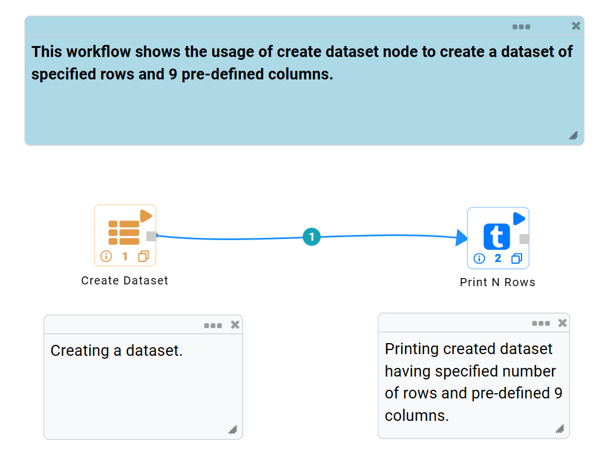
   
**Create Dataset node configuration**

The Create Dataset node is configured as below.

*	Number of rows needed in the created dataset is to be entered in ``Number Of Rows`` box.
*	Output prints the dataset created with specified number of rows and fixed 9 columns.

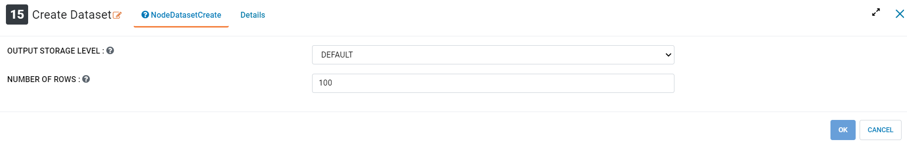
   
**Create Dataset node output**

Output of the Create Dataset node prints the dataset created with specified number of rows and fixed 9 columns.

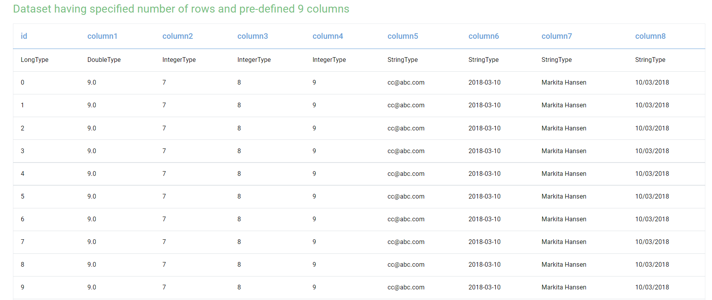

Dataset Structured
----------------------------------------

Below is a sample workflow which contains the Dataset Structured processor in Fire Insights. It demonstrates the usage of Dataset Structured node to create a DataFrame based on rows from a dataset.

It does the following processing of data:

*	Creates a DataFrame based on rows from a dataset using the Dataset Structured node.
*	Prints the created dataset.

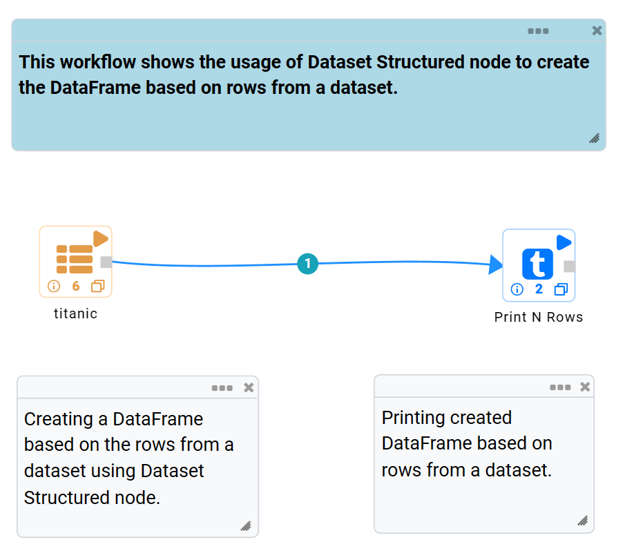
   
**Dataset Structured node configuration**

The Dataset Structured node is configured as below.

*	Dataset to be used to create DataFrame is to be selected in the ``Dataset`` list.
*	Output prints the DataFrame so created based on the data from the selected dataset.

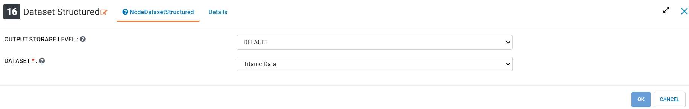
   
**Dataset Structured node output**

Output of the Dataset Structured node prints the DataFrame so created based on data from the selected dataset.

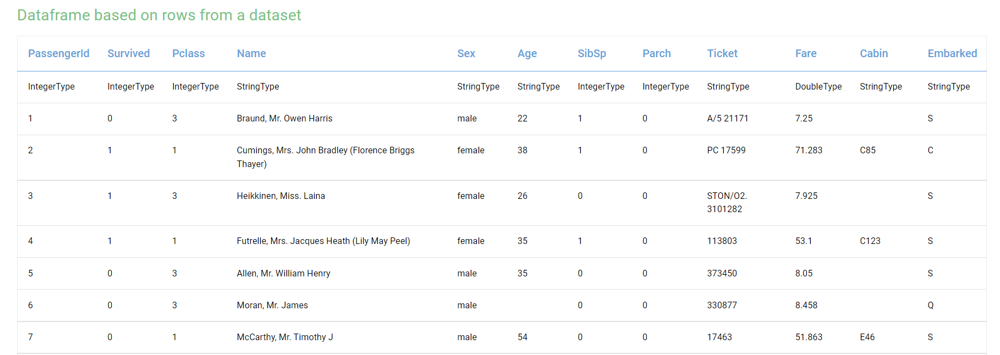

Empty Dataset
---------------------------------------

Below is a sample workflow which contains the Empty Dataset processor in Fire Insights. It demonstrates the usage of Empty Dataset node to create an empty DataFrame.

It does the following processing of data:

*	Creates an empty DataFrame using the Empty Dataset node.
*	Created dataset contains no rows or columns hence, it is not displayed in the output.

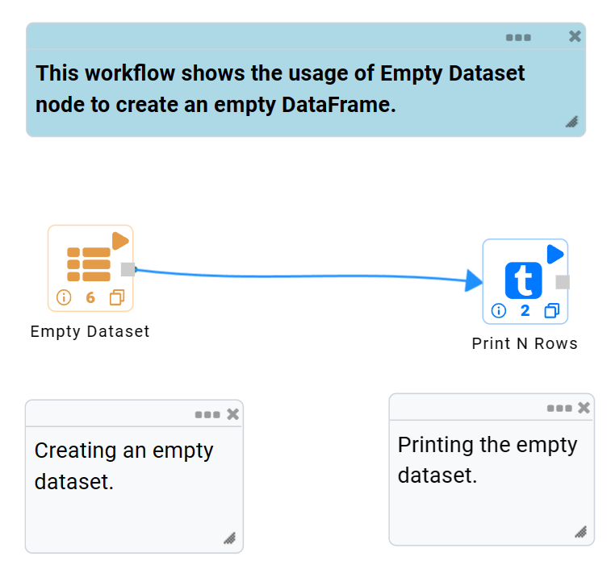
   
**Empty Dataset node configuration**

*	The Empty Dataset node is configured as below.

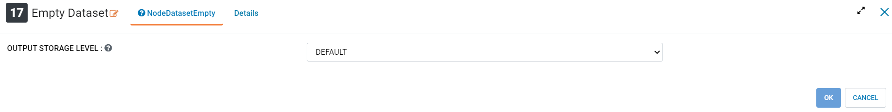
   
Read Excel
----------------------------------------

Below is a sample workflow which contains the Read Excel processor in Fire Insights. It demonstrates the usage of Read Excel node to create a dataset from an excel file.

It does the following processing of data:

*	Creates a dataset from an excel file using Dataset Structured node.
*	Prints the created dataset.

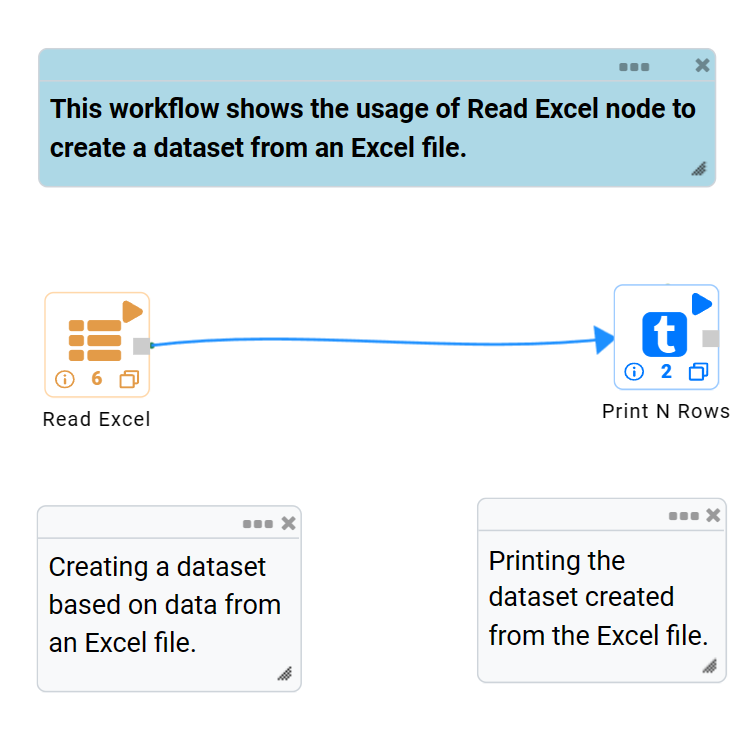
   
**Read Excel node configuration**

The Read Excel node is configured as below.

*	Excel file location needs to be selected or entered in the ``Path`` box.
*	Sheet Name in the Excel file that needs to be used to create dataset is to be entered in the ``Sheetname`` box.
*	If the Data Sheet contains header row then the ``Header`` needs to be selected accordingly.
*	Output prints the DataFrame so created based on data from the selected excel file.

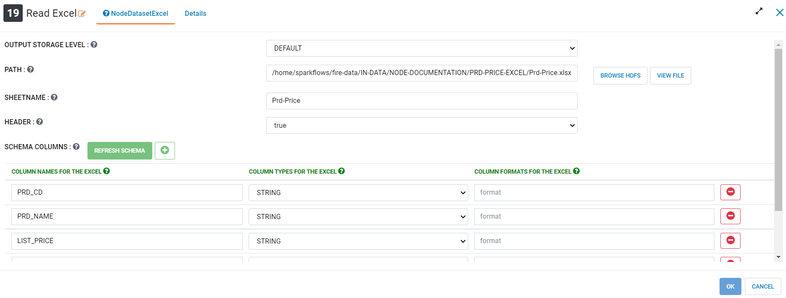
   
**Read Excel node output**

Output of the Read Excel node prints the DataFrame so created based on data from the selected excel file.

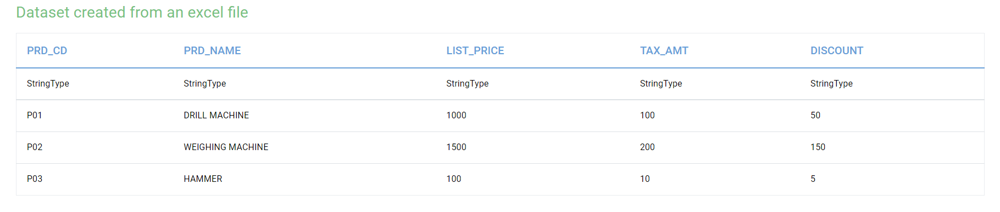

Read Avro
----------------------------------------

Below is a sample workflow which contains the Read Avro processor in Fire Insights. It demonstrates the usage of the Read Avro node to read an Avro Data file.

It does the following processing of data:

*	Reads incoming dataset in the Avro Data File format using the Read Avro node.
* 	Prints the content of Avro file using the Print node.

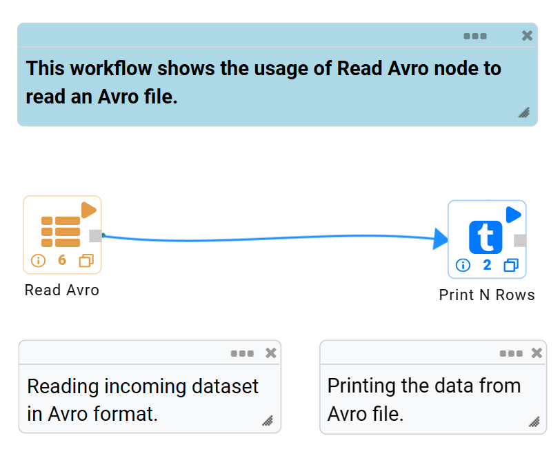
   

**Read Avro node configuration**

The Read Avro node is configured as below.

*	An ``Avro Data File`` needs to be selected in the ``Path``. The ``Browse HDFS`` option can be used to browse and select an Avro file from HDFS.
*	Once an Avro file is selected the ``Refresh Schema`` button needs to be clicked to list Schema defined in the ``Avro Data File``.
*	``OK`` button needs to be clicked to complete configuration.

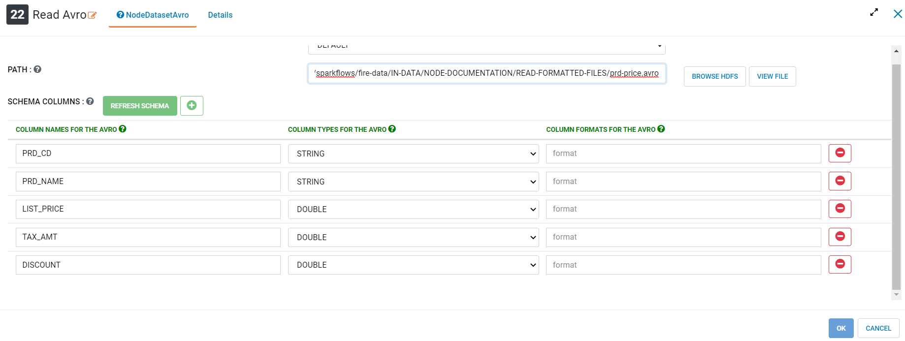

**Read Avro node output**

Data read from an ``Avro Data File`` is printed as below using the Print node.

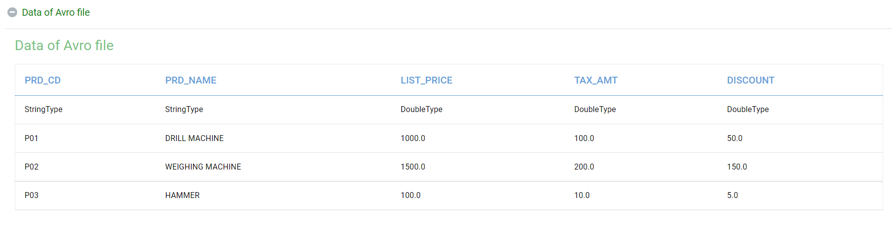
   
Read CSV
----------------------------------------

Below is a sample workflow which contains the Read CSV processor in Fire Insights. It demonstrates the usage of Read CSV File node to read a CSV file.

It does the following processing of data:

*	Reads incoming dataset in CSV Data format using the Read CSV node.
* 	Prints the content of the CSV file using the Print node.

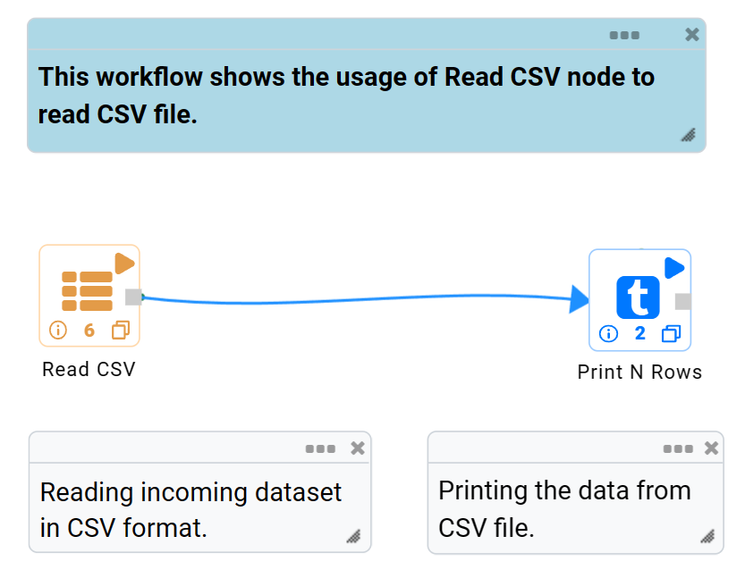
   

**Read CSV Node configuration**

The Read CSV node is configured as below.

*	A ``CSV Data File`` needs to be selected in the ``Path``. The ``Browse HDFS`` option can be used to browse and select a CSV file from HDFS.
*	A Delimiter or Character used to separate two columns' data needs to be selected in the ``Separator``. In most of the cases ``,`` / comma is used to separate two columns.
*	``Header`` needs to be selected as ``True`` or ``False`` based on whether data file contains header row that can be used in the imported dataset.
*	Once a CSV file is selected the ``Refresh Schema`` button needs to be clicked to list Schema defined in the ``CSV Data File``. 
*	``OK`` button needs to be clicked to complete the configuration.

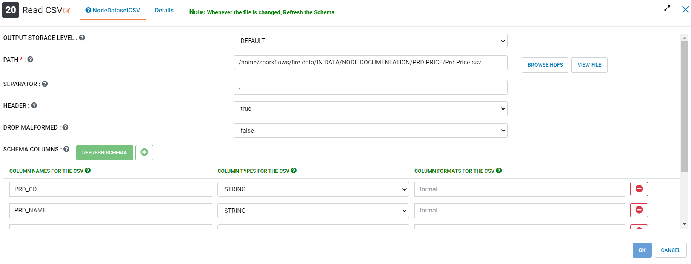

**Read CSV node output**

Data read from a CSV Data File is printed as below using the Print node.

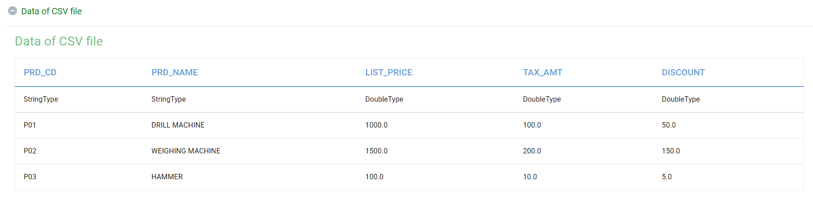
   
Read Parquet
----------------------------------------

Below is a sample workflow which contains Read Parquet processor in Fire Insights. It demonstrates usage of Read Parquet node to read a Parquet file.

It does following processing of data:

*	Reads incoming Dataset in Parquet Data File format using Read Parquet node.
* 	Prints the content of Parquet file using Print node.

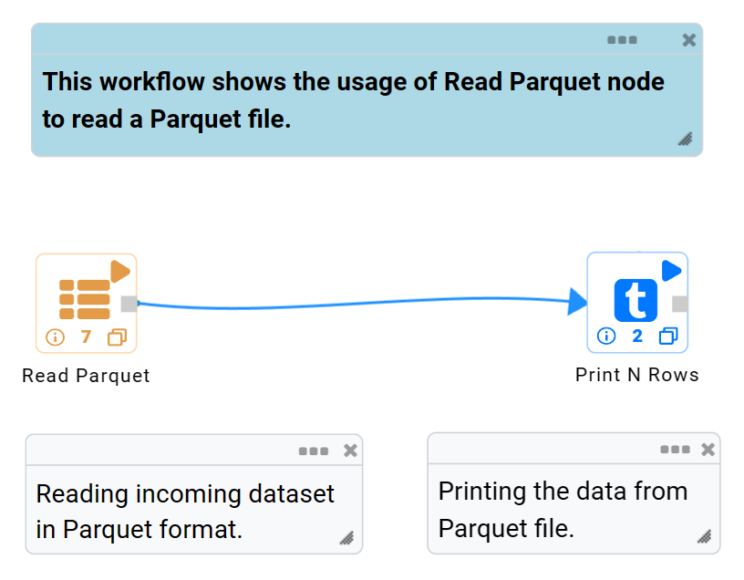
   

**Read Parquet node configuration**

The Read Parquet node is configured as below.

*	A ``Parquet Data File`` needs to be selected in the ``Path``. The ``Browse HDFS`` option can be used to browse and select a Parquet file from HDFS.
*	Once a Parquet file is selected the ``Refresh Schema`` button needs to be clicked to list Schema defined in the ``Parquet Data File``. 
*	``OK`` button needs to be clicked to complete the configuration.

.. figure:: ../../_assets/user-guide/read-write/read-structured/readparquet-configuration.png
   :alt: readparquet_node_userguide
   :width: 70%

**Read Parquet node output**

Data read from a Parquet Data File is printed as below using the Print node.

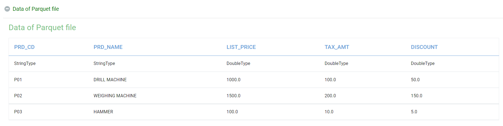
   
Read JSON
----------------------------------------

Below is a sample workflow which contains the Read JSON processor in Fire Insights. It demonstrates the usage of the Read JSON node to read a JSON file.

It does the following processing of data:

*	Reads incoming dataset in JSON File format using the Read JSON node.
* 	Prints the content of JSON file using the Print node.

.. figure:: ../../_assets/user-guide/read-write/read-structured/read-JSON-WF.png
   :alt: readjson_node_userguide
   :width: 50%
   

**Read JSON node configuration**

The Read JSON node is configured as below.

*	A ``JSON Data File`` needs to be selected in the ``Path``. The ``Browse HDFS`` option can be used to browse and select a JSON file from HDFS.
*	If a record data in the JSON file is present in multiple lines then ``Multiline`` needs to be selected as ``True``.
*	Once a JSON file is selected the ``Refresh Schema`` button needs to be clicked to list Schema defined in the ``JSON Data File``. 
*	``OK`` button needs to be clicked to complete the configuration.

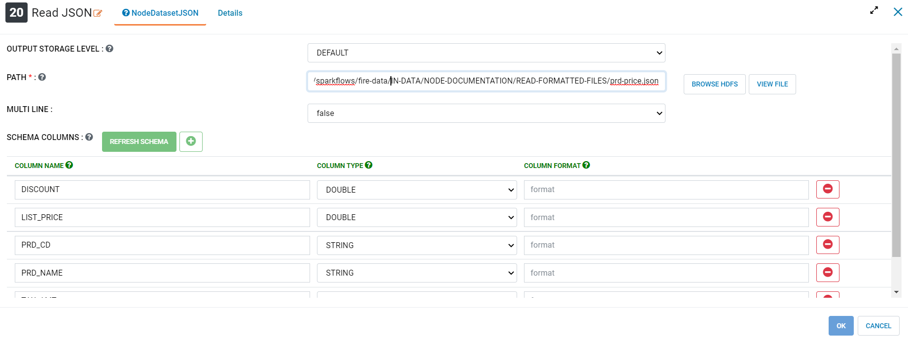

**Read JSON node output**

Data read from JSON File is printed as below using the Print node.

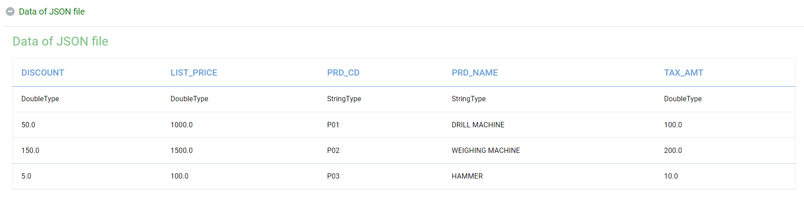
   
URL Single Record JSON Reader
----------------------------------------

Below is a sample workflow which contains the URL Single Record JSON Reader processor in Fire Insights. It demonstrates the usage of URL Single Record JSON Reader node to read the content of a JSON file present at the provided URL.

It does the following processing of data:

*	Reads the content of a JSON file present at the provided URL using URL Single Record JSON Reader node.
*	Prints the content of JSON file in a tabular format.

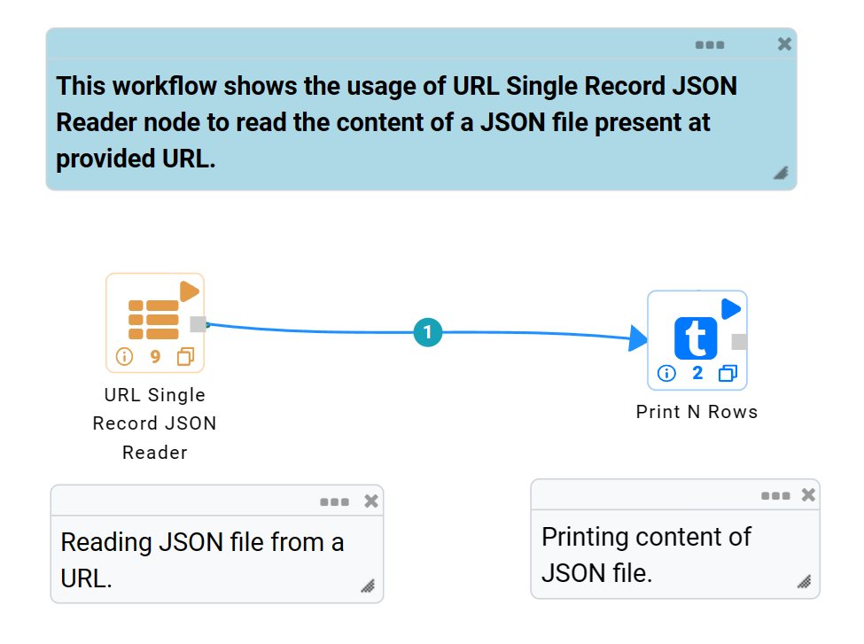
   
**URL Single Record JSON Reader node configuration**

The URL Single Record JSON Reader node is configured as below.

*	The URL address containing JSON file needs to be entered in ``URL`` box. 
*	The ``Refresh Schema`` button needs to be pressed to list schema of the JSON file.
*	Output prints the content of JSON file in a tabular format.

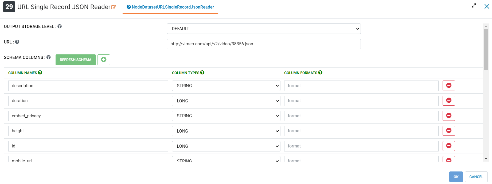
   
**URL Single Record JSON Reader node output**

Output of the URL Single Record JSON Reader node prints the content of JSON file in a tabular format.

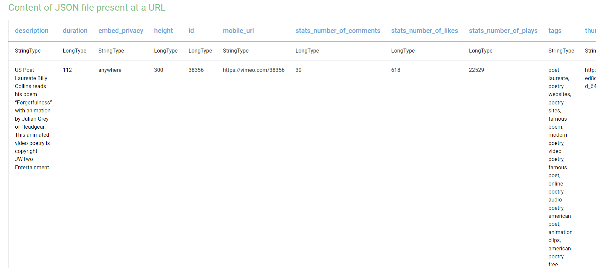

URL Text File Reader
----------------------------------------

Below is a sample workflow which contains the URL Text File Reader processor in Fire Insights. It demonstrates the usage of the URL Text File Reader node to read content of a Text file present at the provided URL.

It does the following processing of data:

*	Reads the content of a Text file present at the provided URL using the URL Text File Reader node.
*	Prints the content of the Text file in a tabular format.

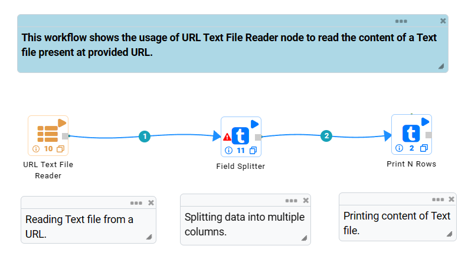
   
**URL Text File Reader Node configuration**

The URL Text File Reader node is configured as below.

*	The URL address containing Text file needs to be entered in ``URL`` box. 
*	Output prints the content of the Text file in a tabular format.

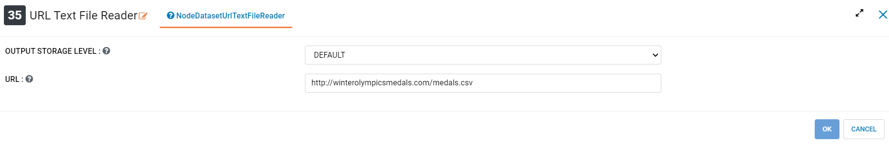
   
**URL Text File Reader node output**

Output of the  URL Text File Reader node prints the content of the Text file in a tabular format.

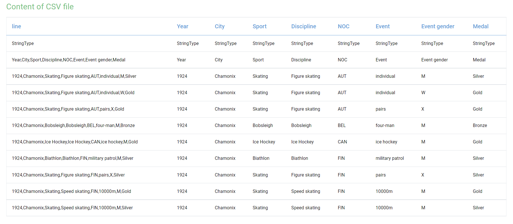
