Read Unstructured Files
==========

Fire Insights provides a number of Processors or Nodes for reading unstructured data from files.

Read Unstructured Data from Files Processors in Fire Insights
----------------------------------------

.. list-table:: Read Unstructured files Processors
   :widths: 30 70
   :header-rows: 1

   * - Title
     - Description
   * - PDF
     - It reads the content of single PDF file or multiple PDF files from a directory.
   * - Text Files
     - It reads the content of a single text file or multiple text files from a directory.
   * - Whole Text Files
     - It reads list of Text Files and their content from a directory and lists them in File Name and File Content pair.
   * - Binary Files
     - It reads content of a Binary File and converts it to Text.
   * - PDF Image OCR
     - It reads the content of OCR image embedded in a PDF file and converts it to Text.
 

PDF
----------------------------------------

Below is a sample workflow which contains the PDF processor in Fire Insights. It demonstrates the usage of PDF node to read the content of PDF files from a given path.

It does the following processing of data:

*	Reads incoming dataset using the PDF node.
* 	Print PDF files along with their content using the Print Node. Output is displayed in file name and its content pair.

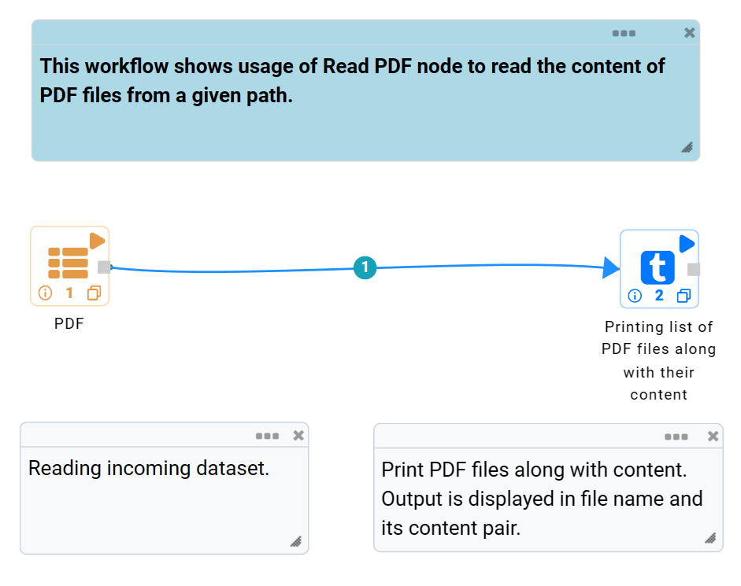
   

**PDF node configuration**

The PDF node is configured as below.

*	A PDF file or path of a directory containing PDF files needs to be selected in the ``Path``. The ``Browse HDFS`` option can be used to browse and select a PDF file or a directory from HDFS.
*	Column name to list file name in output needs to be entered in the ``File Name``.
*	Column name to list file content in output needs to be entered in the ``File Content``.
*	``OK`` button needs to be clicked to complete the configuration.

.. figure:: ../../_assets/user-guide/read-write/read-unstructured/PDF-Config.png
   :alt: readpdf_node_userguide
   :width: 70%

**PDF node output**

Data read from PDF files is printed as below using the Print node. Output is displayed in the file name and its content pair.

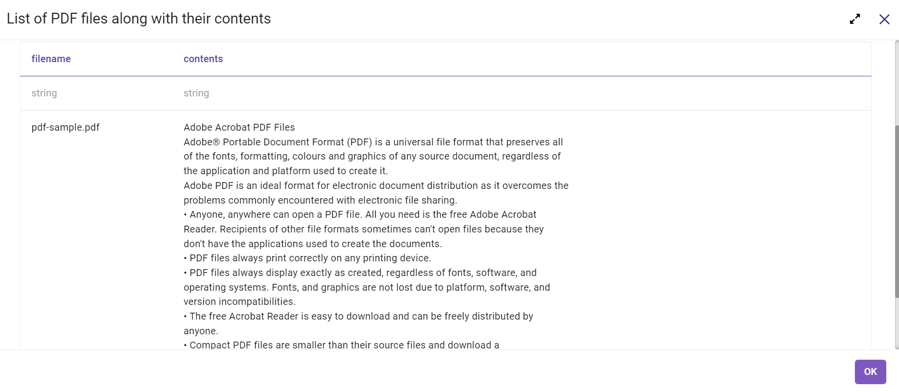
   
Text Files
----------------------------------------

Below is a sample workflow which contains the Text Files processor in Fire Insights. It demonstrates the usage of Text Files node to read the content of Text files from a given path. Data from all the files would be displayed together in a single column. Each line of data in the files would represent one record in the output.

It does the following processing of data:

*	Reads incoming dataset using the Text Files node. Dataset can belong to a single file or a set of files from a directory.
* 	Print the contents of all Text Files in a single outgoing dataset using the Print Node. Each line of data in the Text Files would be listed as a record in output.

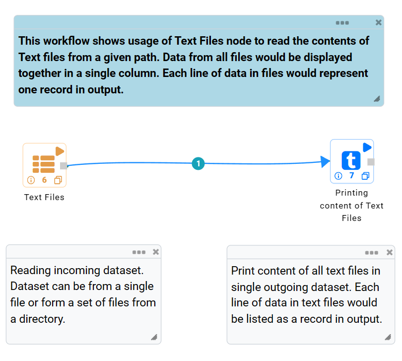
   

**Text Files node configuration**

The Text Files node is configured as below.

*	A Text file or path of a directory containing multiple Text files needs to be selected in the  ``Path``. The ``Browse HDFS`` option can be used to browse and select a Text file or a directory from HDFS.
*	Column name to list Text files' content in output needs to be entered in the ``Output Column Name``.
*	``OK`` button needs to be clicked to complete the configuration.

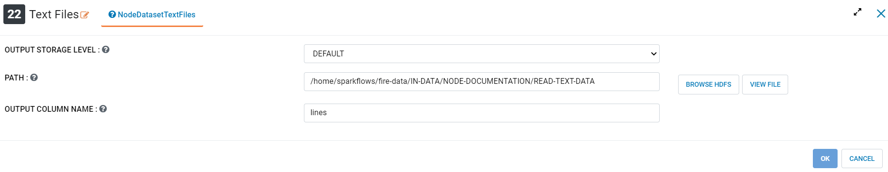

**Text Files node output**

Data read from Text files is printed as below using the Print node. Data from all files would be displayed together in a single column. Each line of data in the files would represent one record in the output.

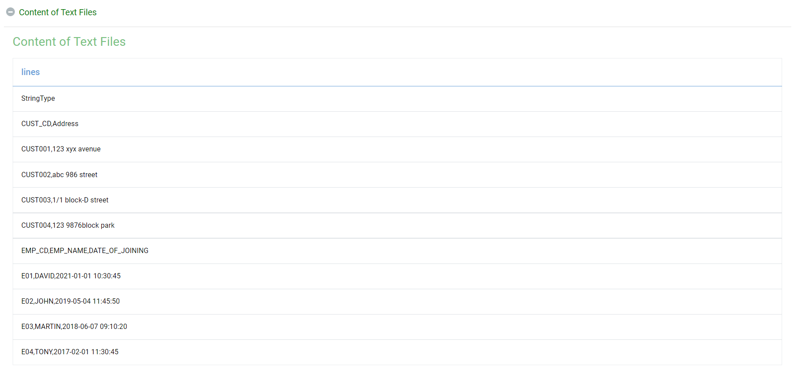
   
Whole Text Files
----------------------------------------

Below is a sample workflow which contains the Whole Text Files processor in Fire Insights. It demonstrates the usage of the Whole Text Files node to read list of Text Files and their contents from a given path and list them in the File Name and File Content pair.

It does following processing of data:

*	Reads incoming Dataset using the Whole Text Files node.
* 	Prints output in the file name and its content pair using the Print Node.

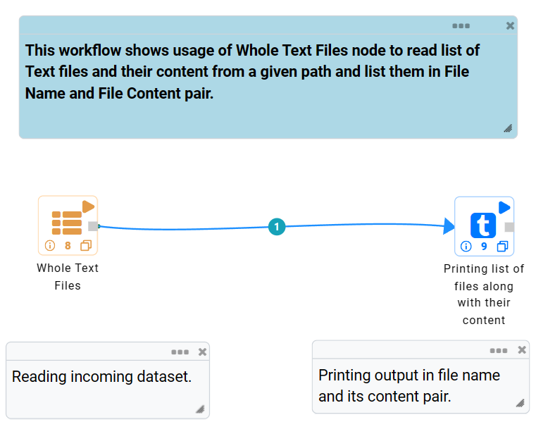
   

**Whole Text Files node configuration**

The Whole Text Files node is configured as below.

*	Path of a directory containing the Text files needs to be selected in the ``Path``. The ``Browse HDFS`` option can be used to browse and select a directory from HDFS.
*	``OK`` button needs to be clicked to complete the configuration.

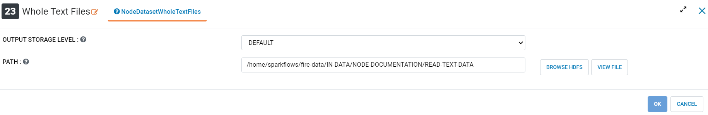

**Whole Text Files node output**

List of Text Files along with their contents is printed as below using the Print node. Output is printed in the File Name and File Content pair.

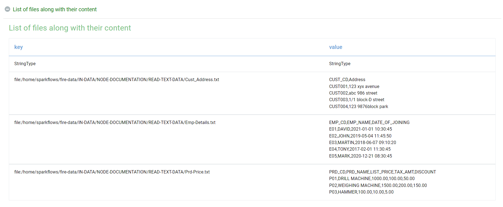

Binary Files
----------------------------------------

Below is a sample workflow which contains the Binary Files processor in Fire Insights. It demonstrates the usage of the Binary Files node to read content of a Binary file.

It does the following processing of data:

*	Reads the content of a Binary File using the Binary Files node. In this example it reads a png image file having an OCR image.
*	Parses the content using the OCR node and converts it to text.
*	Prints the content of Binary file in text format.

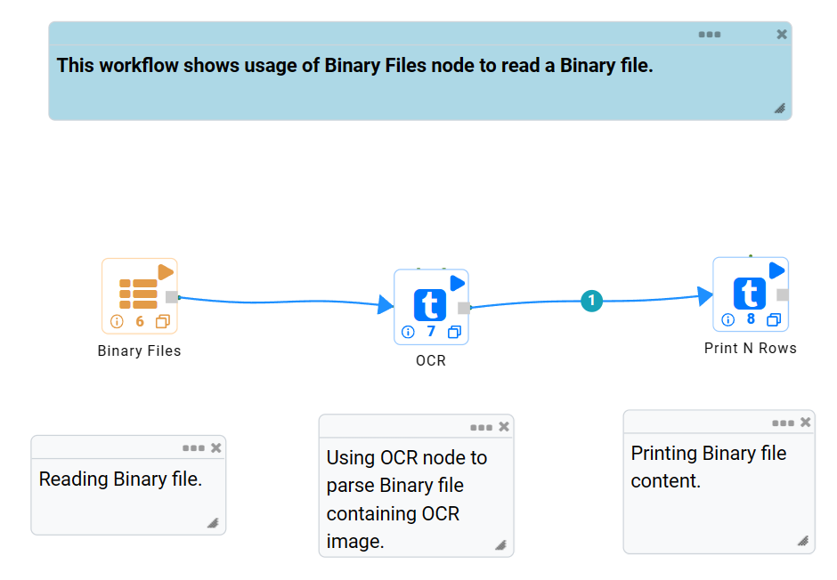
   
**Binary Files node configuration**

The Binary Files node is configured as below.

*	Path of the Binary file needs to be selected in the ``Path`` box.
*	Column in the output to display the file name is to be entered in the ``File Name Column`` box.
*	Column in the output to display the content of the file is to be entered in the ``Binary File Content Column`` box.
*	Output prints the content of the Binary file in text format.

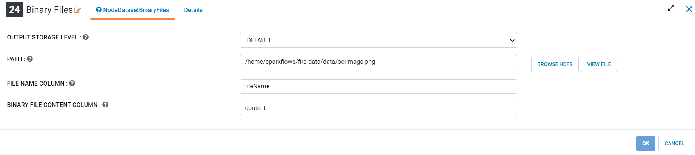
   
**Binary Files node output**

Output of Binary Files node prints content of Binary Image file in text format.

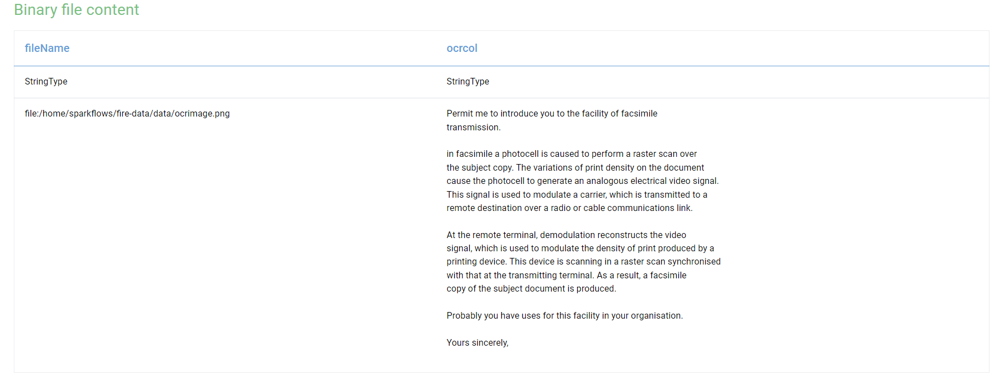

PDF Image OCR
----------------------------------------

Below is a sample workflow which contains the PDF Image OCR processor in Fire Insights. It demonstrates the usage of the PDF Image OCR node to read content of OCR image embedded in a PDF file and converts it to Text.

It does the following processing of data:

*	Reads the content of OCR image embedded in a PDF file and converts it to Text using the PDF Image OCR node.
*	Prints the content of OCR image embedded in a PDF file in text format.

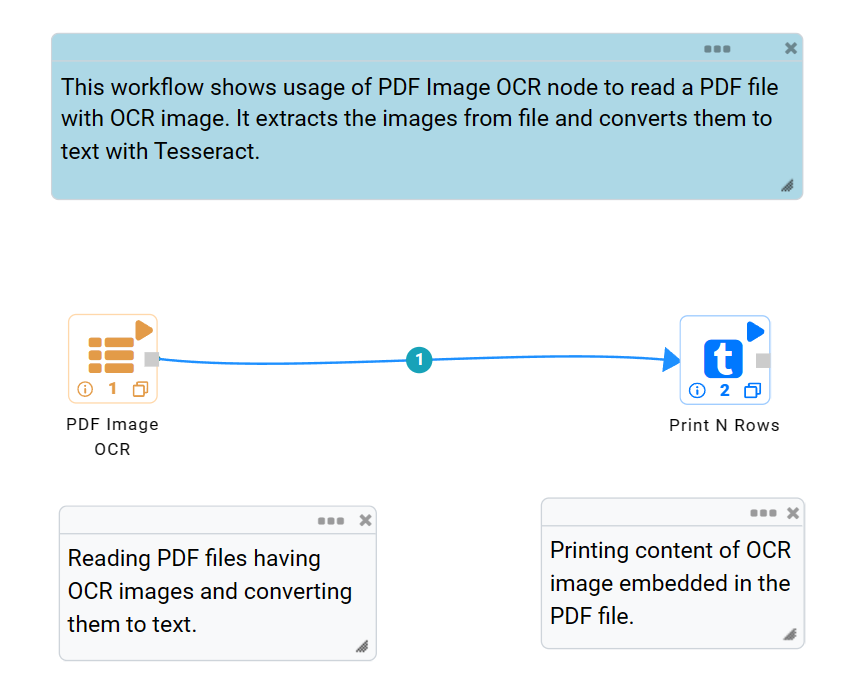
   
**PDF Image OCR node configuration**

PDF Image OCR node is configured as below.

*	Path of the PDF file needs to be entered in the ``Path Of The PDF Files`` box.
*	Column in the output to display file name is to be entered in the ``File Name Column`` box.
*	Column in the output to display content of the file is to be entered in the ``Column Name Which Contains Result of OCR`` box.
*	Output prints the content of OCR image embedded in a PDF file in text format.

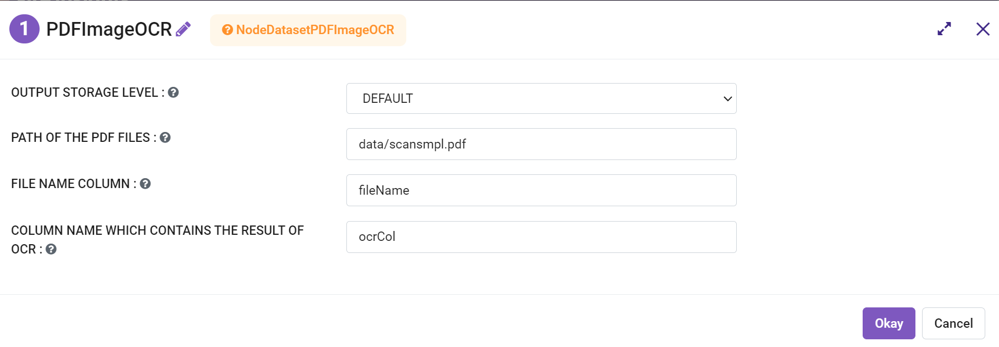
   
**PDF Image OCR node output**

Output of the PDF Image OCR node prints the content of OCR image embedded in a PDF file in text format.

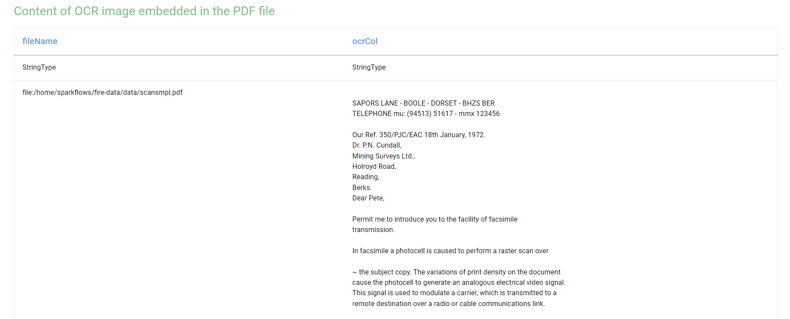
