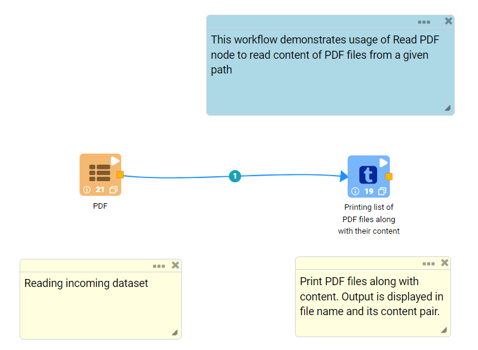
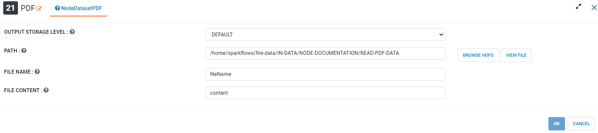
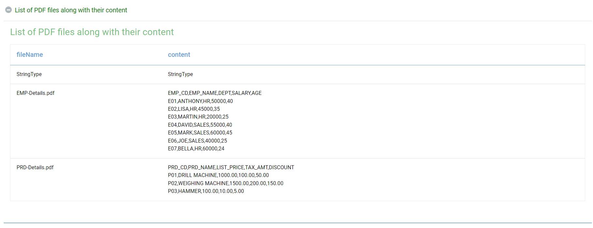
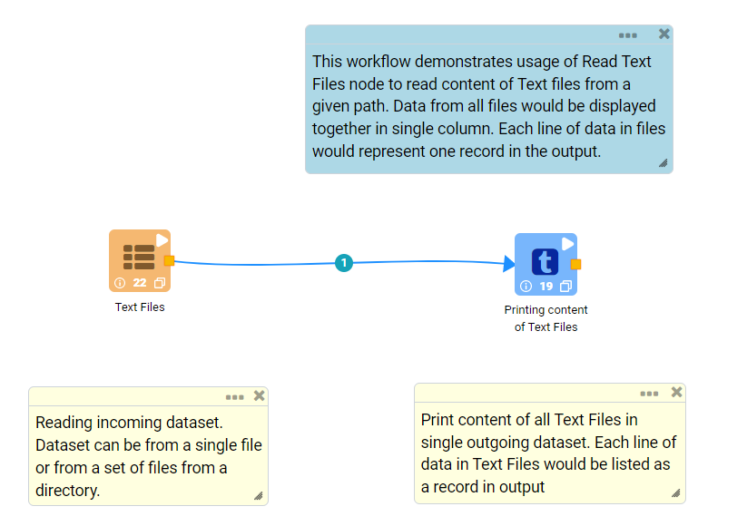
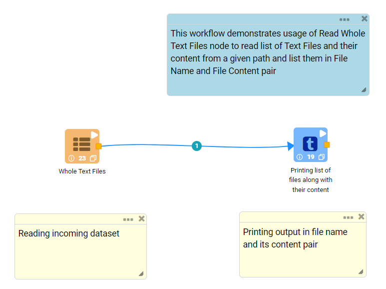

Read Unstructured Files
==========

Fire Insights provides a number of Processors for reading unstructured data from files.

Read Unstructured Data from Files Processors in Fire Insights
----------------------------------------

.. list-table:: Read Unstructured files Processors
   :widths: 30 70
   :header-rows: 1

   * - Title
     - Description
   * - Read PDF
     - Reads content of single PDF file or multiple PDF files from a directory
   * - Read Text files
     - Reads content of a single text file or multiple text files from a directory
   * - Read Whole text files
     - Reads list of Text Files and their content from a directory and lists them in File Name and File Content pair.

 

Read PDF
----------------------------------------

Below is a sample workflow which contains ``Read PDF`` processor in Fire Insights. It demonstrates usage of ``Read PDF`` node to read content of PDF files from a given path.

It does following processing of data:

*	Reads incoming Dataset using ``Read PDF`` node.
* 	Print PDF files along with their content using Print Node. Output is displayed in file name and its content pair.

   

**Read PDF Node configuration**

*	Reads content of PDF files from a given path using ``Read PDF`` node.
*	A PDF file or path of a directory containing PDF files needs to be selected in ``Path``. ``Browse HDFS`` option can be used to browse and select a PDF file or a directory from HDFS.
*	Column name to list file name in output needs to be entered in ``File Name``
*	Column name to list file content in output needs to be entered in ``File Content``
*	``OK`` button needs to be clicked to complete configuration.

**Read PDF Node output**

Data read from PDF files is printed as below using Print node. Output is displayed in file name and its content pair.

   
Read Text Files
----------------------------------------

Below is a sample workflow which contains ``Read Text Files`` processor in Fire Insights. It demonstrates usage of ``Read Text`` Files node to read content of Text files from a given path. Data from all files would be displayed together in single column. Each line of data in files would represent one record in the output.

It does following processing of data:

*	Reads incoming Dataset using ``Read Text Files`` node. Dataset can be from a single file or from a set of files from a directory.
* 	Print content of all Text Files in single outgoing dataset using Print Node. Each line of data in Text Files would be listed as a record in output.

   

**Read Text Files Node configuration**

*	Reads content of Text files from a given path using ``Read Text Files`` node.
*	A Text file or path of a directory containing multiple Text files needs to be selected in ``Path``. ``Browse HDFS`` option can be used to browse and select a Text file or a directory from HDFS.
*	Column name to list Text files' content in output needs to be entered in ``Output Column Name``
*	``OK`` button needs to be clicked to complete configuration.

.. figure:: ../../_assets/user-guide/read-write/read-unstructured/readtextfiles-configuration.png
   :alt: readtextfiles_node_userguide
   :width: 90%

**Read Text Files Node output**

Data read from Text files is printed as below using Print node. Data from all files would be displayed together in single column. Each line of data in files would represent one record in the output.

.. figure:: ../../_assets/user-guide/read-write/read-unstructured/readtextfiles-printnode-output.png
   :alt: readtextfiles_node_userguide
   :width: 90%
   
Read Whole Text Files
----------------------------------------

Below is a sample workflow which contains ``Read Whole Text Files`` processor in Fire Insights. It demonstrates usage of ``Read Whole Text Files`` node to read list of Text Files and their content from a given path and list them in File Name and File Content pair.

It does following processing of data:

*	Reads incoming Dataset using ``Read Whole Text Files`` node.
* 	Prints output in file name and its content pair using Print Node.

   

**Read Whole Text Files Node configuration**

*	Reads list of Text Files and their content from a given directory using ``Read Whole Text Files`` node.
*	Path of a directory containing Text files needs to be selected in ``Path``. ``Browse HDFS`` option can be used to browse and select a directory from HDFS.
*	``OK`` button needs to be clicked to complete configuration.

.. figure:: ../../_assets/user-guide/read-write/read-unstructured/readwholetext-configuration.png
   :alt: readwholetext_node_userguide
   :width: 90%

**Read Whole Text Files Node output**

List of Text Files along with their content is printed as below using Print node. Output is printed in File Name and File Content pair.

.. figure:: ../../_assets/user-guide/read-write/read-unstructured/readwholetext-printnode-output.png
   :alt: readwholetext_node_userguide
   :width: 90%
