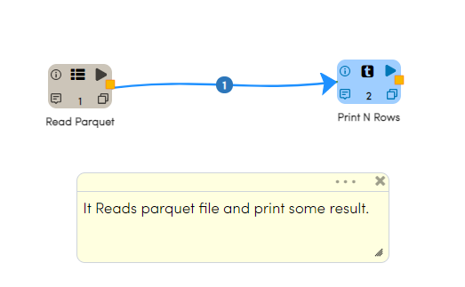

Read Parquet File
================

Fire Insights enable user to Read parquet file.

Workflow
--------

Below is the workflow. It does the following:

* Reads data from a parquet file.
* Print some sample result.

Reading from parquet File
---------------------

It reads data from a parquet file using Read parquet processor.

Processor Configuration
^^^^^^^^^^^^^^^^^^

.. figure:: ../../_assets/user-guide/read-write/8.png
   :alt: readwrite
   :width: 60%
   
Processor Output
^^^^^^

.. figure:: ../../_assets/user-guide/read-write/9.png
   :alt: readwrite
   :width: 60%

Prints the Results
------------------

It prints the first few records
