Save Files
==========

Fire Insights provide processors for Saving Files in various formats

Save Files Processors in Fire Insights
----------------------------------------

.. list-table:: Save Files Processors
   :widths: 30 70
   :header-rows: 1

   * - Title
     - Description
   * - Save Avro
     - It saves incoming dataset as Avro File.
   * - Save CSV
     - It saves incoming dataset as CSV File.
   * - Save JSON
     - It saves incoming dataset as JSON File.
   * - Save ORC
     - It saves incoming dataset as ORC File.
   * - Save Parquet
     - It saves incoming dataset as Parquet File.

	 
Save Avro
----------------------------------------

Below is a sample workflow which contains ``Save Avro`` processor in Fire Insights. It demonstrates usage of ``Save Avro`` node to save incoming dataset in Avro format.

It does following processing of data:

*	Reads incoming Dataset.
*	Coalesce node is used to define number of partitions to be created while saving.
*	Saves incoming dataset in Avro format using ``Save Avro`` node.

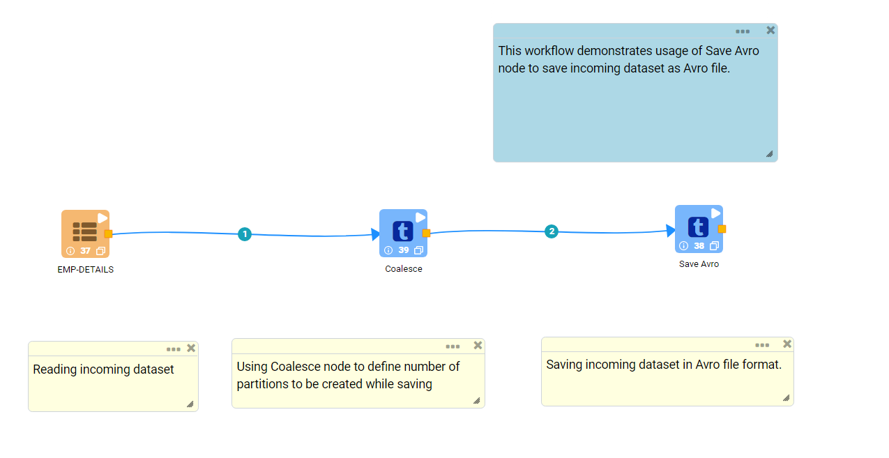
   
**Incoming dataset**

.. figure:: ../../_assets/user-guide/read-write/save-files/saveavro-incoming-dataset.png
   :alt: savefiles_userguide
   :width: 90%
   
**Save Avro Node configuration**

*	``Save Avro`` node is configured as below.
*	HDFS location where created file needs to be save is to be selected in ``Path`` box.
*	Save mode to be selected in ``Save Mode`` list. It states whether to *Append*, *Overwrite*, *Error out if file exists* or *Ignore* while saving file.
*	Saves incoming dataset in Avro format.

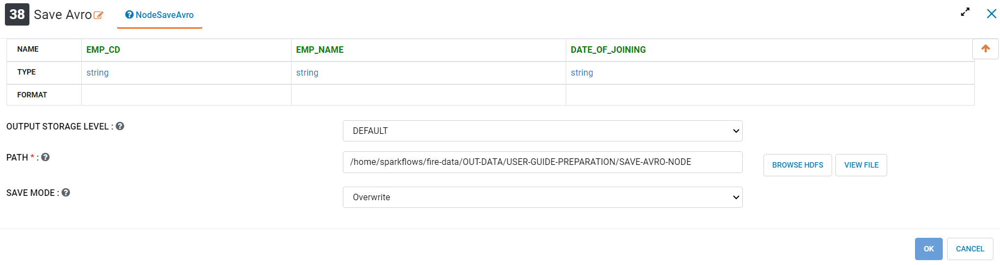
   
Save CSV
----------------------------------------

Below is a sample workflow which contains ``Save CSV`` processor in Fire Insights. It demonstrates usage of ``Save CSV`` node to save incoming dataset in CSV format.

It does following processing of data:

*	Reads incoming Dataset.
*	Coalesce node is used to define number of partitions to be created while saving.
*	Saves incoming dataset in CSV format using ``Save CSV`` node.

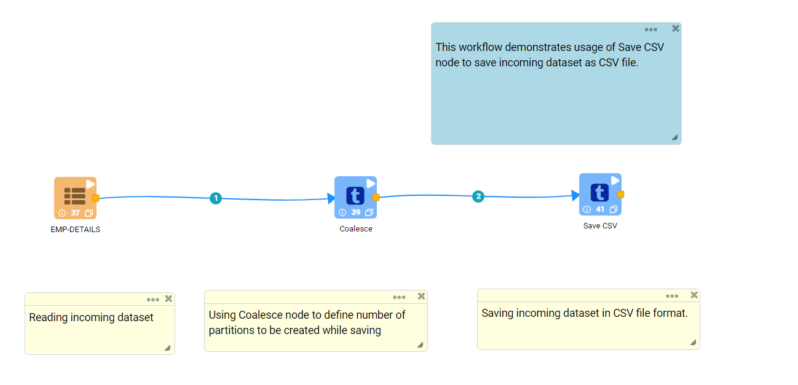
   
**Incoming dataset**

.. figure:: ../../_assets/user-guide/read-write/save-files/savecsv-incoming-dataset.png
   :alt: savefiles_userguide
   :width: 90%
   
**Save CSV Node configuration**

*	``Save CSV`` node is configured as below.
*	HDFS location where created file needs to be save is to be selected in ``Path`` box.
*	Save mode to be selected in ``Save Mode`` list. It states whether to *Append*, *Overwrite*, *Error out if file exists* or *Ignore* while saving file.
*	Option to save Header row is to be selected as True/False in ``Header`` list.
*	In ``Advanced`` tab, set of columns that need to be used to partition data are to be selected in ``Partition Column Names`` list. One file would be created for each partition.
*	Saves incoming dataset in CSV format.

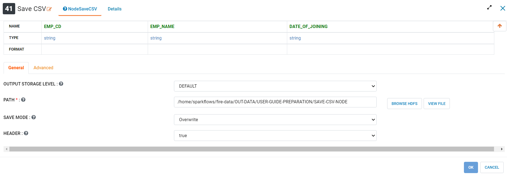
   
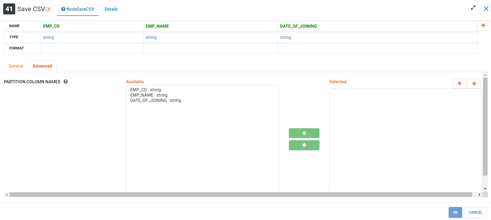
   
Save JSON
----------------------------------------

Below is a sample workflow which contains ``Save JSON`` processor in Fire Insights. It demonstrates usage of ``Save JSON`` node to save incoming dataset in JSON format.

It does following processing of data:

*	Reads incoming Dataset.
*	Coalesce node is used to define number of partitions to be created while saving.
*	Saves incoming dataset in JSON format using ``Save JSON`` node.

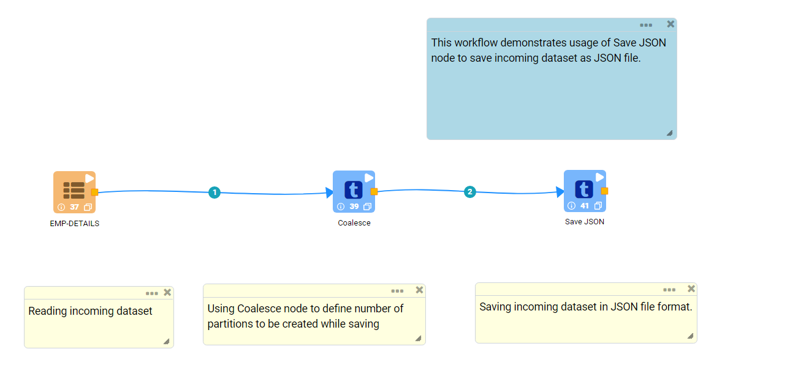
   
**Incoming dataset**

.. figure:: ../../_assets/user-guide/read-write/save-files/savejson-incoming-dataset.png
   :alt: savefiles_userguide
   :width: 90%
   
**Save JSON Node configuration**

*	``Save JSON`` node is configured as below.
*	HDFS location where created file needs to be save is to be selected in ``Path`` box.
*	Save mode to be selected in ``Save Mode`` list. It states whether to *Append*, *Overwrite*, *Error out if file exists* or *Ignore* while saving file.
*	In ``Advanced`` tab, set of columns that need to be used to partition data are to be selected in ``Partition Column Names`` list. One file would be created for each partition.
*	Saves incoming dataset in JSON format.

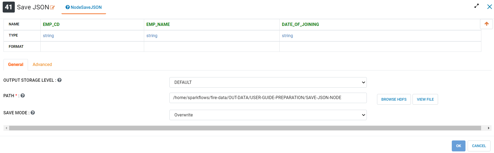
   
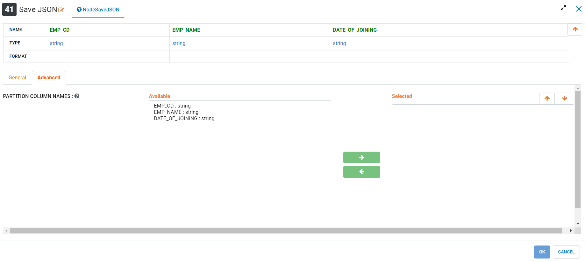
   
Save ORC
----------------------------------------

Below is a sample workflow which contains ``Save ORC`` processor in Fire Insights. It demonstrates usage of ``Save ORC`` node to save incoming dataset in ORC format.

It does following processing of data:

*	Reads incoming Dataset.
*	Coalesce node is used to define number of partitions to be created while saving.
*	Saves incoming dataset in ORC format using ``Save ORC`` node.

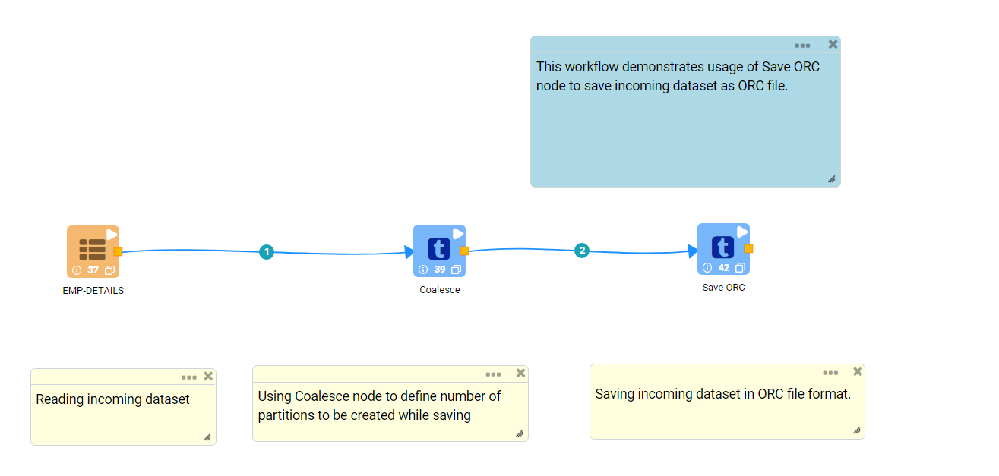
   
**Incoming dataset**

.. figure:: ../../_assets/user-guide/read-write/save-files/saveorc-incoming-dataset.png
   :alt: savefiles_userguide
   :width: 90%
   
**Save ORC Node configuration**

*	``Save ORC`` node is configured as below.
*	HDFS location where created file needs to be save is to be selected in ``Path`` box.
*	Save mode to be selected in ``Save Mode`` list. It states whether to *Append*, *Overwrite*, *Error out if file exists* or *Ignore* while saving file.
*	Saves incoming dataset in ORC format.

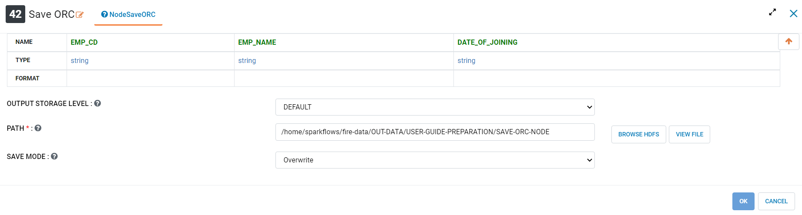

Save Parquet
----------------------------------------

Below is a sample workflow which contains ``Save Parquet`` processor in Fire Insights. It demonstrates usage of ``Save Parquet`` node to save incoming dataset in Parquet format.

It does following processing of data:

*	Reads incoming Dataset.
*	Coalesce node is used to define number of partitions to be created while saving.
*	Saves incoming dataset in Parquet format using ``Save Parquet`` node.

   
**Incoming dataset**

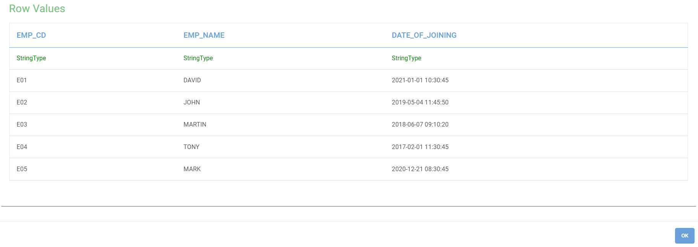
   
**Save Parquet Node configuration**

*	``Save Parquet`` node is configured as below.
*	HDFS location where created file needs to be save is to be selected in ``Path`` box.
*	Save mode to be selected in ``Save Mode`` list. It states whether to *Append*, *Overwrite*, *Error out if file exists* or *Ignore* while saving file.
*	In ``Advanced`` tab, set of columns that need to be used to partition data are to be selected in ``Partition Column Names`` list. One file would be created for each partition.
*	Saves incoming dataset in Parquet format.

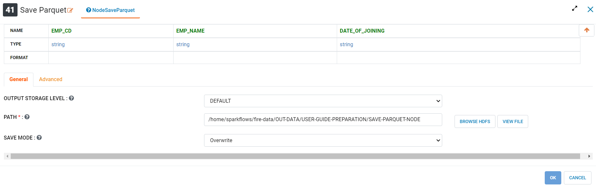
   
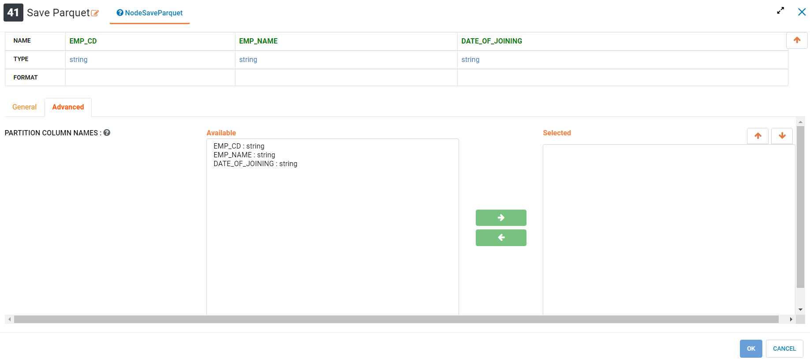

