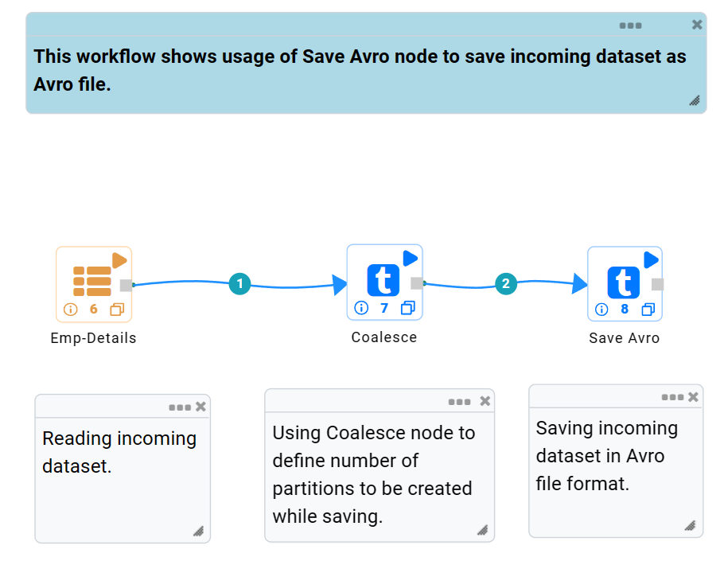
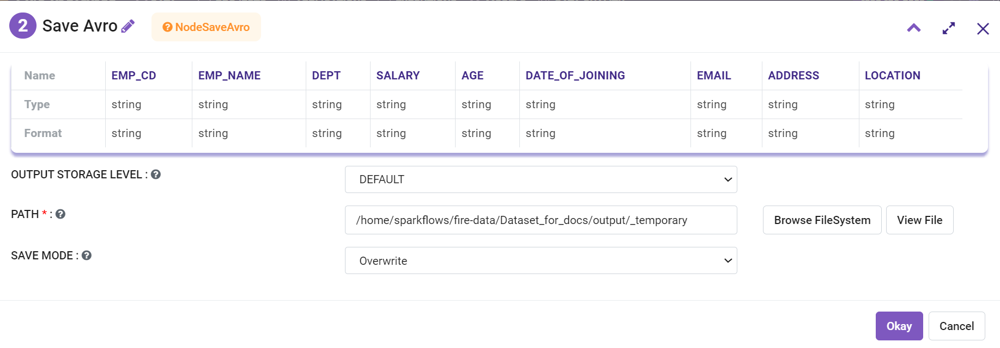
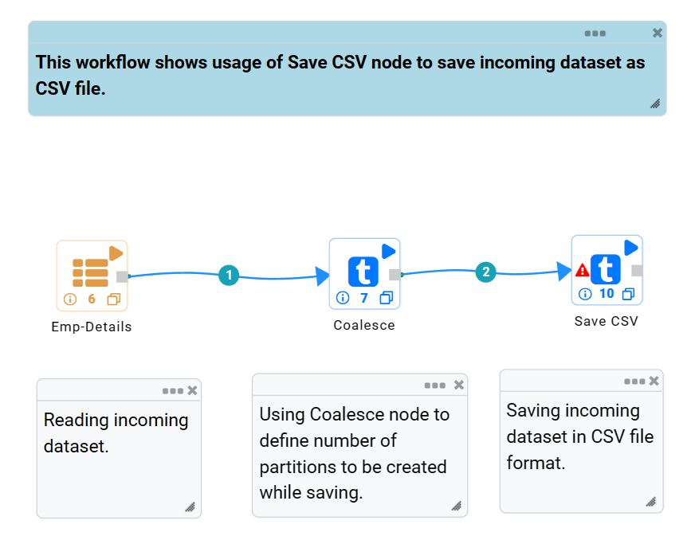
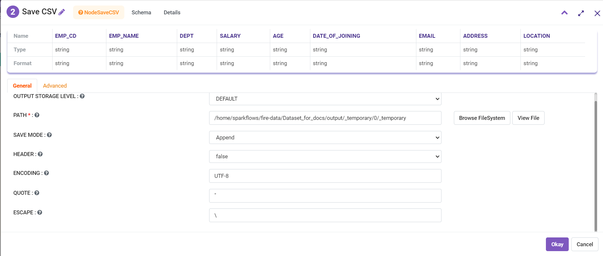
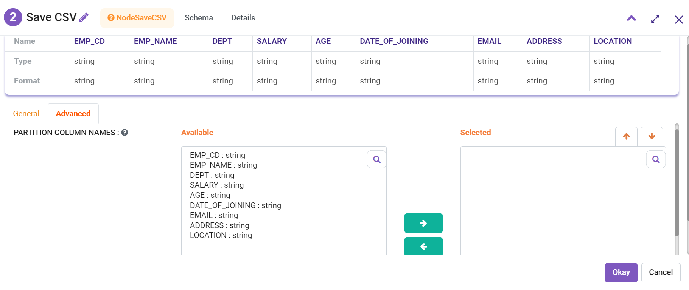
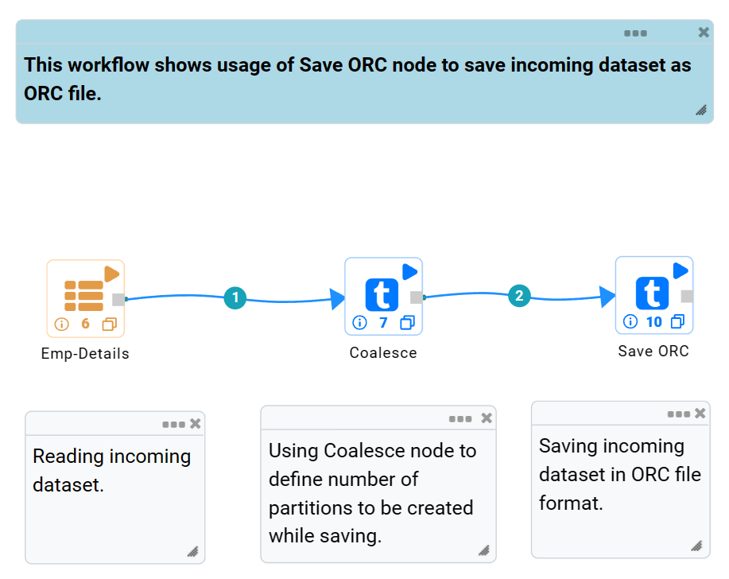
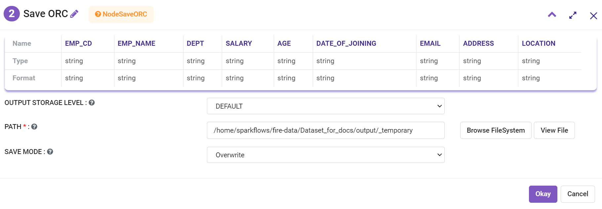
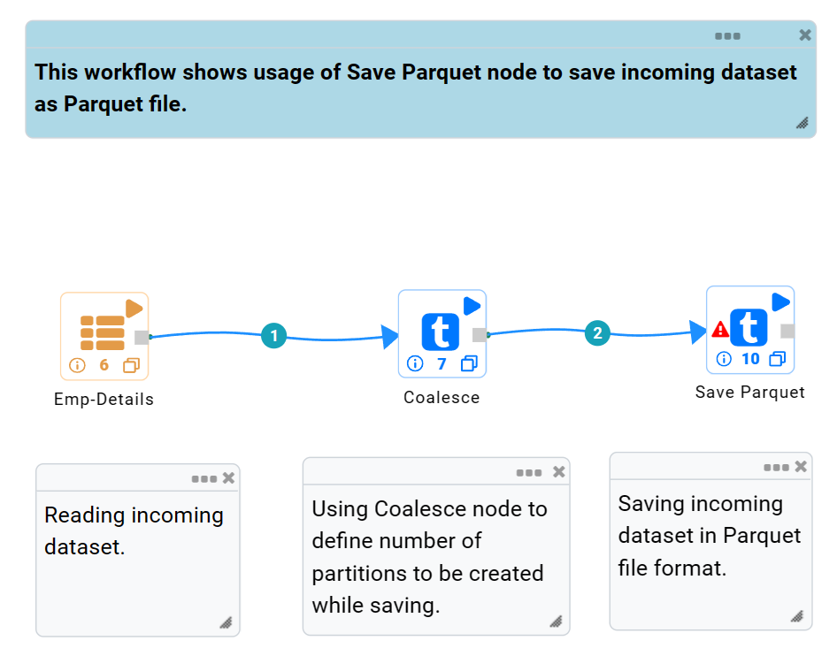
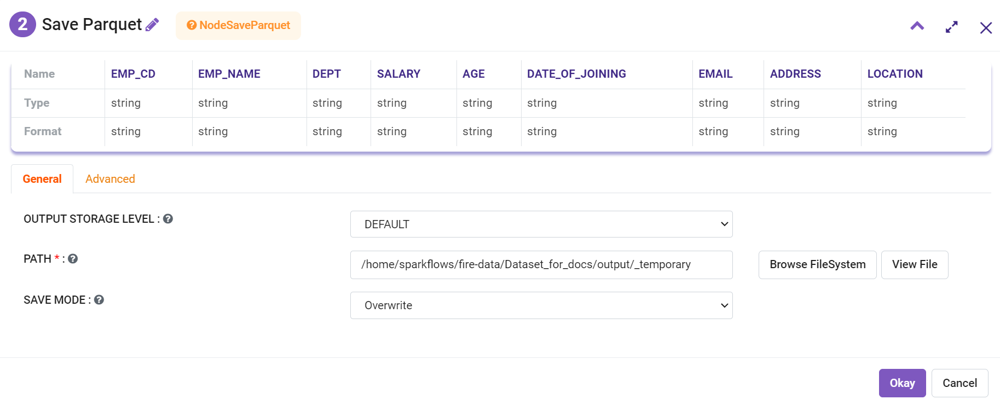
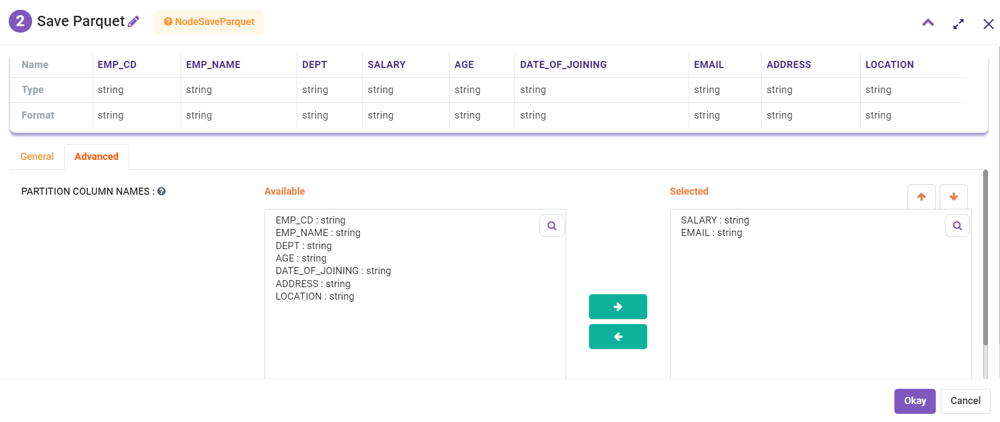

Save Files
==========

Fire Insights provide processors or nodes for Saving Files in various formats.

Save Files Processors in Fire Insights
----------------------------------------

.. list-table:: Save Files Processors
   :widths: 30 70
   :header-rows: 1

   * - Title
     - Description
   * - Save Avro
     - It saves the incoming dataset as Avro File.
   * - Save CSV
     - It saves the incoming dataset as CSV File.
   * - Save JSON
     - It saves the incoming dataset as JSON File.
   * - Save ORC
     - It saves the incoming dataset as ORC File.
   * - Save Parquet
     - It saves the incoming dataset as Parquet File.

	 
Save Avro
----------------------------------------

Below is a sample workflow which contains Save Avro processor in Fire Insights. It demonstrates the usage of Save Avro node to save incoming dataset in Avro format.

It does the following processing of data:

*	Reads the incoming dataset.
*	Coalesce node is used to define the number of partitions to be created while saving.
*	Saves the incoming dataset in Avro format using Save Avro node.

   
**Incoming Dataset**

.. figure:: ../../_assets/user-guide/read-write/save-files/InputData.png
   :alt: savefiles_userguide
   :width: 75%
   
**Save Avro node configuration**

Save Avro node is configured as below.

*	HDFS location where created file needs to be saved is to be selected in the ``Path`` box.
*	Save mode to be selected in ``Save Mode`` list. It states whether to *Append*, *Overwrite*, *Error out if file exists* or *Ignore* while saving the file.
*	Saves the incoming dataset in Avro format.

   
Save CSV
----------------------------------------

Below is a sample workflow which contains the Save CSV processor in Fire Insights. It demonstrates the usage of Save CSV node to save the incoming dataset in CSV format.

It does the following processing of data:

*	Reads the incoming dataset.
*	Coalesce node is used to define the number of partitions to be created while saving.
*	Saves the incoming dataset in CSV format using  the Save CSV node.

   
**Incoming Dataset**

.. figure:: ../../_assets/user-guide/read-write/save-files/InputData.png
   :alt: savefiles_userguide
   :width: 75%
   
**Save CSV node configuration**

Save CSV node is configured as below.

*	HDFS location where created file needs to be saved is to be selected in the ``Path`` box.
*	Save mode to be selected in the ``Save Mode`` list. It states whether to *Append*, *Overwrite*, *Error out if file exists* or *Ignore* while saving the file.
*	Option to save Header row is to be selected as True/False in the ``Header`` list.
*	In ``Advanced`` tab, set of columns that need to be used to partition data are to be selected in the ``Partition Column Names`` list. One file would be created for each partition.
*	Saves the incoming dataset in CSV format.

   

   
Save JSON
----------------------------------------

Below is a sample workflow which contains the Save JSON processor in Fire Insights. It demonstrates the usage of Save JSON node to save the incoming dataset in JSON format.

It does the following processing of data:

*	Reads the incoming dataset.
*	Coalesce node is used to define the number of partitions to be created while saving.
*	Saves the incoming dataset in JSON format using the Save JSON node.

.. figure:: ../../_assets/user-guide/read-write/save-files/save-json-wf.png
   :alt: savefiles_userguide
   :width: 50%
   
**Incoming Dataset**

.. figure:: ../../_assets/user-guide/read-write/save-files/InputData.png
   :alt: savefiles_userguide
   :width: 75%
   
**Save JSON node configuration**

Save JSON node is configured as below.

*	HDFS location where created file needs to be saved is to be selected in the ``Path`` box.
*	Save mode to be selected in the ``Save Mode`` list. It states whether to *Append*, *Overwrite*, *Error out if file exists* or *Ignore* while saving file.
*	In the ``Advanced`` tab, set of columns that need to be used to partition data are to be selected in the ``Partition Column Names`` list. One file would be created for each partition.
*	Saves the incoming dataset in JSON format.

.. figure:: ../../_assets/user-guide/read-write/save-files/JsonGenConfig.png
   :alt: savefiles_userguide
   :width: 75%
   
.. figure:: ../../_assets/user-guide/read-write/save-files/JsonAdvConfig.png
   :alt: savefiles_userguide
   :width: 75%
   
Save ORC
----------------------------------------

Below is a sample workflow which contains the Save ORC processor in Fire Insights. It demonstrates the usage of Save ORC node to save incoming dataset in ORC format.

It does the following processing of data:

*	Reads the incoming dataset.
*	Coalesce node is used to define the number of partitions to be created while saving.
*	Saves incoming dataset in ORC format using the Save ORC node.

   
**Incoming Dataset**

.. figure:: ../../_assets/user-guide/read-write/save-files/InputData.png
   :alt: savefiles_userguide
   :width: 75%
   
**Save ORC node configuration**

Save ORC node is configured as below.

*	HDFS location where created file needs to be saved is to be selected in the ``Path`` box.
*	Save mode to be selected in the ``Save Mode`` list. It states whether to *Append*, *Overwrite*, *Error out if file exists* or *Ignore* while saving the file.
*	Saves the incoming dataset in ORC format.

Save Parquet
----------------------------------------

Below is a sample workflow which contains the Save Parquet processor in Fire Insights. It demonstrates the usage of the Save Parquet node to save incoming dataset in Parquet format.

It does the following processing of data:

*	Reads the incoming Dataset.
*	Coalesce node is used to define the number of partitions to be created while saving.
*	Saves the incoming dataset in Parquet format using the ``Save Parquet`` node.

   
**Incoming Dataset**

.. figure:: ../../_assets/user-guide/read-write/save-files/InputData.png
   :alt: savefiles_userguide
   :width: 75%
   
**Save Parquet node configuration**

Save Parquet node is configured as below.

*	HDFS location where created file needs to be saved is to be selected in ``Path`` box.
*	Save mode to be selected in the ``Save Mode`` list. It states whether to *Append*, *Overwrite*, *Error out if file exists* or *Ignore* while saving the file.
*	In the ``Advanced`` tab, set of columns that need to be used to partition data are to be selected in the ``Partition Column Names`` list. One file would be created for each partition.
*	Saves the incoming dataset in Parquet format.

   

