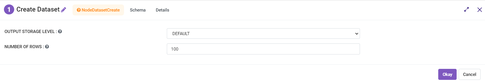
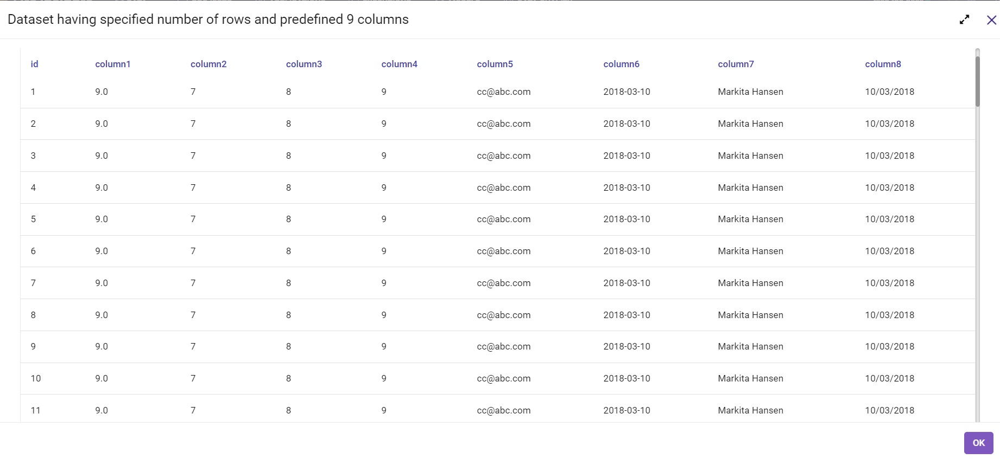

Create Dataset
==========
This node creates a dataset of specified rows and 9 pre-defined columns.

Below is a sample workflow which contains the Create Dataset processor in Fire Insights. It demonstrates the usage of Create Dataset node to create a dataset of specified rows and 9 pre-defined columns.

It does the following processing of data:

*	Creates a dataset of specified rows and 9 pre-defined columns using Create Dataset node.
*	Prints the created dataset.

.. figure:: ../../../_assets/user-guide/read-write/read-structured/create-dataset.png
   :alt: readwrite_userguide
   :width: 50%
   
**Create Dataset node configuration**

The Create Dataset node is configured as below.

*	Number of rows needed in the created dataset is to be entered in ``Number Of Rows`` box.
*	Output prints the dataset created with specified number of rows and fixed 9 columns.

   
**Create Dataset node output**

Output of the Create Dataset node prints the dataset created with specified number of rows and fixed 9 columns.

