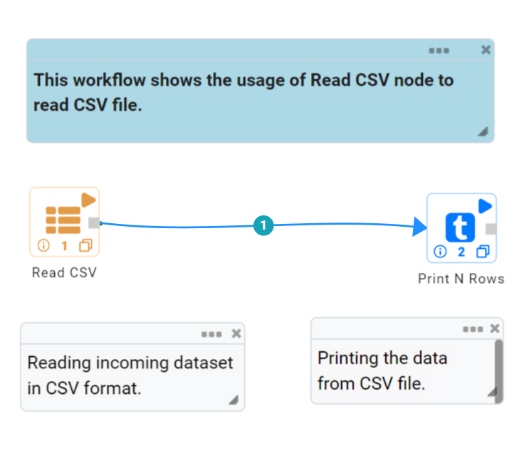
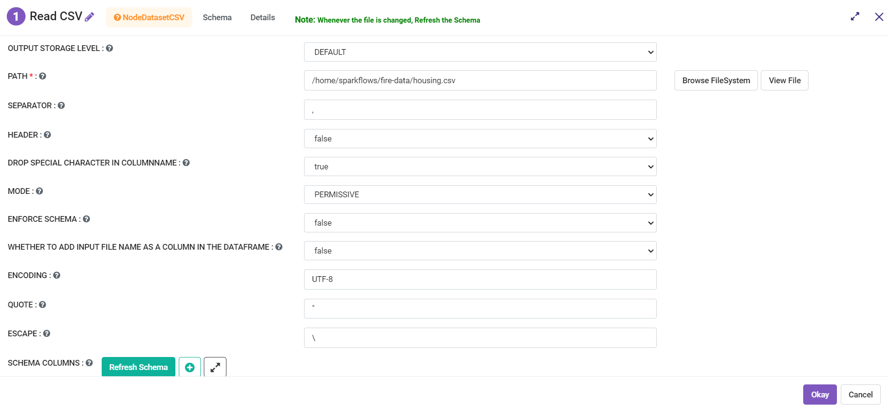
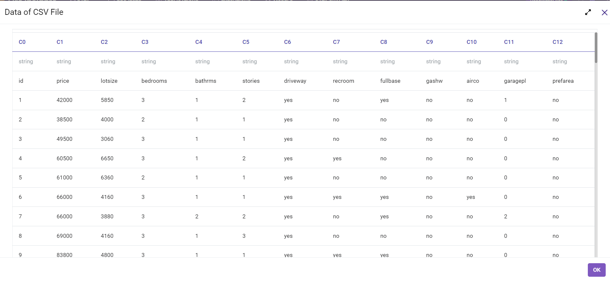

CSV
======

Read CSV
------------
Below is a sample workflow which contains the Read CSV processor in Fire Insights. It demonstrates the usage of Read CSV File node to read a CSV file.

It does the following processing of data:

*	Reads incoming dataset in CSV Data format using the Read CSV node.
* 	Prints the content of the CSV file using the Print node.

   

**Read CSV Node configuration**

The Read CSV node is configured as below.

*	A ``CSV Data File`` needs to be selected in the ``Path``. The ``Browse HDFS`` option can be used to browse and select a CSV file from HDFS.
*	A Delimiter or Character used to separate two columns' data needs to be selected in the ``Separator``. In most of the cases ``,`` / comma is used to separate two columns.
*	``Header`` needs to be selected as ``True`` or ``False`` based on whether data file contains header row that can be used in the imported dataset.
*	Once a CSV file is selected the ``Refresh Schema`` button needs to be clicked to list Schema defined in the ``CSV Data File``. 
*	``OK`` button needs to be clicked to complete the configuration.

**Read CSV node output**

Data read from a CSV Data File is printed as below using the Print node.

   
Save CSV
----------------------------------------

Below is a sample workflow which contains the Save CSV processor in Fire Insights. It demonstrates the usage of Save CSV node to save the incoming dataset in CSV format.

It does the following processing of data:

*	Reads the incoming dataset.
*	Coalesce node is used to define the number of partitions to be created while saving.
*	Saves the incoming dataset in CSV format using  the Save CSV node.

.. figure:: ../../../_assets/user-guide/read-write/save-files/save-csv-wf.png
   :alt: savefiles_userguide
   :width: 50%
   
**Incoming Dataset**

.. figure:: ../../../_assets/user-guide/read-write/save-files/InputData.png
   :alt: savefiles_userguide
   :width: 75%
   
**Save CSV node configuration**

Save CSV node is configured as below.

*	HDFS location where created file needs to be saved is to be selected in the ``Path`` box.
*	Save mode to be selected in the ``Save Mode`` list. It states whether to *Append*, *Overwrite*, *Error out if file exists* or *Ignore* while saving the file.
*	Option to save Header row is to be selected as True/False in the ``Header`` list.
*	In ``Advanced`` tab, set of columns that need to be used to partition data are to be selected in the ``Partition Column Names`` list. One file would be created for each partition.
*	Saves the incoming dataset in CSV format.

.. figure:: ../../../_assets/user-guide/read-write/save-files/CSVGenConfig.png
   :alt: savefiles_userguide
   :width: 75%
   
.. figure:: ../../../_assets/user-guide/read-write/save-files/CSVAdvConfig.png
   :alt: savefiles_userguide
   :width: 75%
   
