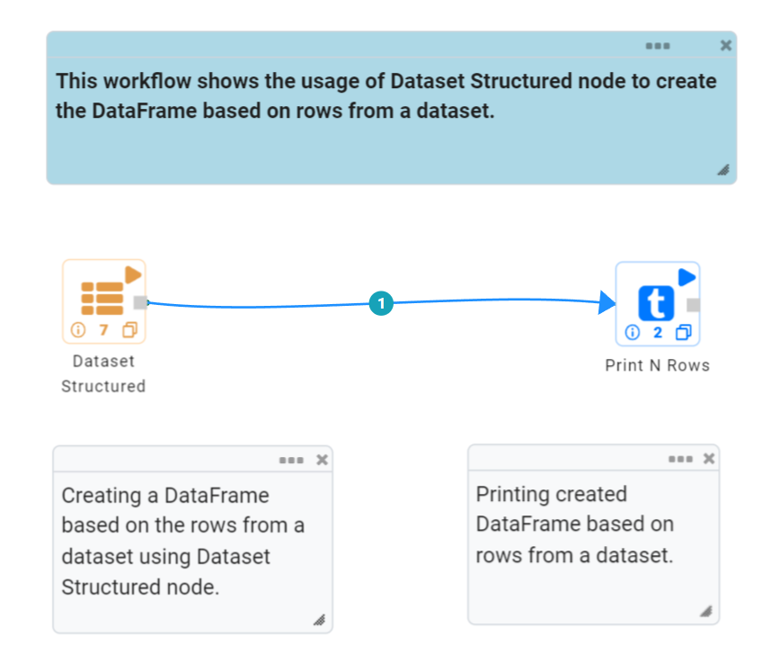
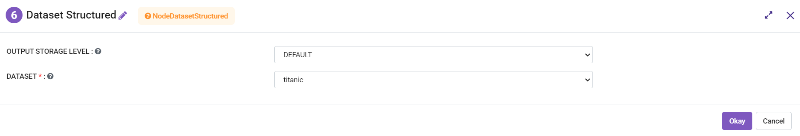
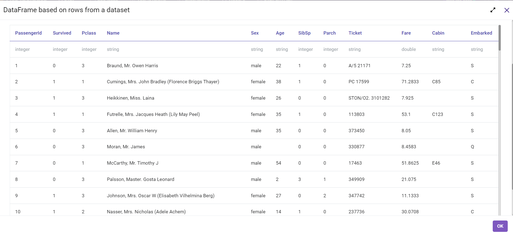

Dataset Structured
==================
This node creates a DataFrame based on rows from a dataset.

Below is a sample workflow which contains the Dataset Structured processor in Fire Insights. It demonstrates the usage of Dataset Structured node to create a DataFrame based on rows from a dataset.

It does the following processing of data:

*	Creates a DataFrame based on rows from a dataset using the Dataset Structured node.
*	Prints the created dataset.

   
**Dataset Structured node configuration**

The Dataset Structured node is configured as below.

*	Dataset to be used to create DataFrame is to be selected in the ``Dataset`` list.
*	Output prints the DataFrame so created based on the data from the selected dataset.

   
**Dataset Structured node output**

Output of the Dataset Structured node prints the DataFrame so created based on data from the selected dataset.

