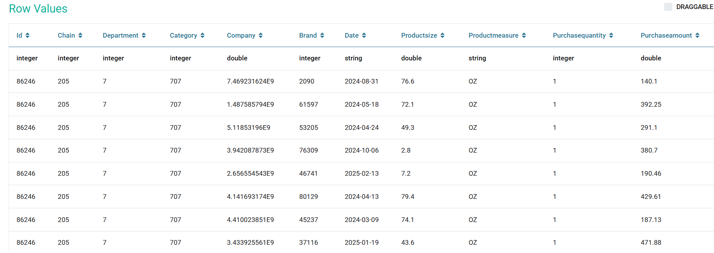
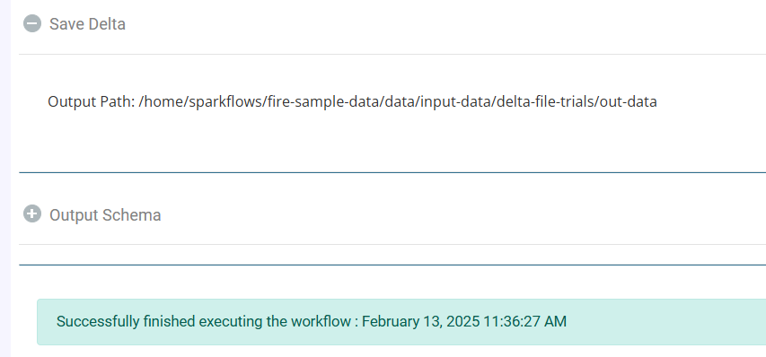

DELTA
======

Read DELTA
------------
This node reads files from a Delta Lake.

Below is a sample workflow which contains the Read Delta processor in Fire Insights. It demonstrates the usage of Read Delta node to read data from a Delta Lake.

It does the following processing of data:

*	Reads the data located in the Delta Lake using the Read Delta node.
* 	Prints the content of the file using the Print node.

.. figure:: ../../../_assets/user-guide/read-write/read-delta/read-delta-wf-1.png
   :alt: read-delta-wf
   :width: 50%
|

**Read Delta Node configuration**

The Read Delta node is configured as below.

#. General Tab

      .. figure:: ../../../_assets/user-guide/read-write/read-delta/read-delta-processor-1.png
         :alt: read-delta-processor
         :width: 70%
      
      *	Path to the ``Delta File`` needs to be selected in the ``Path``. The ``Browse`` option can be used to browse and select a Delta file path from the configured File System.

#. Schema Tab

      .. figure:: ../../../_assets/user-guide/read-write/read-delta/read-delta-processor-2.png
         :alt: read-delta-processor
         :width: 70%

      *	Once the Delta file is selected the ``Refresh Schema`` button needs to be clicked to list Schema defined in the ``Delta File``.

#. Extra Options Tab

      .. figure:: ../../../_assets/user-guide/read-write/read-delta/read-delta-processor-3.png
         :alt: read-delta-processor
         :width: 70%
      
      *	``Extra Options`` can be added in key-value pair. These would be used during reading Delta Files.

*	``Okay`` button needs to be clicked to complete the configuration.

|
**Read Delta node Output**

Data read from the Delta Lake file is printed as below using the Print node.

|
|
  
Save Delta
----------------------------------------
This node saves the incoming dataset to a Delta Lake location in Delta format.

Below is a sample workflow which contains the Save Delta processor in Fire Insights. It demonstrates the usage of Save Delta node to save the incoming dataset to a Delta Lake in Delta format.

It does the following processing of data:

*	Reads the incoming dataset.
*	Partitions and Saves the incoming dataset using the Save Delta node.

.. figure:: ../../../_assets/user-guide/read-write/Save-Delta/save-delta-workflow-1.png
   :alt: save-delta-lake
   :width: 50%
   
**Save Delta node configuration**

Save Delta node is configured as below.

#. General Tab

      .. figure:: ../../../_assets/user-guide/read-write/Save-Delta/save-delta-general.png
         :alt: save-delta-general
         :width: 75%
      
      *	Delta Lake location where created file needs to be saved is to be selected in the ``Path`` box.
      *	Save mode to be selected in the ``Save Mode`` list. It states whether to *Append*, *Overwrite*, *Error out if file exists* or *Ignore* while saving the file.

#. Advanced Tab

      .. figure:: ../../../_assets/user-guide/read-write/Save-Delta/save-delta-advanced-1.png
         :alt: save-delta-general
         :width: 75%

      .. figure:: ../../../_assets/user-guide/read-write/Save-Delta/save-delta-advanced-1a.png
         :alt: save-delta-general
         :width: 75%

      *	In ``Advanced`` tab, set of columns that need to be used to partition data are to be selected in the ``Partition Column Names`` list. One file would be created for each partition.
      *	Merge Schema option to be selected from the list. By default it will be *false*, indicating that the schema of the new data must match the existing Delta table schema. If there are any schema differences, the merge operation will fail.
      *	Overwrite Schema option to be selected from the list. By default it will be *false*, indicating that the schema of the data being written must match the existing schema of the Delta table. If there are any schema differences, the write operation will fail.
      *	Optimize Write option to be selected from the list. By default it will be *false*, indicating that Delta Lake will not optimize file sizes during the write operation, potentially leading to many small files.
      *	Overwrite Partition Predicate option allows you to selectively overwrite specific partitions in a Delta table based on partition values, providing flexibility in updating and managing partitioned data.

#. Extra Options Tab

      .. figure:: ../../../_assets/user-guide/read-write/Save-Delta/save-delta-extoptions-1.png
         :alt: save-delta-general
         :width: 75%

      *	``Extra Options`` can be added in key-value pair. These would be used during saving Delta Files.

**Save Delta - Execution Success Message**

Once data is saved successfully in Delta Lake then message is displayed as below.

   
