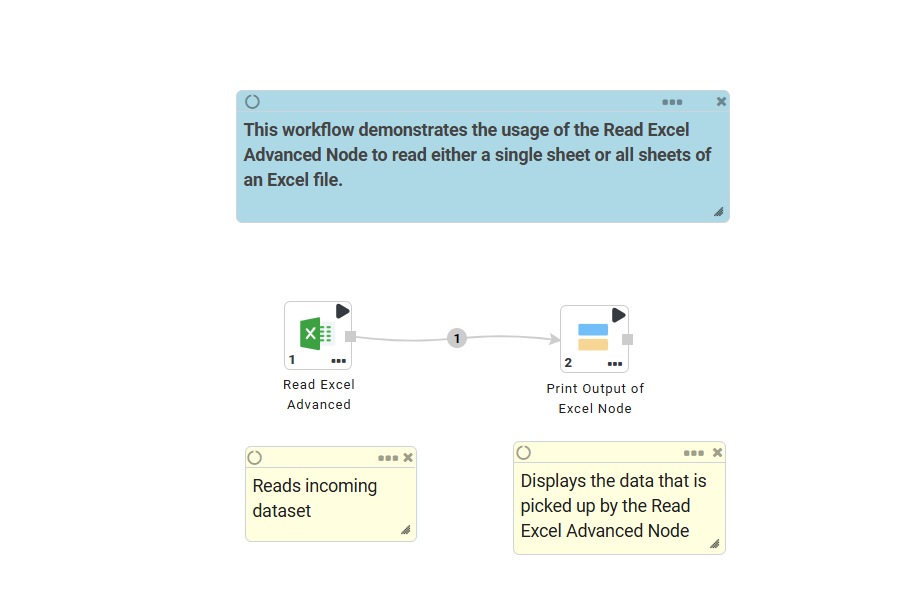
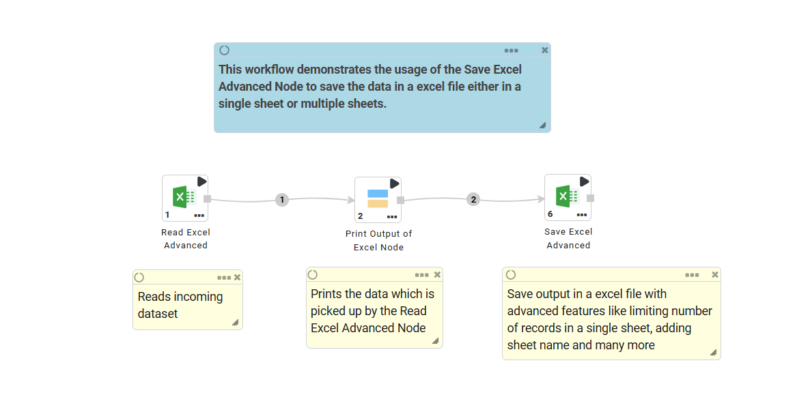

Excel
===========

Excel Processors in Fire Insights
----

.. list-table::
   :widths: 30 70
   :header-rows: 1

   * - Title
     - Description
   * - Read Excel Advanced
     - It reads Excel files with support for sheet selection, custom schema, defined ranges, header controls, row skipping, schema inference, and other advanced options.
   * - Save Excel Advanced
     - It saves output in an excel file with advanced features like limiting number of records in a single sheet, adding sheet name and many more.
   * - Read Excel
     - It reads Excel files to create a dataset.

Read Excel Advanced
----
Below is a sample workflow that contains the Read Excel Advanced processor in Fire Insights. It demonstrates how the node reads Excel files with support for **sheets**, **ranges**, **schema inference**, and **advanced options**.

The workflow performs the following operations:

* Reads an Excel file **(.xlsx or .xls)** using the Read Excel Advanced node.
* Allows selecting a sheet, sheet range, or cell range for ingestion.
* Optionally allows defining a custom schema or inferring column types from Excel data.
* Prints the resulting dataset using a Print N Rows node.

**Read Excel Advanced Node Configuration**
+++++++++++++++++++++++++++++++++++++++++++++++++

The Read Excel Advanced node is configured as below.

* **General Configuration**

   * **File Path:** Specify the exact path of the Excel file to be read. Supports local, HDFS, and cloud file systems (S3, ADLS, GCS) based on platform configuration.
   * **Read Subdirectory Recursively:** If enabled, the node reads Excel files from all subfolders within the given directory.
   * **Read All Sheets:** Reads every sheet in the Excel file. When set to false, you can select specific sheets.
   * **Select Sheets:** Allows you to manually choose which sheet(s) to read or leave empty to read all the sheets.
   * **Named Range:** Lets you import data from a defined named range inside the Excel file.
   * **Range:** Allows specifying a cell range using Excel notation (e.g., A1:D20).
   * **Start Data Import on Line:** Defines the row number from which data import begins.
   * **Header Handling Mode:** Decides whether the first row should be treated as a header row:
      
      * TRUE - First row becomes column names
      * FALSE - Columns are auto-generated (Col_1, Col2, …)

   * **Custom Header Row:** If the header isn’t in the first row, you can specify which row contains actual column headers.
   * **Drop Special Character in Column Name:** Removes special characters from column names to keep them clean and compatible.
   * **Import Only Sheet Names:** When enabled, it returns only the sheet names instead of data (useful for exploration).
   * **Output File Name as Field:** Adds the file name as a separate column in the output.
   * **Output Sheet Name as Field:** Adds the sheet name as a separate column in the output.
   * **Enforce Schema:** If enabled, the node applies a predefined schema and rejects records that don't conform.

  .. figure:: ../../../_assets/user-guide/read-write/read-structured/read-excel-adv-node-config-1.png
     :alt: readwrite_userguide
     :width: 60%

* **Schema Configuration**

  Column types and names can be controlled using schema settings.

   * **Infer Schema:** If enabled, the node automatically detects column data types by sampling the Excel data.
   * **Custom Schema:** You may additionally define a custom schema to override the inferred one.

  .. figure:: ../../../_assets/user-guide/read-write/read-structured/read-excel-adv-node-config-2.png
     :alt: readwrite_userguide
     :width: 60%

**Read Excel Advanced Node Output**
++++++++

Output of the Read Excel Advanced node prints the DataFrame so created based on data from the selected excel file.

.. figure:: ../../../_assets/user-guide/read-write/read-structured/read-excel-adv-node-output.png
   :alt: readwrite_userguide
   :width: 60%

Save Excel Advanced
----
This node saves the incoming dataset as Excel File.

Below is a sample workflow which contains the Save Excel Advanced processor in Fire Insights. It demonstrates the usage of the Save Excel Advanced node to save incoming dataset in Excel format.

It does the following processing of data:

* Reads the incoming Dataset.
* Prints the input dataset read by Read Excel Advanced node using Print N Rows node.
* Saves the incoming dataset in Excel format using the Save Excel Advanced node to the specified storage path, fully formatted and structured according to the configuration.

**Save Excel Advanced Node Configuration**
++++++++++++++++++++++++++++++++++++++++++++

This node can be configured as below:

* **Path / File:** The full destination path (Local, HDFS, S3, ADLS, etc.).
* **Save Mode:** Controls how to handle existing data:

   * OverwriteFile: Replaces the entire workbook.
   * OverwriteSheet: Replaces only the specific target sheet (keeping others intact).
   * AppendSheet: Adds new rows to the end of existing data.
   * ErrorIfExists / Ignore: safeguards against accidental overwrites.

* **Sheet Name & Dynamic Naming:** Define a static name (e.g., "Data"). Use **Name From Field** to split data into multiple sheets based on a column's unique values.
* **Range:** Specify a starting cell (e.g., B10) or a specific block (B10:F50) to write data exactly where needed.
* **Preserve Formatting:** When enabled with OverwriteSheet, this keeps existing cell styles (borders, colors) while updating the values.
* **Max Records Per Sheet:** Automatically creates new sheets (Sheet1_1, Sheet1_2) if the row count exceeds the limit.
* **Max Records Per File:** Automatically splits the output into multiple physical files (report_01.xlsx, report_02.xlsx).
* **Security:** Optional Password field to protect the workbook or specific sheets.

  .. figure:: ../../../_assets/user-guide/read-write/read-structured/save-excel-adv-config.png
     :alt: readwrite_userguide
     :width: 60%

Read Excel
----
This node creates a dataset from an Excel file.

Below is a sample workflow which contains the Read Excel processor in Fire Insights. It demonstrates the usage of Read Excel node to create a dataset from an excel file.

It does the following processing of data:

*	Creates a dataset from an excel file using Dataset Structured node.
*	Prints the created dataset.

.. figure:: ../../../_assets/user-guide/read-write/read-structured/ReadExcelWF.png
   :alt: readwrite_userguide
   :width: 50%
   
**Read Excel node configuration**

The Read Excel node is configured as below.

*	Excel file location needs to be selected or entered in the ``Path`` box.
*	Sheet Name in the Excel file that needs to be used to create dataset is to be entered in the ``Sheetname`` box.
*	If the Data Sheet contains header row then the ``Header`` needs to be selected accordingly.
*	Output prints the DataFrame so created based on data from the selected excel file.

.. figure:: ../../../_assets/user-guide/read-write/read-structured/ExcelConfig.png
   :alt: readwrite_userguide
   :width: 70%
   
**Read Excel node output**

Output of the Read Excel node prints the DataFrame so created based on data from the selected excel file.

.. figure:: ../../../_assets/user-guide/read-write/read-structured/ExcelOutput.png
   :alt: readwrite_userguide
   :width: 70%       	    
