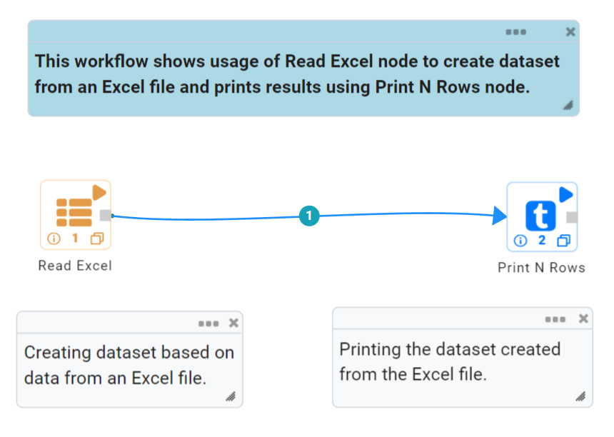
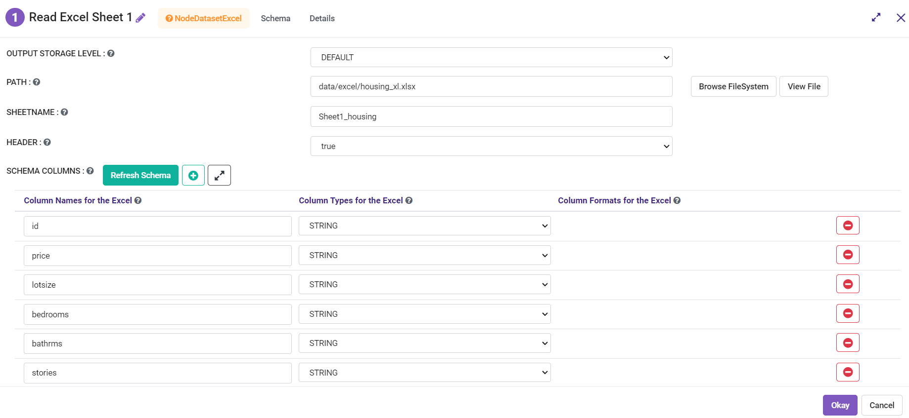
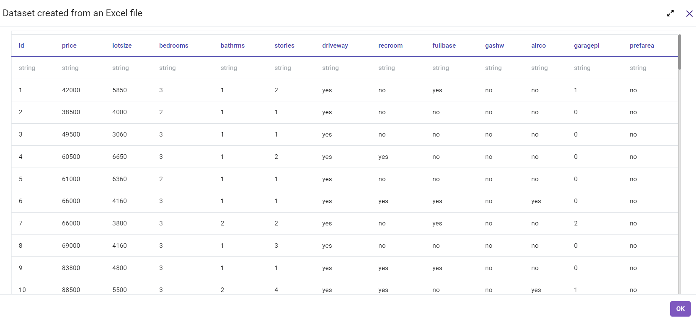

Excel
===========
This node creates a dataset from an Excel file.

Below is a sample workflow which contains the Read Excel processor in Fire Insights. It demonstrates the usage of Read Excel node to create a dataset from an excel file.

It does the following processing of data:

*	Creates a dataset from an excel file using Dataset Structured node.
*	Prints the created dataset.

   
**Read Excel node configuration**

The Read Excel node is configured as below.

*	Excel file location needs to be selected or entered in the ``Path`` box.
*	Sheet Name in the Excel file that needs to be used to create dataset is to be entered in the ``Sheetname`` box.
*	If the Data Sheet contains header row then the ``Header`` needs to be selected accordingly.
*	Output prints the DataFrame so created based on data from the selected excel file.

   
**Read Excel node output**

Output of the Read Excel node prints the DataFrame so created based on data from the selected excel file.

