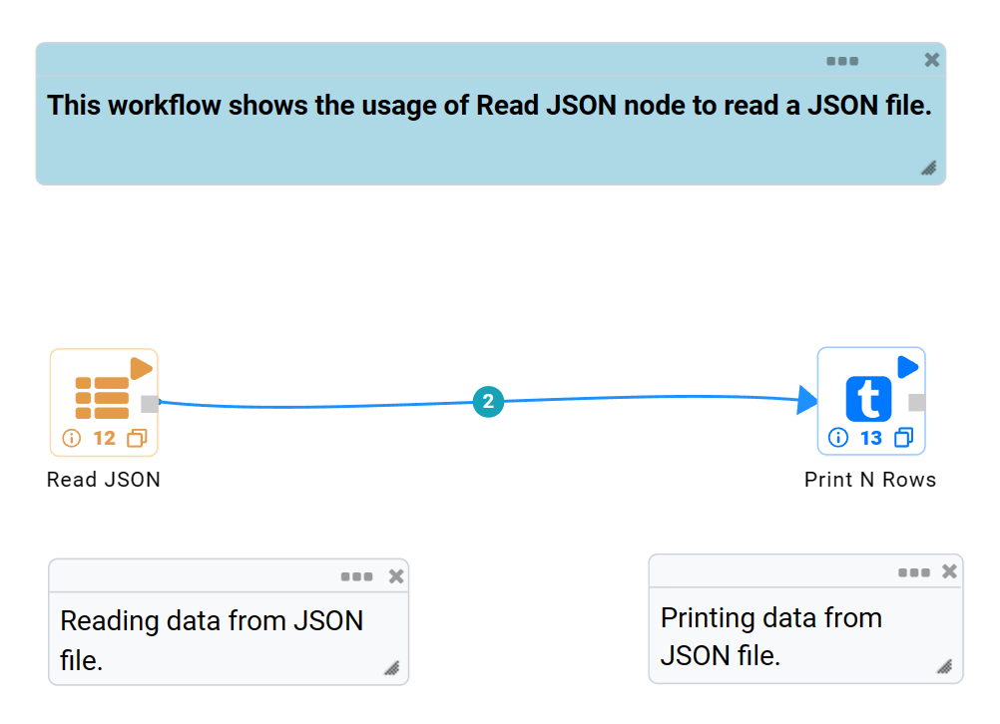
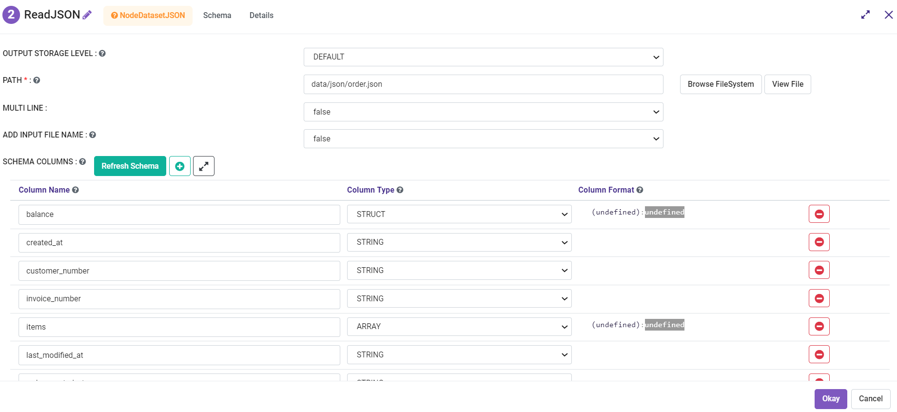
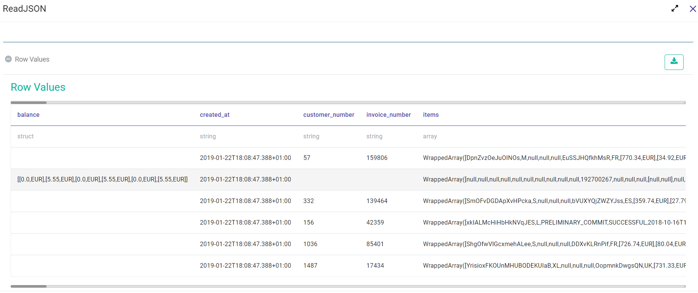
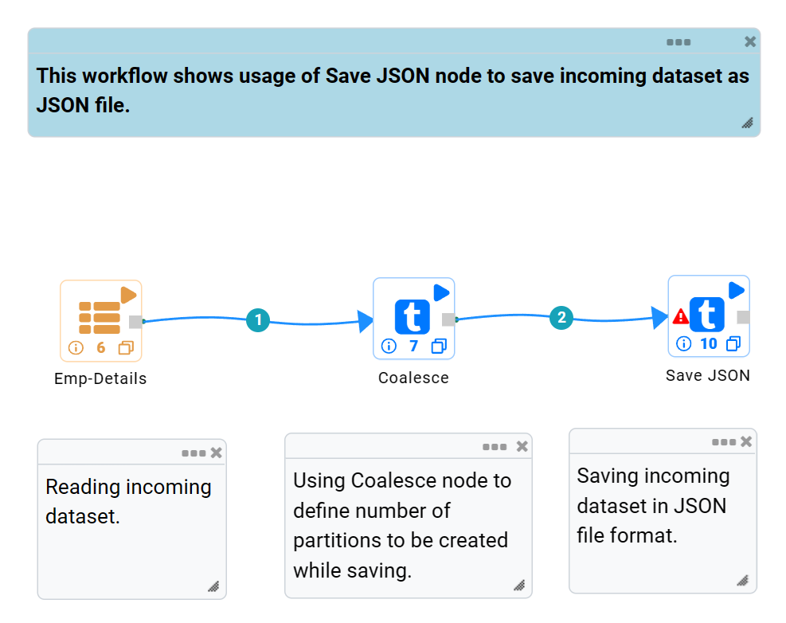
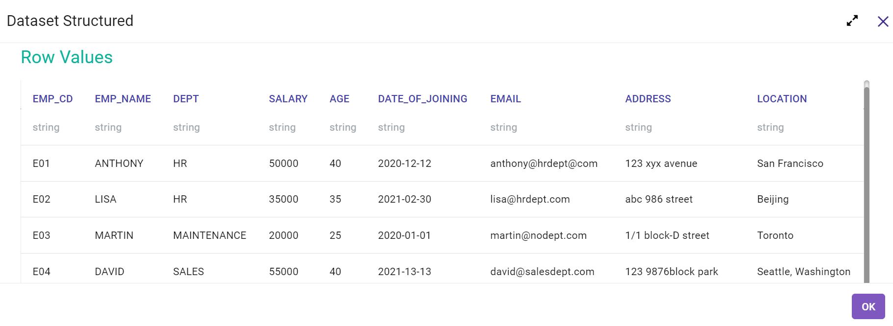
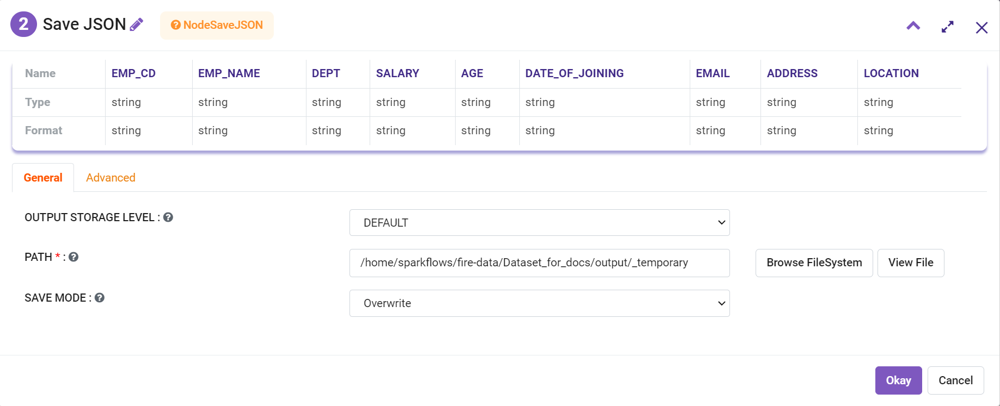
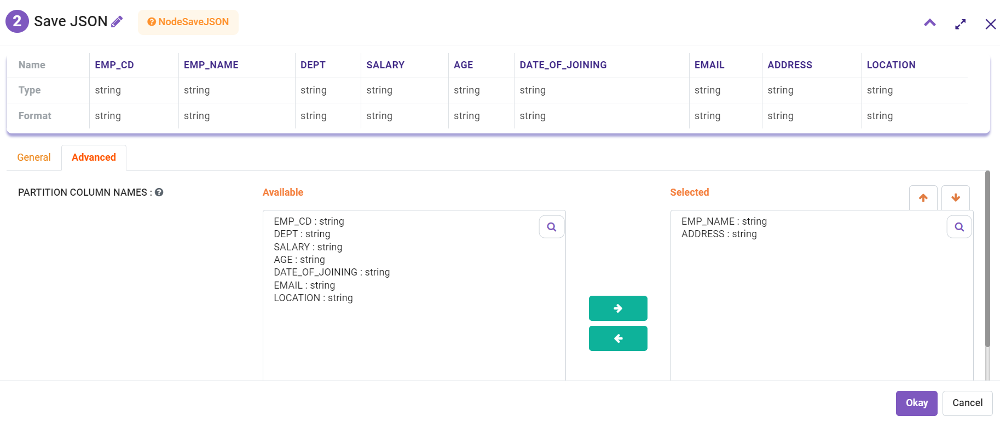

JSON
========

Read JSON
-------------
This node reads JSON files.

Below is a sample workflow which contains the Read JSON processor in Fire Insights. It demonstrates the usage of the Read JSON node to read a JSON file.

It does the following processing of data:

*	Reads incoming dataset in JSON File format using the Read JSON node.
* 	Prints the content of JSON file using the Print node.

   

**Read JSON node configuration**

The Read JSON node is configured as below.

*	A ``JSON Data File`` needs to be selected in the ``Path``. The ``Browse HDFS`` option can be used to browse and select a JSON file from HDFS.
*	If a record data in the JSON file is present in multiple lines then ``Multiline`` needs to be selected as ``True``.
*	Once a JSON file is selected the ``Refresh Schema`` button needs to be clicked to list Schema defined in the ``JSON Data File``. 
*	``OK`` button needs to be clicked to complete the configuration.

**Read JSON node output**

Data read from JSON File is printed as below using the Print node.

Save JSON
----------------------------------------
This node saves the incoming dataset as JSON File.

Below is a sample workflow which contains the Save JSON processor in Fire Insights. It demonstrates the usage of Save JSON node to save the incoming dataset in JSON format.

It does the following processing of data:

*	Reads the incoming dataset.
*	Coalesce node is used to define the number of partitions to be created while saving.
*	Saves the incoming dataset in JSON format using the Save JSON node.

   
**Incoming Dataset**

   
**Save JSON node configuration**

Save JSON node is configured as below.

*	HDFS location where created file needs to be saved is to be selected in the ``Path`` box.
*	Save mode to be selected in the ``Save Mode`` list. It states whether to *Append*, *Overwrite*, *Error out if file exists* or *Ignore* while saving file.
*	In the ``Advanced`` tab, set of columns that need to be used to partition data are to be selected in the ``Partition Column Names`` list. One file would be created for each partition.
*	Saves the incoming dataset in JSON format.

   

   
