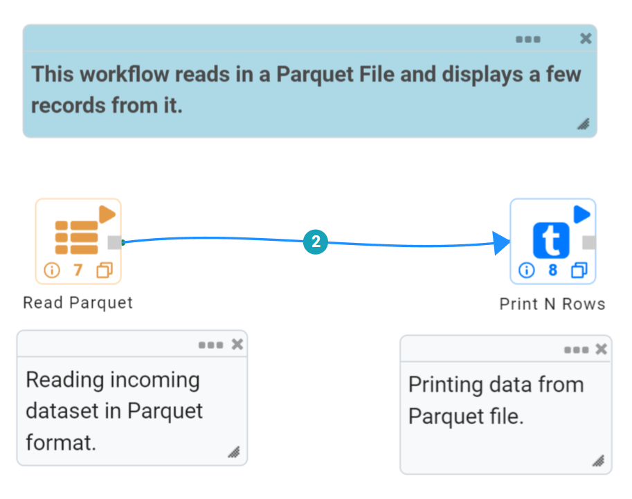
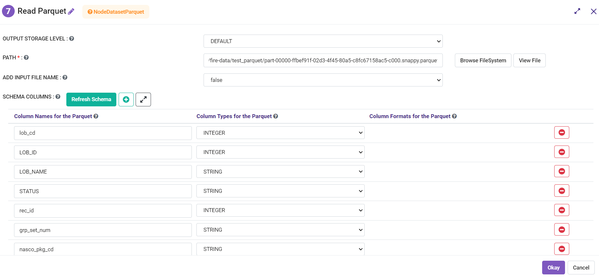
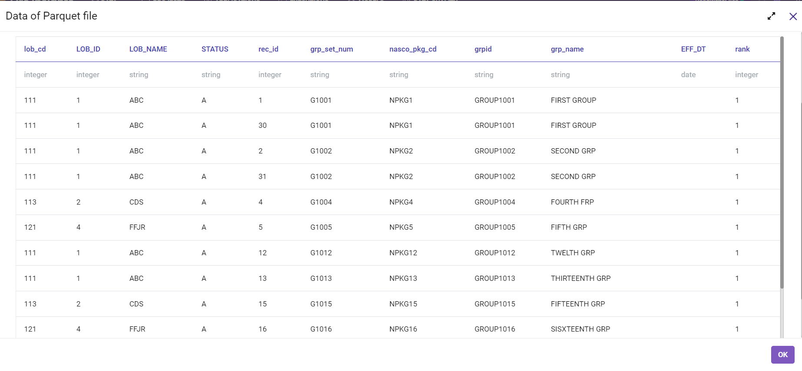

Parquet
========

Read Parquet
-----------------
This node reads Parquet files.

Below is a sample workflow which contains Read Parquet processor in Fire Insights. It demonstrates usage of Read Parquet node to read a Parquet file.

It does following processing of data:

*	Reads incoming Dataset in Parquet Data File format using Read Parquet node.
* 	Prints the content of Parquet file using Print node.

   

**Read Parquet node configuration**

The Read Parquet node is configured as below.

*	A ``Parquet Data File`` needs to be selected in the ``Path``. The ``Browse HDFS`` option can be used to browse and select a Parquet file from HDFS.
*	Once a Parquet file is selected the ``Refresh Schema`` button needs to be clicked to list Schema defined in the ``Parquet Data File``. 
*	``OK`` button needs to be clicked to complete the configuration.

**Read Parquet node output**

Data read from a Parquet Data File is printed as below using the Print node.

Save Parquet
----------------------------------------
This node saves the incoming dataset as Parquet File.

Below is a sample workflow which contains the Save Parquet processor in Fire Insights. It demonstrates the usage of the Save Parquet node to save incoming dataset in Parquet format.

It does the following processing of data:

*	Reads the incoming Dataset.
*	Coalesce node is used to define the number of partitions to be created while saving.
*	Saves the incoming dataset in Parquet format using the ``Save Parquet`` node.

.. figure:: ../../../_assets/user-guide/read-write/save-files/save-parquet-wf.png
   :alt: savefiles_userguide
   :width: 50%
   
**Incoming Dataset**

.. figure:: ../../../_assets/user-guide/read-write/save-files/InputData.png
   :alt: savefiles_userguide
   :width: 75%
   
**Save Parquet node configuration**

Save Parquet node is configured as below.

*	HDFS location where created file needs to be saved is to be selected in ``Path`` box.
*	Save mode to be selected in the ``Save Mode`` list. It states whether to *Append*, *Overwrite*, *Error out if file exists* or *Ignore* while saving the file.
*	In the ``Advanced`` tab, set of columns that need to be used to partition data are to be selected in the ``Partition Column Names`` list. One file would be created for each partition.
*	Saves the incoming dataset in Parquet format.

.. figure:: ../../../_assets/user-guide/read-write/save-files/ParquetGenConfig.png
   :alt: savefiles_userguide
   :width: 75%
   
.. figure:: ../../../_assets/user-guide/read-write/save-files/ParquetAdvConfig.png
   :alt: savefiles_userguide
   :width: 75%
