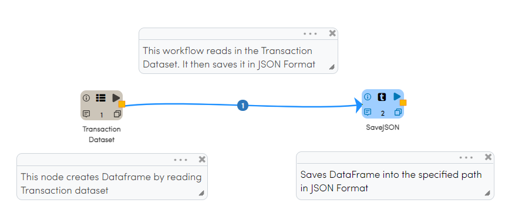
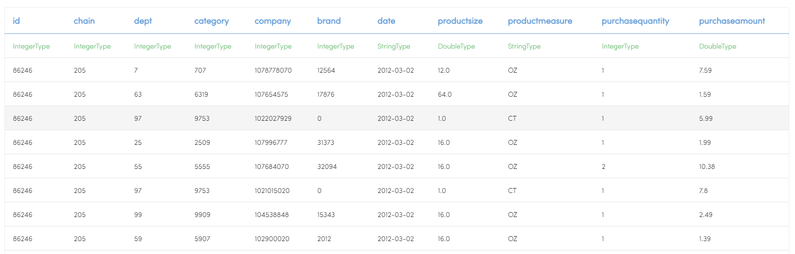
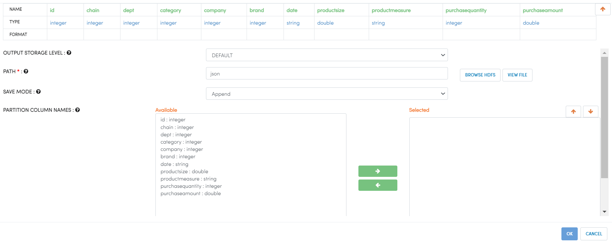

Writing to JSON Files
=====================

Fire Insights enables you to write your DataFrame to JSON Files.

Workflow for writing to JSON file
----------------------

   

Reading From Dataset
----------------------

Node ``TransactionDataset`` creates DataFrame of your dataset named 'Transaction Dataset' by reading data from HDFS, HIVE, etc. which had been defined earlier in Fire by using the Dataset feature. As a user, you just have to select the Dataset of your interest and configure the details as shown below.

SaveJSON Processor Configuration
--------------------

Node ``SaveJSON`` saves DataFrame into the specified path in JSON Format. When running on Hadoop, JSON files get saved into HDFS.

   

