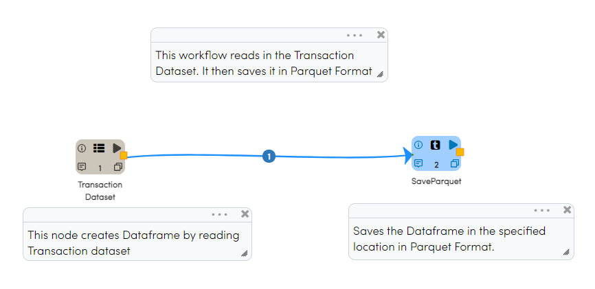
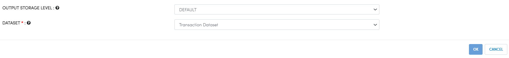
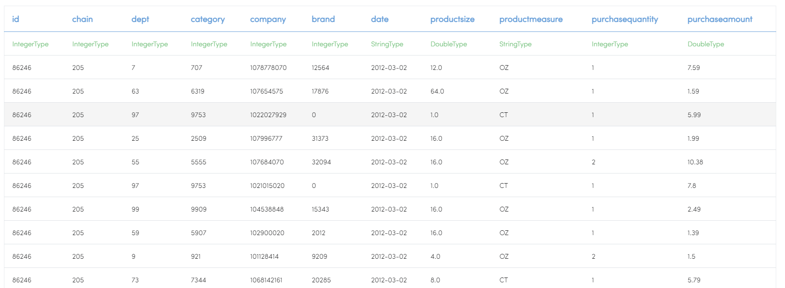
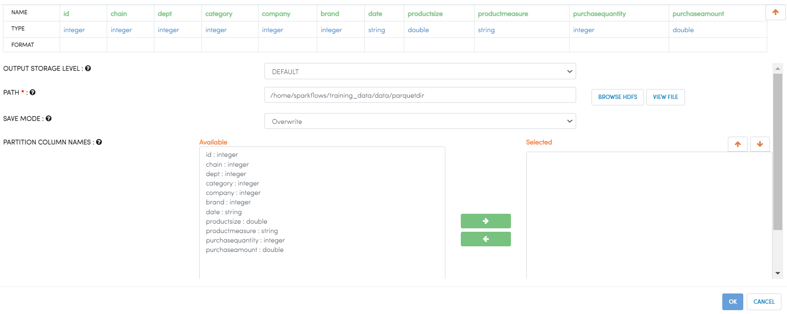
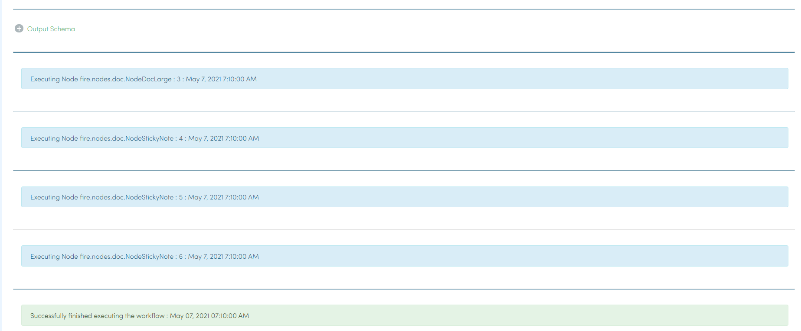

Write parquet
================

Fire Insights enables user to write in parquet file

Workflow
--------

Below is the workflow. It does the following:

* Reads transaction dataset.
* save parquet to specified location.

Reads transaction dataset
---------------------

It Reads transaction dataset.

Processor Configuration
^^^^^^^^^^^^^^^^^^

   
Processor Output
^^^^^^

Save parquet file
----------------

It save parquet file in specified location

Processor Configuration
^^^^^^^^^^^^^^^^^^

   
Once the workflow executed successfully the csv file will be saved to specified location

