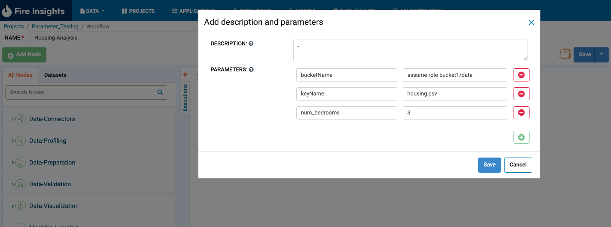
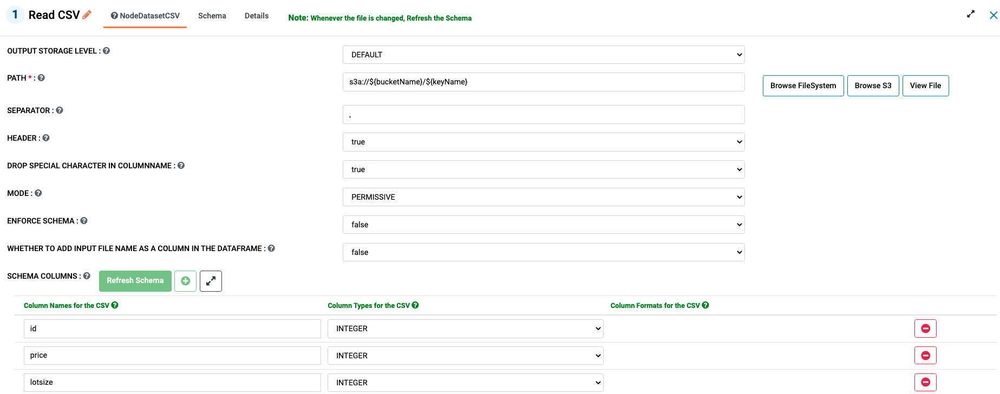
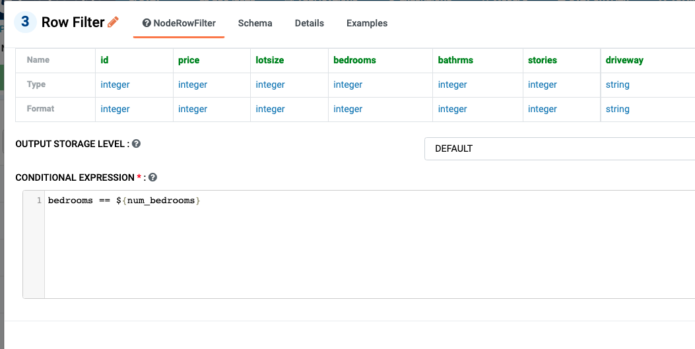

Runtime Parameters
===========================

Fire Insights allow user to parameterize the field value in node in workflow and use the value at run time.

To call the parameters at runtime below syntax is used.

``${parameter_name}``

In the workflow editor page parmeters should be definied with ``parameter_name`` and ``value``. And use the parameter_name inside the node fields with ``${parameter_name}``

Define the Parameters in Workflow Edit Page
------------------------------------------

Below are the three parameters defined and those values will be used in interactive mode.

* bucketName
* keyName
* num_bedrooms

``bucketName`` and ``keyName`` used in ReadCSV node path field with ``s3a://${bucketName}/${keyName}``

``num_bedrooms`` used in Row Filter node with ``bedrooms == ${num_bedrooms}``

Parametrs at Execution time
----------------------------

During the Execution time in execute page user get the option to change parameters value for execution time. By default parameters values are copied from edit page.
 
In below case ``num_bedrooms`` value changed to ``4`` for runtime execution.
 
 .. figure:: ../../_assets/user-guide/runtime-parameters/execute-page-parameter.png
   :alt: parameters in execute page
   :width: 60%
 
 
 
 
