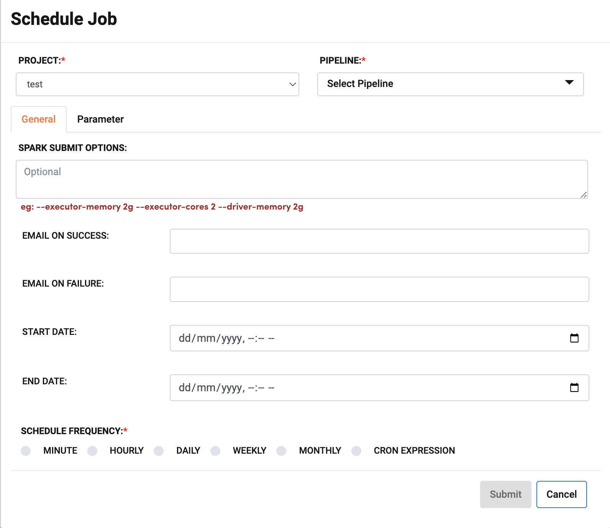
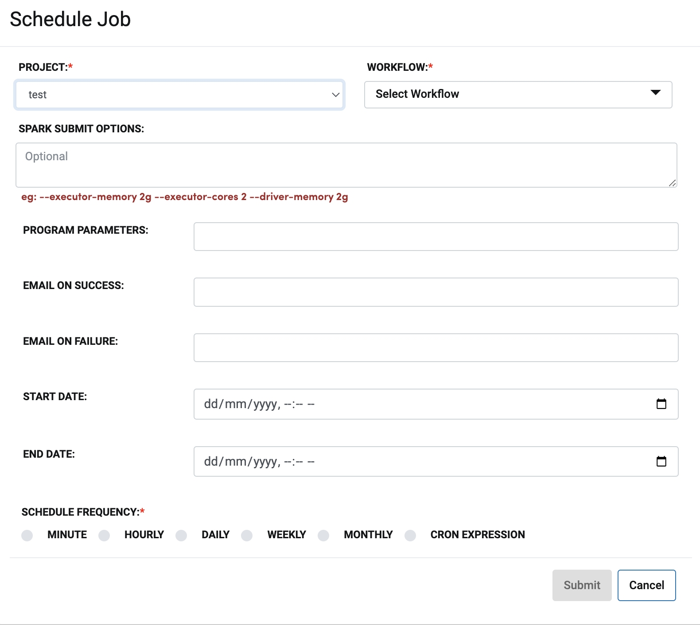
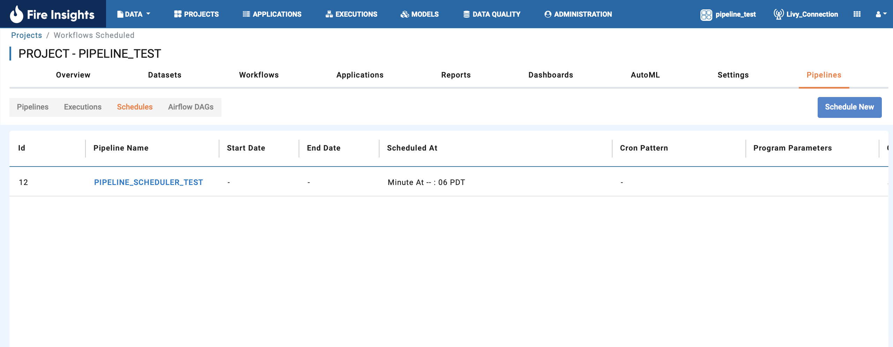
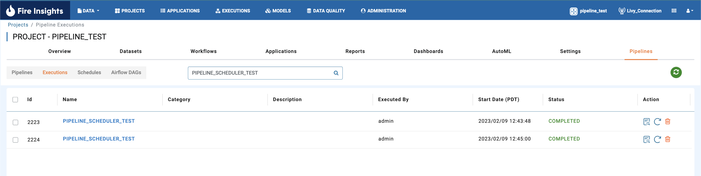
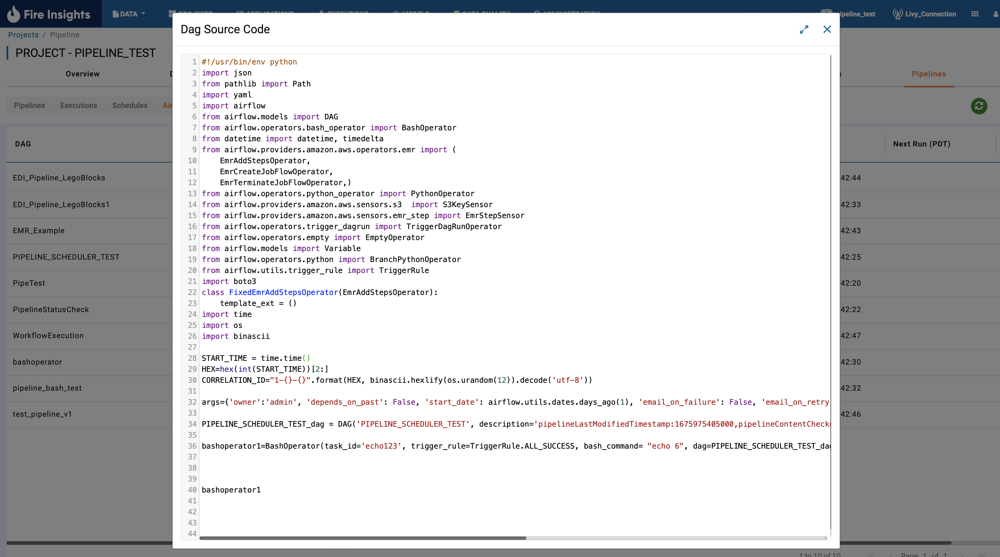
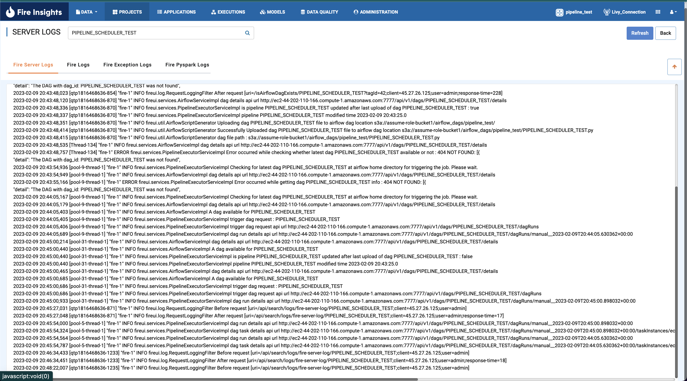
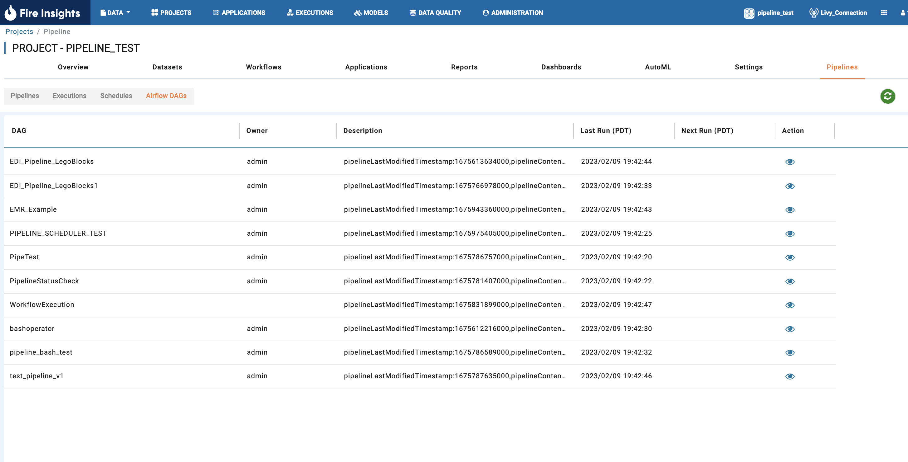
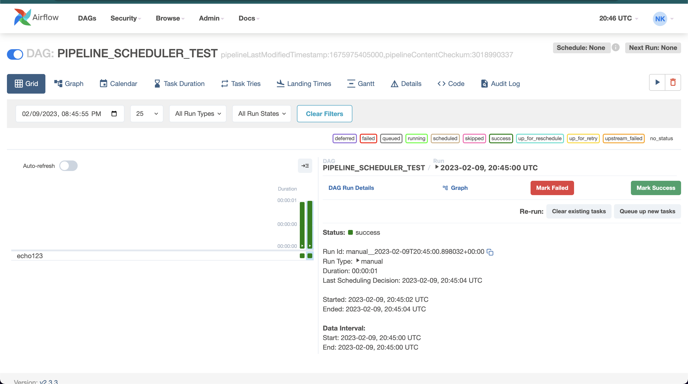

Scheduling Pipeline
=========

Scheduling pipelines refers to the process of automating the execution of tasks, such as data processing, building machine learning models, triggering airflow jobs at a specific time or interval. It's important to consider factors such as scalability, reliability, and cost when scheduling pipelines. This can be useful in a variety of situations, such as:

* Running every X minutes/hourly/daily/weekly/monthly data processing jobs.
* Automatically triggering the airflow pipelines.

In Sparkflows, there are two ways to schedule pipelines:

* Using Cron in the Scheduler. 
* Using Scheduler with choosing options from the UI.

Steps to Schedule and view the Scheduled jobs
---------------------------------------------

Schedule Jobs
+++++

Sparkflows allows you to schedule Jobs. These jobs can be either comprise of running Workflows or Pipelines. The Scheduler takes in the below fields as input as seen in the images below. The first one corresponds to Scheduling pipeline and the next one is for Scheduling workflow:
      
**Pipeline Scheduler**

      
**Workflow Scheduler**
      

       
       
Each of the above fields is described below:
   1. ``Project``: From the dropdown, one has to choose the Project in which the workflow or pipeline which user wants to Schedule resides.
   2. ``Workflow``: One has to choose the workflow or the pipeline which user wants to Schedule.
   3. ``Spark submit options``: This field can be made use of to specify the runtime options while submitting Workflows which will be run as Apache Spark jobs. If not, it can be left empty.
   4. ``Program parameters``: If the Workflow taken in any parameters, it can be specified here. If not, it can be left empty.
   5. ``Email on Success``: Email address of people who should be notified on success of the scheduled job can be specified in this field.
   6. ``Email on Failure``: Email address of people who should be notified on failure of the scheduled job can be specified in this field.
   7. ``Start date``: This can be used to specify when should the scheduled job start. One can specify date and time and the scheduled job will start executing only after the start date has elapsed. For e.g., one can schedule a job to run hourly starting three days later using this feature.
   8. ``End date``: This can be used to specify when should the job should stop getting scheduled. One can specify date and time and the scheduled job will stop getting scheduled after the stop date has elapsed. For e.g., one can schedule a job to run hourly but stop getting scheduled three days later using this feature.
   9. ``Schedule frequency``: One can choose the frequency of the job by choosing from the options below along with the time zone:
         a. ``Minute`` : Will schedule the Job every X minutes with a rollover at the end of hour. More details in the notes below.
         b. ``Hourly`` : Will schedule the Job every hour at X minutes.
         c. ``Daily`` : Will schedule the Job daily at X hour and Y minutes.
         d. ``Weekly``  : Will schedule the Job weekly on X day, Y hour and Z minutes.
         e. ``Monthly`` : Will schedule the Job monthly at X day, Y hour and Z minutes.
         f. ``Cron Expression``: Cron expression of the form can be used to schedule job in Sparkflows ``0 0/15 * * * ? *`` This Cron will schedule the job every 15 minutes.
         
   
View Scheduled Jobs
+++++

Once the Jobs are scheduled, you can view the list of scheduled jobs by clicking on the ``Schedules`` tab. One can also view other meta data of the scheduled jobs as seen in the image below.

   
         
Check the status of the Scheduled Jobs
+++++

   

**Note: Airflow should be enabled in Admin Configuration if Pipelines need to run in Airflow.**

View the DAG Script generated from the Pipeline
+++++

Directly Trigger Pipeline Execution in Airflow
+++++

.. figure:: ../../_assets/user-guide/scheduler/DIRECTLY_EXECUTE_PIPELINE_IN_AIRFLOW.png
   :alt: Trigger Pipeline 
   :width: 60%

Check the logs for Pipeline and Airflow Interaction
+++++

        
View the DAGs in Pipeline
+++++

        

View the DAGs in Airflow
+++++

        
Verify if DAGs are triggered in Airflow as per Schedules
+++++
.. figure:: ../../_assets/user-guide/scheduler/TEST_SCHEDULED.png
   :alt: Airflow DAGs
   :width: 60%

Notes  
-----

* One can use the scheduler in Sparkflows to trigger Airflow pipelines.

* Redeployment of the Sparkflows application will not remove the already scheduled workflows and pipelines. The jobs will start to get scheduled once the application is restarted.

* The scheduler will continue to trigger the workflow even if the compute cluster is not reachable.

* The scheduler will continue to trigger the airlfow pipelines even if the airflow cluster is not reachable.

* The scheduler will continue to trigger the next executions regardless of the previous trigger status.

* If there are too many pipelines yet to be exeucted, they will get queued up and will execute once the previous pipelines have completed.

* If the job is scheduled at every X minutes, it will execute at the beginning of the hour and then every X minutes in that hour" and then then the counter resets. For example: If the current time is 5:00 and a job is scheduled to run every 25 minutes , it would run at 5:00, 5:25,5:50, 6:00, 6:25, 6:50. If  the job needs to run at 5:00, 5:25, :5:50, 6:15, 6:40 (every 25 minutes in true sense), then one would need to use a CRON expression.

* The Pipeline and existing DAG checksum are compared at the time of trigerring the Pipeline. If it is found that the Pipeline has been updated then the DAG script is regnerated and redeployed so that Airflow can execute the latest DAG. 

* Cron Maker can be used to create the cron expression - http://www.cronmaker.com/

Troubleshooting
-----

1. Pipeline is not running consistently in Airflow
+++++

**Issue Details**

There could be different reasons for this issue.

* The Background Event Trigger Thread is stalled.
* The Websocket doesn't receive events in timely manner.
* Airflow DAG Execution requests are not trigerred in timely manner.
  
**Resolution**

Check the Machine Configuration.

* Ensure minumum 8 cores and 16 GB RAM are used.
* Check if any additional processes (running in the same VM where Sparkflows is running) hogging the memory and processes.

  Examples of additional processes: 
    * Agent handling the traffic between Load Balancer and installed service. 
    * any Applications (e.g. Envoy) which scans the deployed App and logs (CPU, Mem).  

* Check DAGs in Airflow are not queued up.
* Ensure Airflow Instance is configured with enough Memory and Processing Cores. 

2. It seems job is running at a wrong schedule
+++++

**Issue Details**

Lets conside a typical example of misperception.
The Piopeline Schedule is showing that Job is running at say every 15th minute of the hour as opposed to 45th min of the hour

**Resolution**

Let's assume a Job was scheduled in IST time to run every 45th minute.
But when viewed in CDT timezone it may give a wrong impression that the job is running at the 15th min of the hour.
Note: 8:45 am IST is 9:15 pm CDT

One need to ensure correct cron expression is used for running the job every 45th min.

3. Pipeline is not getting trigerred at all
+++++

**Issue Details**

Let's assume the Cron Expression has been copied from external website like http://www.cronmaker.com/. Then one tries to run the Pipeline and the job fails.

**Resolution**

Ensure that there is no extra space and unwanted characters in the Cron Expression. 
