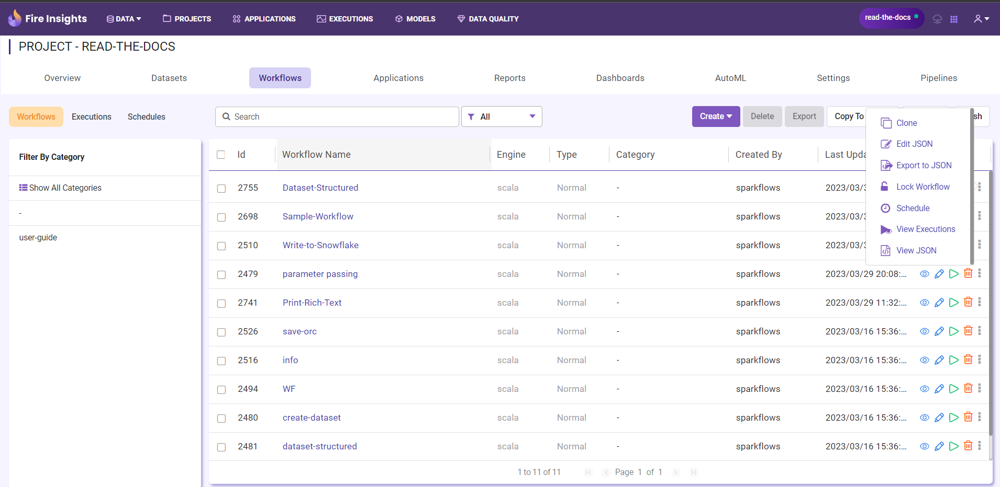
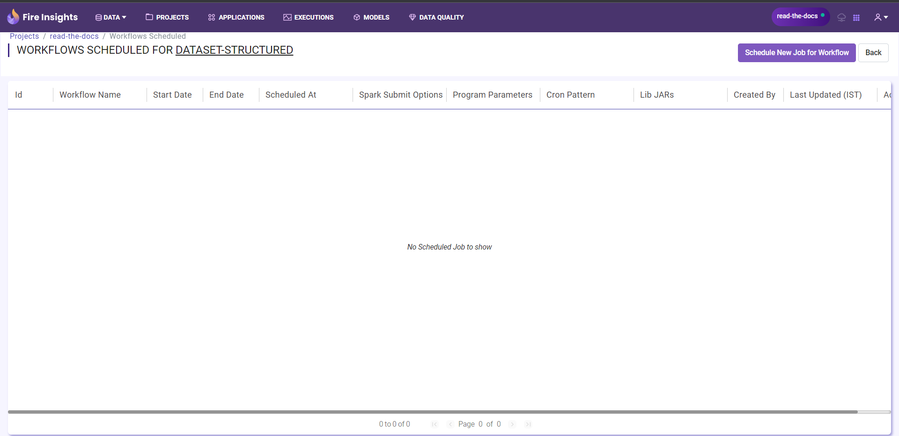
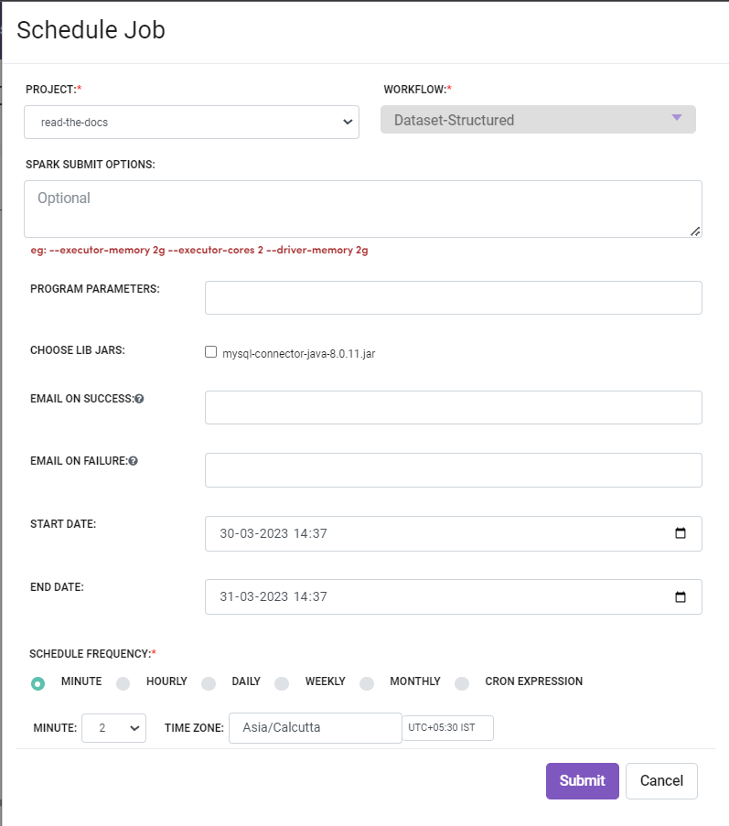
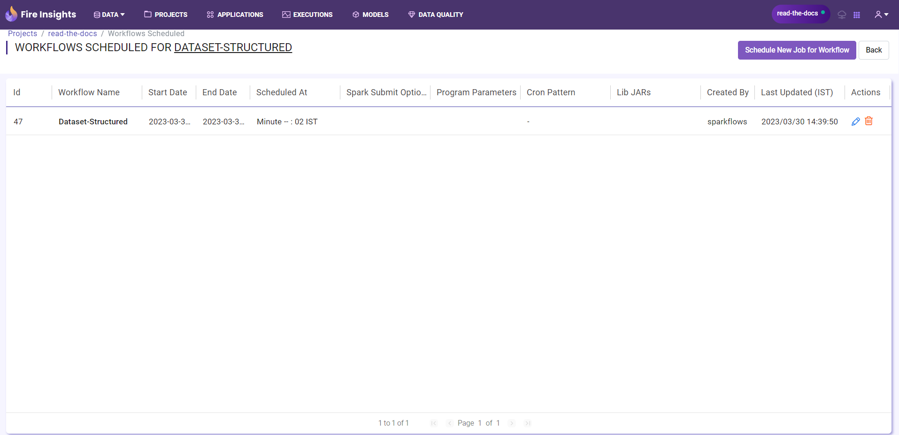
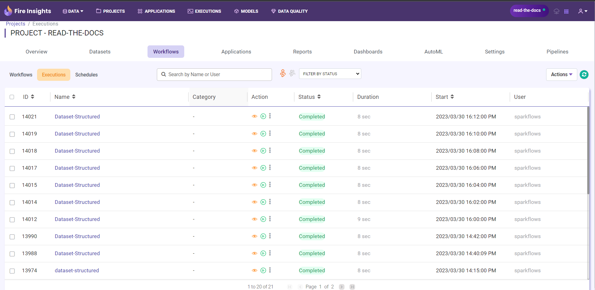

Scheduling Workflows
====================

Fire allows you to schedule workflows to be run at regular intervals through its built in Scheduler.

Scheduling New Workflow
-----------------------

Select ``Schedule`` option from Action column
++++++

The workflows page displays the list of various workflows. On the workflows page, in the ``Action`` column, there appears a ``Schedule`` option in the action menu that schedules any given workflow.

   
Click ``Schedule New Jobs for Workflows`` Button
+++++

Selecting the schedule option takes you to a page for creating new schedules for the workflow. Here, click on the ``Schedule New Jobs for Workflows`` button located on the top right corner of the page to reach the ``Scheduling Window``.

Enter Details on the Scheduling Window
+++++

In the Scheduling window enter all the details as per your requirement e.g. starting and ending date, frequency of execution i.e. hourly, daily, weekly, etc. and E-Mail IDs for getting failure or success mesaages.

   
Save the Schedule by clicking ``Submit Button``
++++

Click on the submit button to successfully save your workflow. Your scheduled workflow would automatically run as per the schedule.

Viewing Workflows Scheduled
-------------

Find the ``Schedules Button`` located on the left hand side on the workflows page. Click on it to view the ``Scheduled Workflows page``.

Editing a Scheduled Workflow
----------------------------

You can edit a schedule by clicking on the ``Edit`` icon and then updating the new values, and saving it from the Scheduled Workflows page.

Viewing Results of the Workflow Executions
--------------------------------------

When workflows are scheduled, they are executed by Fire at the specified schedule.

The results of the execution of the workflows can be viewed in the Workflow Executions Page. This allows us to view the results of the past execution, logs of the run, etc.

Deleting a Scheduled Workflow
-----------------------------

Go to the Scheduled Workflows page. It would display the list of scheduled workflows.

Click on the ``Delete`` icon next to any Scheduled workflow to delete the schedule.
