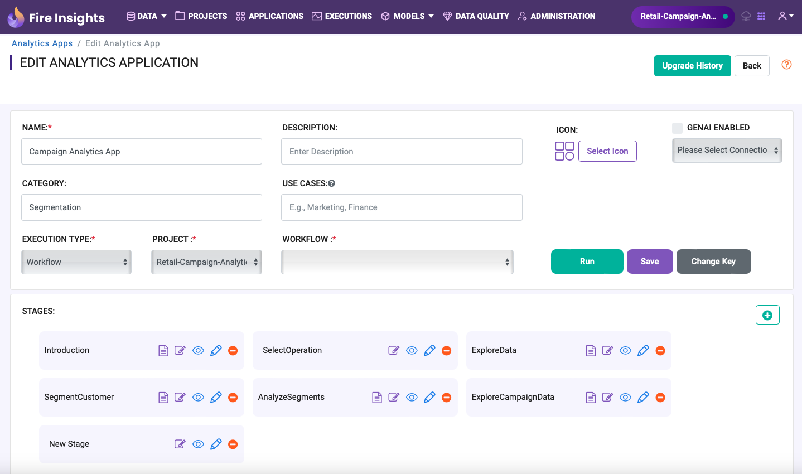
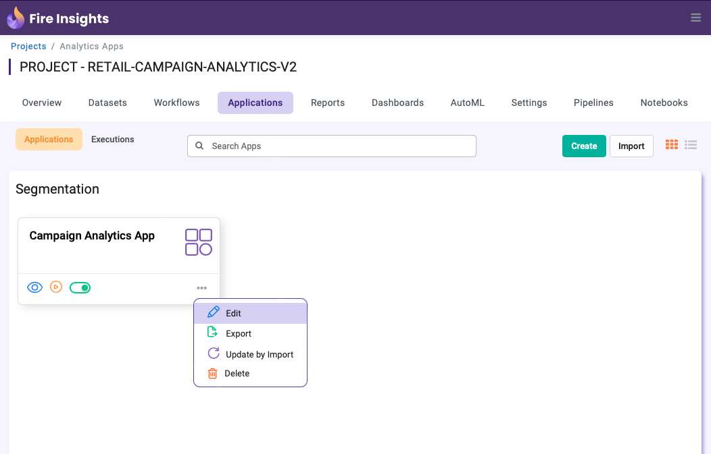
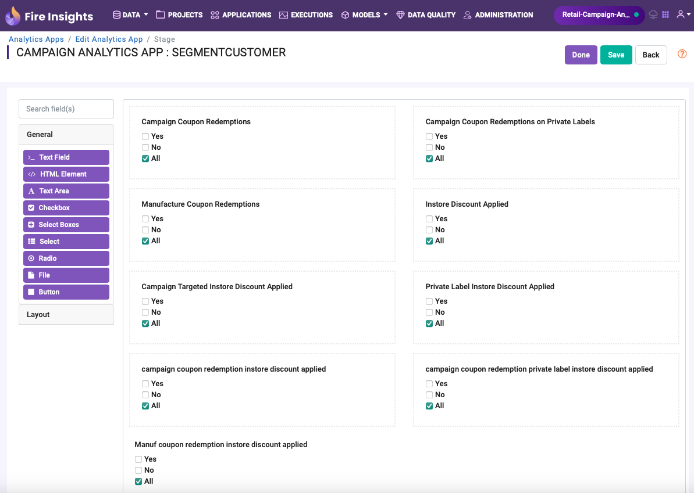
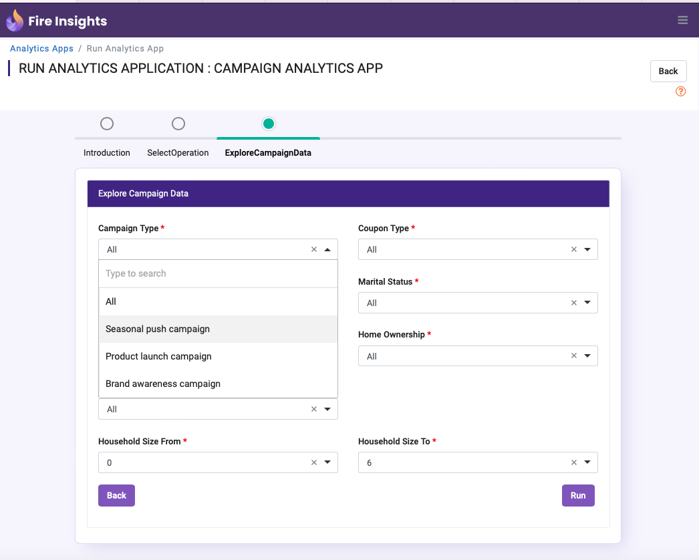

Business App for Campaign Analytics
==============
Users can design intuitive Analytical Apps to build solution.
Users can capture inputs and feed them into workflows or notebooks seamlessly using Analytics Apps.
The connected workflows or notebooks are executed and the results are streamed back to the user.

This App can be created by using Point & Click widgets.

Various operations can be performed on the App.

This App allows Business Analysts to run different operations like exploring data, performing descriptive analytics, running model trianing and generating predictive insights.

This App allows Business Analysts to explore data based on user inputs.

This App allows Business Analysts to create segments based on user inputs.

